# ReRoute — Autonomous Airline Disruption Recovery Agent

[🇰🇷 한국어](README.md) · **🇺🇸 English**

**NVIDIA Korea Agentic AI Hackathon** entry

> An operator types one sentence — *"KE123편이 결항됐어. 영향 승객을 확인하고 최적 재배정안을 만들어줘."*
> (*"KE123 is cancelled. Find the affected passengers and build the optimal re-accommodation plan."*)
> The ReRoute agent plans on its own, calls tools, retrieves airline policies, computes the optimal re-accommodation
> with NVIDIA cuOpt, **gets operator approval**, then changes the bookings and writes an audit trail.

| Principle | |
|---|---|
| **"LLM does not decide passenger allocation."** | The agent formulates the recovery task, retrieves airline policies, and delegates constrained allocation to **NVIDIA cuOpt**. |
| **"Read-only actions can execute autonomously, while state-changing booking actions require human approval."** | Lookups, retrieval and optimization run autonomously; booking changes always go through a human. |
| **"Governed by NVIDIA OpenShell."** | The agent runs under an OpenShell policy: unknown egress, credential access and self-approval calls are denied. |

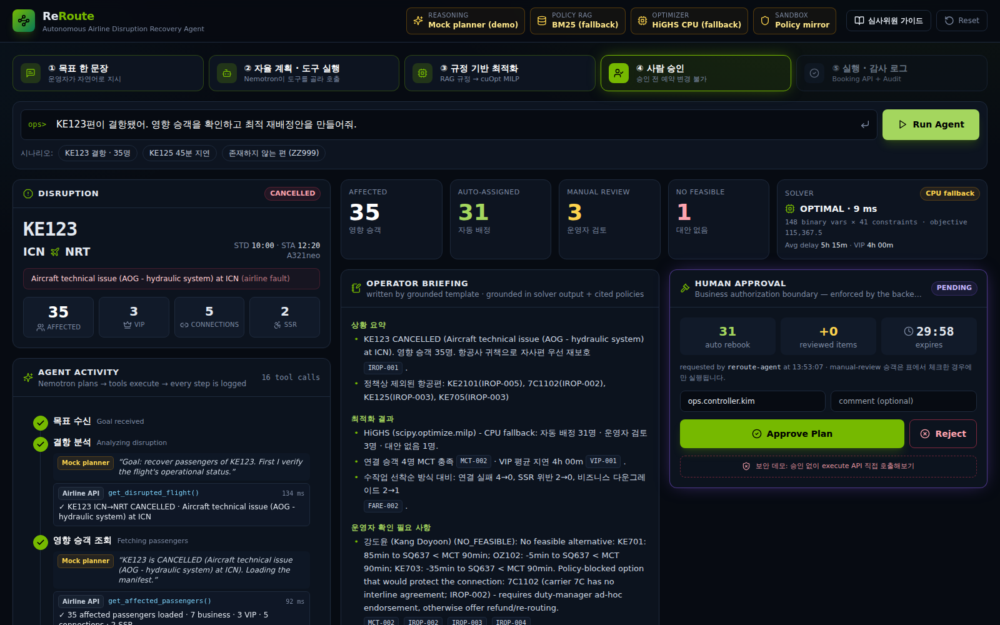

| Quick links | |
|---|---|
| 🎬 Demo in one command | `docker compose up --build` → http://localhost:3000 → **Run Agent** |
| 📖 3-minute judge guide | http://localhost:3000/guide · [docs/demo-scenario.md](docs/demo-scenario.md) |
| 🤖 Agent structure & behaviour (7 diagrams) | [docs/agent.en.md](docs/agent.en.md) · [한국어](docs/agent.md) |
| 🧭 System architecture (7 Mermaid diagrams) | [docs/architecture.en.md](docs/architecture.en.md) · [한국어](docs/architecture.md) |
| 🟩 NVIDIA integration & verification status | [docs/nvidia-integration.md](docs/nvidia-integration.md) · [nvidia/](nvidia/) |
| ☁️ AWS deployment (Terraform) | [infra/terraform/README.en.md](infra/terraform/README.en.md) · [한국어](infra/terraform/README.md) |

---

## Contents
1. [Problem](#problem) · 2. [Solution](#solution) · 3. [Why Agentic AI?](#why-agentic-ai) · 4. [Why NVIDIA?](#why-nvidia)
5. [Architecture](#architecture) · [How the LLM agent works](#how-the-llm-agent-works) · 6. [NVIDIA stack & run modes](#nvidia-stack--run-modes) · 7. [Demo](#demo) · 8. [Getting started](#getting-started)
9. [AWS deployment](#aws-deployment) · 10. [Security](#security) · 11. [Optimization](#optimization) · 12. [Screenshots](#screenshots) · 13. [Future work](#future-work)

---

## Problem

A single cancellation creates dozens of passengers, dozens of rules and hundreds of seat combinations at once. During IROPS
(irregular operations) controllers must respect **minimum connection times (MCT), VIPs, special-assistance passengers
(wheelchair, unaccompanied minors), cabin classes, interline agreements and re-protection time limits** — all while
re-seating people onto a handful of flights, fast.

- A **first-come-first-served (FCFS) desk process** under time pressure misses connections and breaks policy.
- An **LLM chatbot** may invent rules or propose a plausible-sounding allocation that violates seat constraints.

## Solution

ReRoute is not a chatbot that answers — it is an **operations agent that plans the work, uses tools and takes action**.

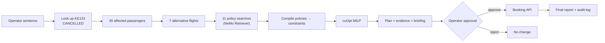

KE123 demo result (cuOpt and the CPU fallback solve the **same MILP** and reach the same optimum, 115,367.5):

| Affected | Auto-assigned | Manual review | No feasible |
|---:|---:|---:|---:|
| **35** | **31** | **3** (2 special assistance, 1 at-risk connection) | **1** (MCT not met — the only option, 7C1102, is blocked by IROP-002 → escalated to the operator) |

Versus an FCFS desk process on the same eligible flights: **missed connections 4 → 0, special-assistance violations 2 → 0,
business downgrades 2 → 1, VIP average delay 5h40m → 4h00m.** Overall average delay rises by 6 minutes — an **intended
trade-off** to protect connections and VIPs, shown openly in the UI.

## Why Agentic AI?

Because the path depends on the situation — a fixed script cannot handle it.

| Situation | What the agent does |
|---|---|
| KE123 cancelled | Full re-accommodation workflow → approval request |
| KE125 delayed 45 min | **Retrieves** RBK-002 (180-min threshold) itself and stops with "no re-accommodation required" — no needless booking changes |
| ZZ999 (non-existent flight) | Reports failure instead of guessing |
| Optimizing without required policies | A guardrail blocks the call and returns "retrieve the MCT policy first" |
| Nemotron endpoint outage | Switches to the deterministic planner and records it in the event log |

## Why NVIDIA?

Each technology closes a **different failure mode** of LLM agents.

| NVIDIA | Role in ReRoute | Failure mode closed |
|---|---|---|
| **Nemotron · NIM** | Goal interpretation, planning, tool selection (function calling), exception narrative | Rigid scripts |
| **NeMo Retriever** (RAG) | Rebooking / fare / VIP / MCT / IROPS policy search with policy id · document · score provenance | Hallucinated rules |
| **cuOpt** | Final allocation as a passenger × flight × cabin 0-1 MILP (source of truth) | Arbitrary LLM allocation, constraint violations |
| **OpenShell** | Agent sandbox: egress / L7 rules, filesystem, process, credential isolation | Over-privilege, data exfiltration |
| **NemoClaw** | Governed runtime for an operator copilot (policy preset + skill) | Ungoverned always-on agents |
| **NVIDIA Skills** | Implemented following `cuopt-numerical-optimization-formulation`, `cuopt-server-api-python`, `nemo-retriever` | Guessed APIs |

> NVIDIA APIs were not guessed. NIM, cuOpt, OpenShell, NemoClaw and Retriever interfaces were taken from the `docs/` sources
> in NVIDIA's official repositories and the NVIDIA skills catalog. The verification level of each (Verified / Contract-tested /
> Documented) is listed in [docs/nvidia-integration.md](docs/nvidia-integration.md).

## Architecture

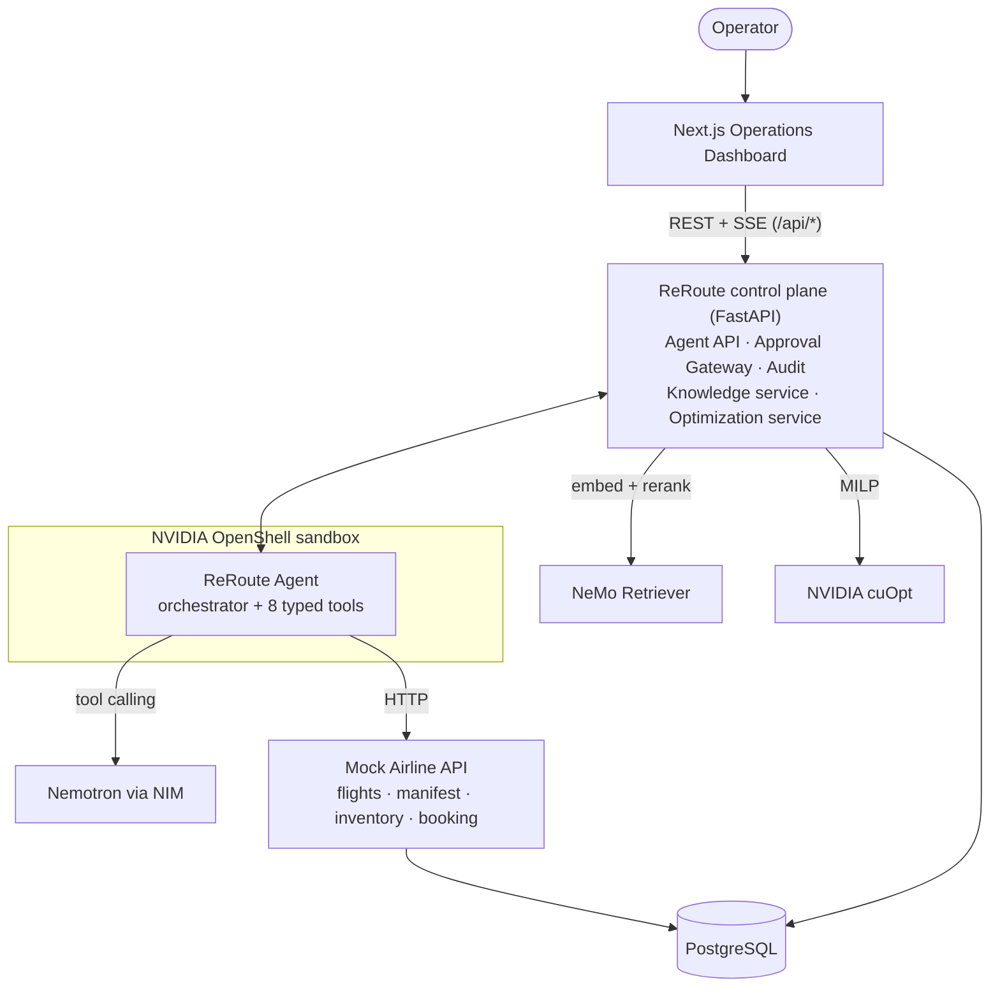

- The agent never runs SQL. Every domain action goes through an explicit tool → HTTP API.
- Tool arguments are **handles, not data** (flight numbers, queries). Passenger data never passes through the LLM, so the LLM cannot alter the allocation.
- With `AGENT_EXECUTION=remote` the agent runs as a separate worker **with no DB credentials and no approval-signing key** — the process that runs inside an OpenShell sandbox.

**Tools:** `get_disrupted_flight` · `get_affected_passengers` · `search_alternative_flights` · `search_rebooking_policy` ·
`optimize_rebooking` · `explore_exception_options` · `propose_rebooking` · `execute_rebooking` *(approval required)*

**State machine:** `RECEIVED → ANALYZING_DISRUPTION → FETCHING_PASSENGERS → SEARCHING_ALTERNATIVES → RETRIEVING_POLICIES →
OPTIMIZING → GENERATING_PROPOSAL → WAITING_APPROVAL → EXECUTING → COMPLETED` (+ `REJECTED`, `FAILED`). Every transition is
persisted and streamed to the UI over SSE. Detailed diagrams: [docs/architecture.en.md](docs/architecture.en.md).

## How the LLM agent works

> As diagrams: [docs/agent.en.md](docs/agent.en.md) — structure, loop, one run, who decides what, recovery paths

With the default `LLM_PROVIDER=auto` and an NVIDIA key, **Nemotron chooses the next tool at every step** — there is no fixed order.

| Design element | Role |
|---|---|
| Plan first | The first reply is a 3–6 step plan; before each tool call the model writes a short rationale in the operator's language (shown in the timeline) |
| Tool feedback | Policy search returns `coverage` (grounded rules / missing rules / suggested queries), so the model decides when to search more |
| Exception reasoning | After optimization, `explore_exception_options` examines each exception passenger's options and blocking constraints; grounded actions go into the briefing |
| Guardrails | Wrong order / arguments come back as errors for the model to fix; if it stops early it gets a **concrete next-step instruction** (up to 2×) |
| Robustness | Text-form tool calls (`<TOOLCALL>` …) are parsed, `<think>` separated, 429/5xx retried. Only if it still cannot finish does the scripted planner take over — and that is logged |
| Decision boundary | The model cannot change the allocation (the solver decides) and cannot change bookings without approval |

Real-model evaluation: `NVIDIA_API_KEY=nvapi-... make eval-llm` runs 4 scenarios (cancellation KO/EN, delay, unknown flight) on Nemotron and
scores final state, tools used, guidance interventions, fallback, and solver result.

> Status: no run against real Nemotron yet (this dev environment has no key and its network blocks the NVIDIA endpoint). Tests with
> fake models that behave imperfectly (one tool per turn, wrong order, wrong argument shape, stopping early) verify the agent still completes.

## NVIDIA stack & run modes

| Env | Real NVIDIA mode | Demo / fallback mode |
|---|---|---|
| `LLM_PROVIDER` | `auto` (default) / `nvidia` → Nemotron via NIM (default `nvidia/nemotron-3-super-120b-a12b`) | only without a key → scripted planner, same tools & guardrails, warning banner in the UI |
| `RETRIEVER_PROVIDER` | `nvidia` → `llama-nemotron-embed-1b-v2` + `llama-nemotron-rerank-1b-v2` | `lexical` → BM25 over the same documents |
| `OPTIMIZATION_PROVIDER` | `cuopt` → cuOpt server (GPU) | `fallback` → HiGHS (CPU), **same** MILP object |
| `SECURITY_RUNTIME` | `openshell` → agent worker inside an OpenShell sandbox | `policy-mirror` → same policy YAML evaluated in-process |

**Honesty rule:** runtime chips and every timeline badge show the implementation that actually ran — green for NVIDIA, amber for
fallbacks. A fallback is never labelled as NVIDIA; automatic fallbacks are recorded as `GUARDRAIL` events.

## Demo

`DEMO_MODE=true` uses the same seed, the same disruption and deterministic responses, so a network hiccup cannot break the
presentation. Full script: [docs/demo-scenario.md](docs/demo-scenario.md).

1. **Run Agent** → live timeline of tool calls with component badges
2. KPIs 35 / 31 / 3 / 1, FCFS comparison, seat loads, excluded flights with the policy that excluded them
3. Allocation table: per-passenger reasons and policy chips → hovering highlights the matching policy evidence card
4. **"Call execute without approval"** → `HTTP 403 APPROVAL_REQUIRED`, audited
5. **Approve** (optionally including reviewed passengers) → execution → final report, real inventory change
6. **Run all probes** → OpenShell policy decisions: unknown host, self-approval, `~/.ssh/id_rsa`, secrets all denied
7. Scenario **KE125 45-min delay** → the agent finds RBK-002 and stops with "no action required"

## Getting started

### Docker (recommended)

```bash
cp .env.example .env            # optional — defaults run the full demo without any API key
docker compose up --build
open http://localhost:3000      # API docs: http://localhost:8000/docs
./tests/e2e/smoke.sh            # verifies the whole MVP flow
```

- **Real NVIDIA mode:** set `NVIDIA_API_KEY` (build.nvidia.com), `LLM_PROVIDER=nvidia`, `RETRIEVER_PROVIDER=nvidia`;
  on a GPU host `OPTIMIZATION_PROVIDER=cuopt` and `docker compose --profile gpu up --build`.
- **Agent as a separate worker:** `AGENT_EXECUTION=remote`, `AGENT_WORKER_TOKEN=...`, `docker compose --profile worker up`;
  inside OpenShell: `make sandbox` ([nvidia/openshell](nvidia/openshell)).

### Local development

```bash
make install                    # uv venv (Python 3.12) + npm ci
make test                       # 84 backend tests
DATABASE_URL=sqlite:///./reroute.db make dev-api    # or a local PostgreSQL
make dev-web                    # http://localhost:3000 (proxies /api to :8000)
```

## AWS deployment

One-shot deployment to AWS with Terraform. Full procedure and checklist: [infra/terraform/README.en.md](infra/terraform/README.en.md).

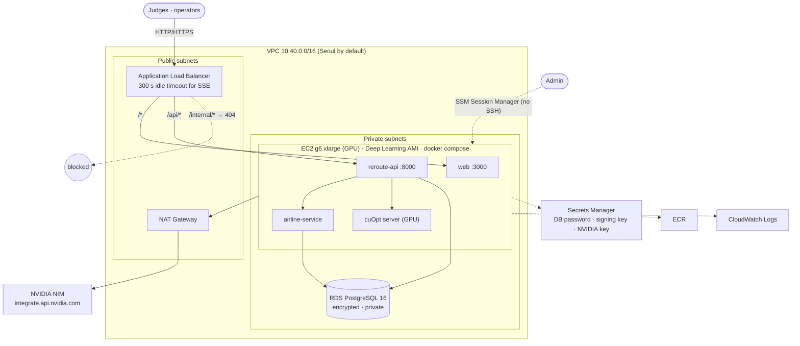

```bash
cd infra/terraform && cp terraform.tfvars.example terraform.tfvars
terraform init && terraform apply -target=aws_ecr_repository.repo   # 1) registries first
cd ../.. && make push                                               # 2) build & push images
aws secretsmanager put-secret-value --secret-id "$(cd infra/terraform && terraform output -raw nvidia_api_key_secret_arn)" \
  --secret-string 'nvapi-...'                                       # 3) NVIDIA key (before step 4)
cd infra/terraform && terraform apply && terraform output url       # 4) everything else, then the URL
```

> ⚠️ Before deploying: **GPU instance quota** (often 0 on new accounts), **g6 availability in your region** (else `g5.xlarge`),
> **register the NVIDIA key before the host is created**. Run `terraform destroy` after the demo. `enable_gpu = false` gives a
> cheaper CPU-only setup. Terraform passes `terraform validate`; it has not been applied yet.

## Security

Two boundaries, never confused:

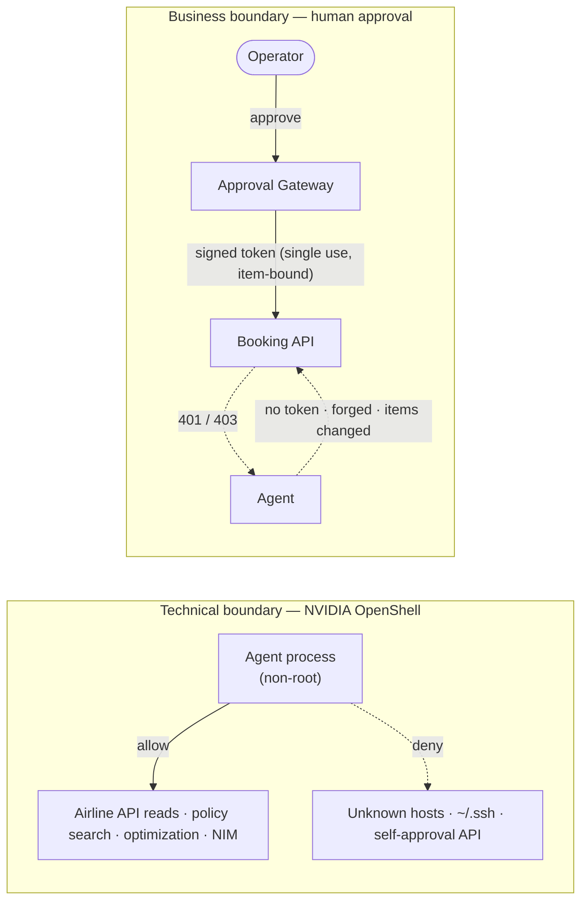

| | Technical boundary — **OpenShell** | Business boundary — **human approval** |
|---|---|---|
| Question | *Can this process reach that endpoint / file?* | *Has an accountable person authorised this change?* |
| Mechanism | [`reroute-agent.yaml`](nvidia/openshell/policies/reroute-agent.yaml): deny-by-default egress, L7 method/path rules, `deny_rules` on approval endpoints, filesystem allow-list, non-root | Approval Gateway (`PENDING → APPROVED/REJECTED/EXPIRED`, TTL) mints an HMAC token bound to plan, approval and **item digest** — single use, 5-min expiry |
| Enforced by | OpenShell (sandbox mode) / in-process mirror of the same YAML (demo mode, labelled) | Backend: the gateway **and**, independently, the Booking API — not the UI |

- No approval → `execute` returns 403 and is audited; the Booking API rejects writes without a token (401), with a forged token (403) or with items different from what was approved (403).
- Operators must present a human identity; agent identities cannot approve.
- Audit fields: `timestamp · agent · tool · target · action · policy · result · enforced_by`, including real OpenShell decisions via `POST /api/audit/openshell` ([ingest script](nvidia/openshell/scripts/ingest-logs.sh)).
- Credentials only via environment / Secrets Manager; `.env` is git-ignored; only `.env.example` is committed.

## Optimization

```
x[p,f,c] ∈ {0,1}  passenger p on flight f in cabin c        y[p] ∈ {0,1}  unassigned
C1  Σ_f,c x[p,f,c] + y[p] = 1                one outcome per passenger
C2  Σ_p x[p,f,c] ≤ seats[f,c]                cabin capacity
C3  business keeps business when possible    downgrade penalty × tier × VIP
C4  onward_departure − arrival(f) ≥ MCT      (MCT-002, retrieved)
C5  destination(f) = original destination    (IROP-005 co-terminal)
C6  carrier / window / flight status allowed (IROP-002, IROP-003)
min Σ delay·tier + VIP delay + downgrade + connection risk + rebooking cost + 100 000·y
```

- Constraint parameters are **compiled from retrieved policy documents** (`policy-params` blocks). If a required policy was not retrieved, a conservative default applies and the gap is reported — never filled from LLM memory.
- Weights live in [`config/optimization.yaml`](config/optimization.yaml) (`delay_weight`, `vip_delay_weight`, `downgrade_weight`, `connection_risk_weight`, `unassigned_weight`, …).
- `OptimizationProvider` → `CuOptOptimizationProvider` (cuOpt server REST) | `FallbackOptimizationProvider` (HiGHS).
- Per-passenger output: original/alternative flight, original/new cabin, delay, penalty breakdown, objective contribution, status, reason, policy IDs. Try the exact model on a cuOpt server: [`nvidia/cuopt/ke123-milp.json`](nvidia/cuopt/).

## Screenshots

| | |
|---|---|
| 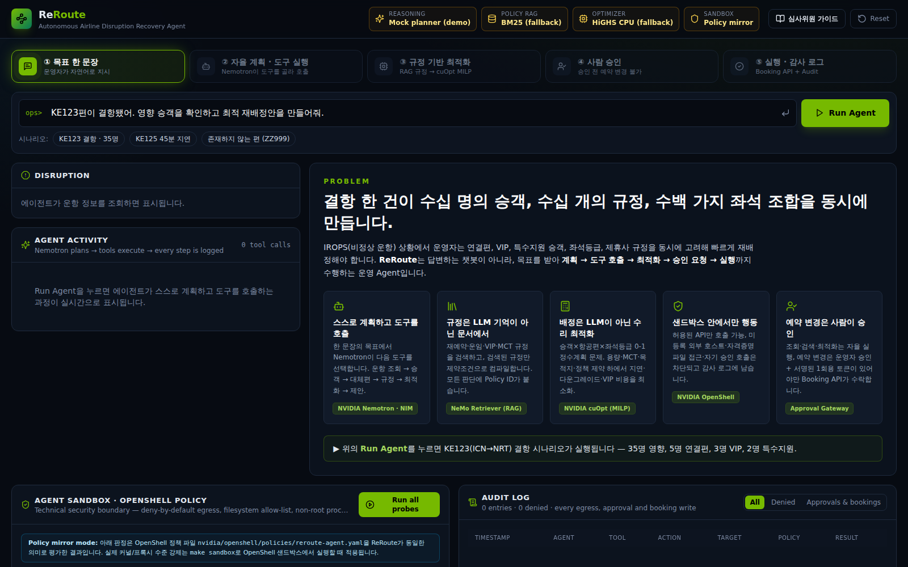 Problem & pillars | 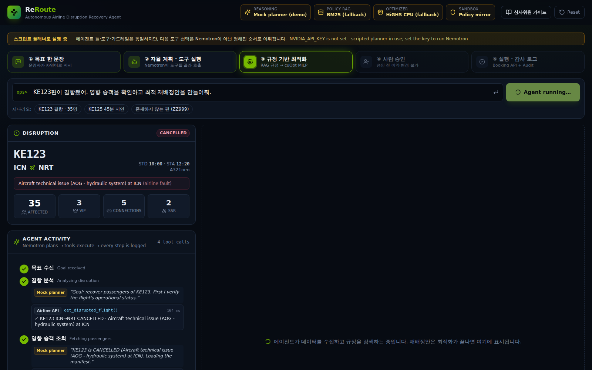 Agent running — live tool timeline |
| 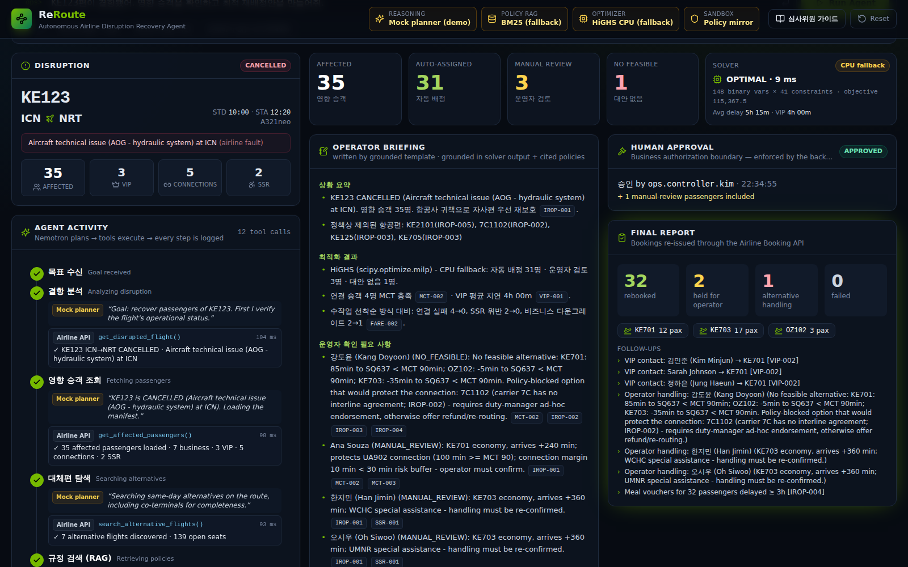 Approved → executed, final report | 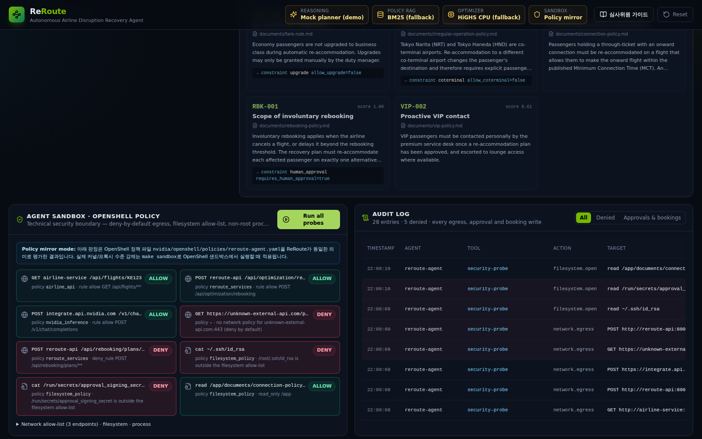 OpenShell probes & audit log |
| 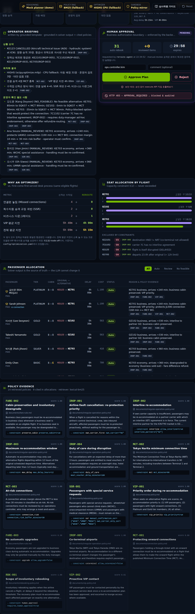 Execute without approval → 403 | 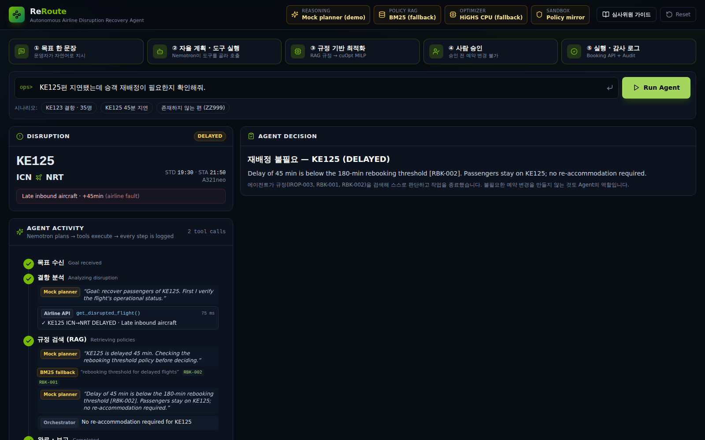 KE125 delay: agent decides no action |

Full-page views: [plan](docs/screenshots/03b-plan-full.png) · [completed](docs/screenshots/05b-completed-full.png) · [judge guide](docs/screenshots/08-guide.png)

## Repository layout

```
apps/api      FastAPI: mock airline API, agent (orchestrator, tools, LLM adapters), RAG, optimization,
              approval gateway, audit, OpenShell policy mirror, worker — 84 tests
apps/web      Next.js + TypeScript + Tailwind operations dashboard and judge guide
documents     airline policy corpus (IROP, RBK, SSR, FARE, VIP, MCT) with machine-readable params
data/seed     KE123 scenario: 9 flights, 35 passengers
config        optimization weights
nvidia        openshell · nemoclaw · cuopt · skills
infra         terraform (AWS)
docs          architecture · demo scenario · NVIDIA integration · screenshots
tests/e2e     smoke test of the MVP definition of done
```

## Quality

- 84 backend tests: flight / passenger lookup, policy retrieval & provenance, every optimization constraint (C1–C6), weights, cuOpt REST contract, approval required, unauthorized execution blocked, token tampering, expiry, successful rebooking, OpenShell policy schema & decisions, NIM request contract & fallback, DB-less remote worker over real HTTP, schema migration.
- End-to-end smoke test (`tests/e2e/smoke.sh`) and a Playwright walkthrough of the dashboard.
- CI: lint, tests + smoke on PostgreSQL, web typecheck/build, `terraform validate`, Docker builds.

## Future work

- Hub-wide IROPS: re-optimize many disrupted flights in one cuOpt model (the GPU advantage grows with scale).
- Crew and aircraft rotation recovery as additional cuOpt models; passenger notifications (SMS / app).
- NeMo Guardrails for conversational policy; NeMo Evaluator for planner regression tests.
- OIDC operator identity with approval limits by plan size / cost; Alembic migrations; ECS/EKS GPU node groups.
- Live GDS/PSS integration behind the existing airline API adapter.

---

Demo data and policies are fictional. "KE", "OZ", "7C" are used only as illustrative carrier codes.
