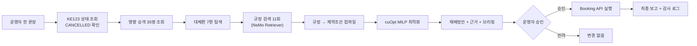
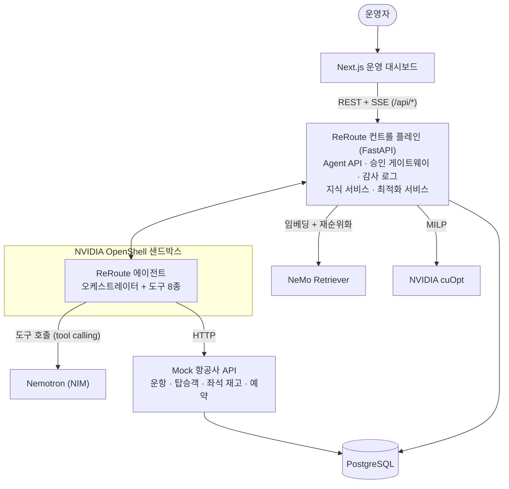
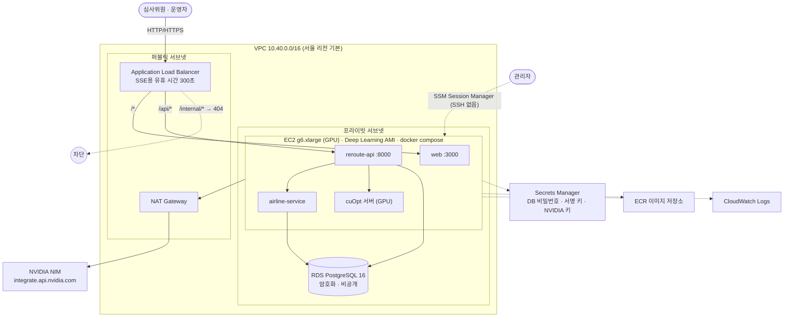
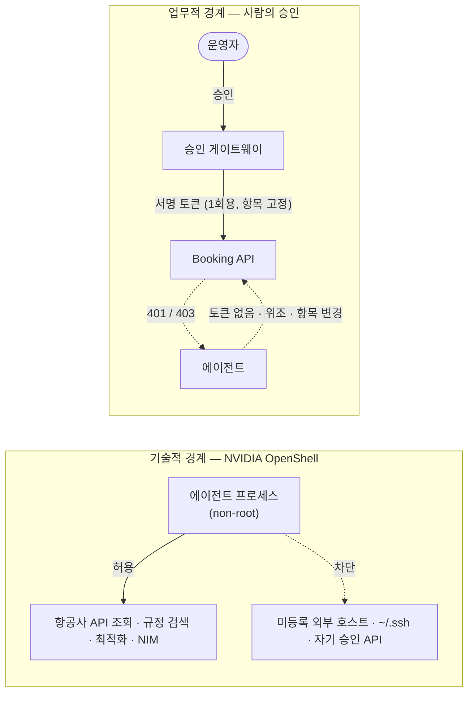

# ReRoute — 자율 항공 비정상운항 복구 에이전트

**🇰🇷 한국어** · [🇺🇸 English](README.en.md)

**ReRoute: Autonomous Airline Disruption Recovery Agent** · NVIDIA Korea Agentic AI Hackathon 출품작

> 운영자가 한 문장을 입력합니다 — *"KE123편이 결항됐어. 영향 승객을 확인하고 최적 재배정안을 만들어줘."*
> ReRoute 에이전트가 스스로 계획을 세우고, 도구를 호출하고, 항공사 규정을 검색하고, NVIDIA cuOpt로 최적 재배정을 계산한 뒤,
> **운영자 승인을 받아** 실제 예약을 변경하고 감사 로그를 남깁니다.

| 핵심 원칙 | |
|---|---|
| **"LLM does not decide passenger allocation."** | LLM은 승객 배정을 결정하지 않습니다. 에이전트는 문제를 정식화하고 규정을 검색하며, 제약이 있는 배정은 **NVIDIA cuOpt**에 위임합니다. |
| **"Read-only actions can execute autonomously, while state-changing booking actions require human approval."** | 조회·검색·최적화는 자율 실행하고, 예약 변경은 반드시 사람의 승인을 거칩니다. |
| **"Governed by NVIDIA OpenShell."** | 에이전트는 OpenShell 정책 안에서만 동작합니다. 허용되지 않은 외부 통신·자격증명 접근·자기 승인 호출은 모두 차단됩니다. |


| 바로가기 | |
|---|---|
| 🎬 명령 한 줄로 데모 | `docker compose up --build` → http://localhost:3000 → **Run Agent** |
| 📖 심사위원 3분 가이드 | http://localhost:3000/guide · [발표 대본 (영문)](docs/demo-scenario.md) |
| 🤖 에이전트 구조와 동작 (그림 7종) | [docs/agent.md](docs/agent.md) · [English](docs/agent.en.md) |
| 🧭 시스템 아키텍처 (Mermaid 다이어그램 7종) | [docs/architecture.md](docs/architecture.md) · [English](docs/architecture.en.md) |
| 🟩 NVIDIA 연동 방식과 검증 수준 | [docs/nvidia-integration.md (영문)](docs/nvidia-integration.md) · [nvidia/](nvidia/) |
| ☁️ AWS 배포 (Terraform) | [infra/terraform/README.md](infra/terraform/README.md) · [English](infra/terraform/README.en.md) · 아래 [AWS 배포](#aws-배포) 절 |

---

## 목차
1. [문제](#문제) · 2. [해결책](#해결책) · 3. [왜 Agentic AI인가](#왜-agentic-ai인가) · 4. [왜 NVIDIA인가](#왜-nvidia인가)
5. [아키텍처](#아키텍처) · [LLM 에이전트 동작 방식](#llm-에이전트-동작-방식) · 6. [NVIDIA 스택과 실행 모드](#nvidia-스택과-실행-모드) · 7. [데모](#데모) · 8. [시작하기](#시작하기)
9. [AWS 배포](#aws-배포) · 10. [보안](#보안) · 11. [최적화 모델](#최적화-모델) · 12. [화면](#화면) · 13. [향후 계획](#향후-계획)

---

## 문제

결항 한 건은 수십 명의 승객, 수십 개의 규정, 수백 가지 좌석 조합을 동시에 만듭니다. IROPS(비정상 운항) 상황에서
운영자는 **연결편 최소 환승시간(MCT), VIP, 특수지원 승객(휠체어·비동반 소아), 좌석등급, 제휴사 협정, 재보호 시간 한도**를
동시에 지키며 제한된 좌석에 빠르게 재배정해야 합니다.

- 시간 압박 속의 **선착순(FCFS) 수작업**은 연결편 놓침과 규정 위반을 만듭니다.
- **LLM 챗봇**은 규정을 지어내거나, 좌석 제약을 어긴 배정을 "그럴듯하게" 제안할 수 있습니다.

## 해결책

ReRoute는 답변하는 챗봇이 아니라 **업무를 계획하고 도구를 사용해 실제 행동까지 수행하는 운영 에이전트**입니다.



KE123 데모 결과 (cuOpt와 CPU 대체 solver가 **동일한 MILP**를 풀어 같은 최적해 115,367.5를 냅니다):

| 영향 승객 | 자동 배정 | 운영자 검토 | 대안 없음 |
|---:|---:|---:|---:|
| **35** | **31** | **3** (특수지원 2, 환승 여유 부족 1) | **1** (MCT 불충족 — 유일한 대안 7C1102는 IROP-002로 차단되어 운영자 판단 요청) |

같은 허용 항공편에서 선착순 수작업과 비교하면 **연결편 놓침 4 → 0, 특수지원 규정 위반 2 → 0, 비즈니스 다운그레이드 2 → 1,
VIP 평균 지연 5시간 40분 → 4시간**입니다. 전체 평균 지연은 6분 늘어나는데, 연결편과 VIP를 보호하기 위한 **의도된 trade-off**이며
화면에 그대로 표시합니다.

## 왜 Agentic AI인가

고정 스크립트로는 처리할 수 없는, **상황에 따라 경로가 달라지는** 업무이기 때문입니다.

| 상황 | 에이전트의 행동 |
|---|---|
| KE123 결항 | 전체 재배정 워크플로 수행 → 승인 요청 |
| KE125 45분 지연 | 규정 RBK-002(180분 기준)를 **스스로 검색**해 "재배정 불필요"로 종료 — 불필요한 예약 변경을 만들지 않음 |
| ZZ999 (존재하지 않는 편) | 추측하지 않고 실패를 명확히 보고 |
| 필수 규정 없이 최적화 시도 | 가드레일이 도구 호출을 막고 "MCT 규정을 먼저 검색하라"고 되돌려 줌 |
| Nemotron 엔드포인트 장애 | 결정론적 플래너로 전환하고, 그 사실을 이벤트 로그에 기록 |

## 왜 NVIDIA인가

각 기술은 LLM 에이전트의 **서로 다른 실패 모드**를 막습니다.

| NVIDIA 기술 | ReRoute에서의 역할 | 막는 실패 모드 |
|---|---|---|
| **Nemotron · NIM** | 목표 해석, 계획, 도구 선택(function calling), 예외 설명 | 경직된 스크립트 |
| **NeMo Retriever** (RAG) | 재예약·운임·VIP·MCT·IROPS 규정 검색, 정책 ID·문서·점수 출처 제공 | 지어낸 규정 |
| **cuOpt** | 승객×항공편×좌석등급 0-1 MILP로 최종 배정 계산 (결과의 기준값) | LLM의 임의 배정·제약 위반 |
| **OpenShell** | 에이전트 샌드박스: 외부 통신·L7 규칙·파일시스템·프로세스·자격증명 격리 | 과도한 권한·데이터 유출 |
| **NemoClaw** | 운영자 코파일럿의 통제된 실행 환경 (정책 프리셋 + 스킬) | 통제 없는 상시 에이전트 |
| **NVIDIA Skills** | `cuopt-numerical-optimization-formulation`, `cuopt-server-api-python`, `nemo-retriever` 규약을 따라 구현 | 추측한 API |

> NVIDIA API는 추측하지 않았습니다. NIM·cuOpt·OpenShell·NemoClaw·Retriever 인터페이스는 NVIDIA 공식 저장소의 문서 원본과
> NVIDIA skills 카탈로그에서 확인했습니다. 기술별 검증 수준(실행 검증 / 계약 테스트 / 문서 기반)은
> [docs/nvidia-integration.md](docs/nvidia-integration.md)에 정리했습니다.

## 아키텍처



- 에이전트는 DB에 직접 SQL을 실행하지 않습니다. 모든 도메인 행동은 명시적인 도구 → HTTP API를 거칩니다.
- 도구 인자는 **데이터가 아니라 핸들**(편명, 검색어)입니다. 승객 35명의 데이터가 LLM을 거치지 않으므로 LLM이 배정을 바꿀 수 없습니다.
- `AGENT_EXECUTION=remote`로 두면 에이전트는 **DB 접속 정보도, 승인 서명 키도 없는** 별도 worker 프로세스로 실행됩니다. 이 worker가 OpenShell 샌드박스에서 돌아가는 대상입니다.

**도구:** `get_disrupted_flight` · `get_affected_passengers` · `search_alternative_flights` · `search_rebooking_policy` ·
`optimize_rebooking` · `explore_exception_options` · `propose_rebooking` · `execute_rebooking` *(승인 필요)*

**상태 머신:** `RECEIVED → ANALYZING_DISRUPTION → FETCHING_PASSENGERS → SEARCHING_ALTERNATIVES → RETRIEVING_POLICIES →
OPTIMIZING → GENERATING_PROPOSAL → WAITING_APPROVAL → EXECUTING → COMPLETED` (+ `REJECTED`, `FAILED`).
모든 상태 변경은 DB에 저장되고 SSE로 화면에 실시간 전달됩니다. 상세 다이어그램(상태도·시퀀스·보안 경계·승인 흐름·최적화 흐름·배포)은
[docs/architecture.md](docs/architecture.md)에 있습니다.

## LLM 에이전트 동작 방식

> 그림으로 보기: [docs/agent.md](docs/agent.md) — 에이전트 구조, 루프, 실행 순서, 역할 분리, 복구 경로

기본값 `LLM_PROVIDER=auto`에서는 NVIDIA 키가 있으면 **Nemotron이 매 단계 다음 도구를 직접 고릅니다**. 정해진 순서는 없습니다.

| 설계 요소 | 역할 |
|---|---|
| 계획 먼저 | 첫 응답에서 3~6단계 계획을 세우고, 매 도구 호출 전에 운영자의 언어로 짧은 추론을 남깁니다 (타임라인에 표시) |
| 도구 피드백 | 규정 검색 결과에 `coverage`(확보된 규정 / 빠진 규정 / 추천 질의)가 포함되어, 모델이 스스로 추가 검색을 판단합니다 |
| 예외 추론 | 최적화 후 `explore_exception_options`로 예외 승객의 선택지와 차단 사유를 조사하고, 근거 있는 조치를 브리핑에 담습니다 |
| 가드레일 | 잘못된 순서·인자는 오류로 되돌려 모델이 고치게 합니다. 모델이 일찍 멈추면 **다음에 할 일을 구체적으로 안내**합니다 (최대 2회) |
| 견고성 | 텍스트로 온 도구 호출(`<TOOLCALL>` 등) 파싱, `<think>` 분리, 429/5xx 재시도. 끝까지 진행이 안 될 때만 스크립트 플래너가 이어받고 그 사실을 기록합니다 |
| 결정 경계 | 모델은 배정을 바꿀 수 없고(solver가 결정), 예약 변경은 승인 없이 불가능합니다 |

실제 모델 평가: `NVIDIA_API_KEY=nvapi-... make eval-llm` → 시나리오 4개(결항 국문/영문, 지연, 없는 편)를 Nemotron으로 실행하고,
최종 상태 · 사용 도구 · 안내 개입 횟수 · 스크립트 플래너 전환 여부 · solver 결과를 채점합니다.

> 현재 상태: 실제 Nemotron으로 실행한 결과는 아직 없습니다(이 개발 환경에는 키가 없고 NVIDIA 엔드포인트 접속도 막혀 있음).
> 실제 모델의 불완전한 행동(도구 하나씩 호출, 순서 오류, 인자 형식 오류, 중간 멈춤)을 흉내 낸 테스트로 끝까지 완료되는 것은 검증했습니다.

## NVIDIA 스택과 실행 모드

| 환경 변수 | 실제 NVIDIA 모드 | 데모 / 대체(Fallback) 모드 |
|---|---|---|
| `LLM_PROVIDER` | `auto`(기본) / `nvidia` → NIM의 Nemotron (기본 `nvidia/nemotron-3-super-120b-a12b`) | 키가 없을 때만 → 스크립트 플래너 (도구·가드레일은 동일, 화면에 경고 표시) |
| `RETRIEVER_PROVIDER` | `nvidia` → `llama-nemotron-embed-1b-v2` + `llama-nemotron-rerank-1b-v2` | `lexical` → 같은 문서에 대한 BM25 검색 |
| `OPTIMIZATION_PROVIDER` | `cuopt` → cuOpt 서버 (GPU) | `fallback` → HiGHS (CPU), **같은** MILP 객체 |
| `SECURITY_RUNTIME` | `openshell` → OpenShell 샌드박스 안의 에이전트 worker | `policy-mirror` → 같은 정책 YAML을 프로세스 안에서 평가 |

**정직성 원칙:** 대시보드 상단 표시등과 타임라인의 모든 배지는 **실제로 실행된 구현**을 보여줍니다. NVIDIA 서비스는 초록색,
대체 구현은 주황색입니다. 대체 구현을 NVIDIA로 표시하는 일은 없으며, 자동 전환이 일어나면 `GUARDRAIL` 이벤트로 기록합니다.

## 데모

`DEMO_MODE=true`에서는 같은 시드 데이터, 같은 결항 상황, 결정론적 응답을 사용하므로 네트워크 문제로 발표가 깨지지 않습니다.
전체 대본은 [docs/demo-scenario.md](docs/demo-scenario.md)에 있습니다.

1. **Run Agent** → 도구 호출이 배지와 함께 실시간 타임라인으로 표시
2. KPI 35 / 31 / 3 / 1, 선착순 대비 비교표, 항공편별 좌석 배정, 제외된 항공편과 제외 근거 규정
3. 배정표: 승객별 사유와 정책 칩 → 마우스를 올리면 해당 규정 근거 카드가 강조
4. **"승인 없이 execute API 직접 호출"** → `HTTP 403 APPROVAL_REQUIRED`, 감사 로그에 기록
5. **Approve** (검토 대상 승객 선택 포함 가능) → 실행 → 최종 보고, 실제 좌석 재고 변화
6. **Run all probes** → OpenShell 정책 판정: 미등록 외부 호스트, 자기 승인 호출, `~/.ssh/id_rsa`, 비밀값 접근 모두 차단
7. 시나리오 **KE125 45분 지연** → 에이전트가 RBK-002를 찾아 "조치 불필요"로 종료

## 시작하기

### Docker (권장)

```bash
cp .env.example .env            # 선택 사항 — 기본값만으로 API 키 없이 전체 데모가 동작합니다
docker compose up --build
open http://localhost:3000      # API 문서: http://localhost:8000/docs
./tests/e2e/smoke.sh            # MVP 흐름 전체를 자동 점검
```

- **실제 NVIDIA 모드:** `NVIDIA_API_KEY`(build.nvidia.com), `LLM_PROVIDER=nvidia`, `RETRIEVER_PROVIDER=nvidia`.
  GPU 서버에서는 `OPTIMIZATION_PROVIDER=cuopt`로 두고 `docker compose --profile gpu up --build`.
- **에이전트를 별도 worker로 실행:** `AGENT_EXECUTION=remote`, `AGENT_WORKER_TOKEN=...`, `docker compose --profile worker up`.
  OpenShell 샌드박스 안에서 실행하려면 `make sandbox` ([nvidia/openshell](nvidia/openshell)).

### 로컬 개발

```bash
make install                    # uv 가상환경(Python 3.12) + npm ci
make test                       # 백엔드 테스트 84개
DATABASE_URL=sqlite:///./reroute.db make dev-api    # 또는 로컬 PostgreSQL
make dev-web                    # http://localhost:3000 (/api는 :8000으로 프록시)
```

## AWS 배포

Terraform으로 AWS에 한 번에 배포합니다. 상세 절차와 체크리스트는 [infra/terraform/README.md](infra/terraform/README.md)에 있습니다.



```bash
cd infra/terraform && cp terraform.tfvars.example terraform.tfvars
terraform init && terraform apply -target=aws_ecr_repository.repo   # 1) 이미지 저장소 먼저
cd ../.. && make push                                               # 2) 이미지 빌드·업로드
aws secretsmanager put-secret-value --secret-id "$(cd infra/terraform && terraform output -raw nvidia_api_key_secret_arn)" \
  --secret-string 'nvapi-...'                                       # 3) NVIDIA 키 등록 (4번보다 먼저)
cd infra/terraform && terraform apply && terraform output url       # 4) 전체 생성 후 접속 주소 확인
```

> ⚠️ 배포 전 확인: **GPU 인스턴스 할당량**(새 계정은 0인 경우가 많음), **서울 리전의 g6 제공 여부**(없으면 `g5.xlarge`),
> **NVIDIA 키는 서버 생성 전에 등록**. 시연 후에는 `terraform destroy`. `enable_gpu = false`로 두면 CPU 전용의 저렴한 구성입니다.
> Terraform은 `terraform validate`까지 통과했고, 실제 `apply`는 아직 해 보지 않았습니다.

## 보안

두 개의 경계를 절대 섞지 않습니다.



| | 기술적 경계 — **OpenShell** | 업무적 경계 — **사람의 승인** |
|---|---|---|
| 질문 | *이 프로세스가 이 엔드포인트·파일에 접근해도 되는가?* | *책임 있는 사람이 이 변경을 승인했는가?* |
| 방식 | [`reroute-agent.yaml`](nvidia/openshell/policies/reroute-agent.yaml): 기본 차단 egress, L7 메서드·경로 규칙, 승인 엔드포인트 `deny_rules`, 파일시스템 허용 목록, non-root | 승인 게이트웨이(`PENDING → APPROVED/REJECTED/EXPIRED`, 유효시간)가 계획·승인·**승객 목록 해시**에 묶인 HMAC 토큰 발급 — 1회용, 5분 만료 |
| 강제 주체 | OpenShell(샌드박스 모드) / 같은 YAML의 프로세스 내 평가(데모 모드, 화면에 명시) | 백엔드: 게이트웨이 **그리고** Booking API가 각각 독립 검증 (UI 버튼 차단이 아님) |

- 승인 없이 실행하면 403이 반환되고 감사 로그에 남습니다. Booking API는 토큰이 없으면 401, 위조되었거나 승인된 목록과 다르면 403으로 거부합니다.
- 승인은 사람 운영자 신원으로만 가능하며, 에이전트 신원으로는 승인할 수 없습니다.
- 감사 로그 필드: `timestamp · agent · tool · target · action · policy · result · enforced_by`. 실제 OpenShell의 판정 로그도
  `POST /api/audit/openshell`로 가져올 수 있습니다([수집 스크립트](nvidia/openshell/scripts/ingest-logs.sh)).
- 자격증명은 환경 변수 / Secrets Manager로만 다룹니다. `.env`는 git에서 제외되며 `.env.example`만 커밋합니다.

## 최적화 모델

```
x[p,f,c] ∈ {0,1}  승객 p를 항공편 f의 좌석등급 c에 배정        y[p] ∈ {0,1}  미배정
C1  Σ_f,c x[p,f,c] + y[p] = 1                승객마다 결과는 정확히 하나
C2  Σ_p x[p,f,c] ≤ seats[f,c]                좌석등급별 잔여 좌석
C3  비즈니스는 가능하면 비즈니스 유지         다운그레이드 벌점 × 등급 × VIP
C4  후속편 출발 − 도착(f) ≥ MCT               (MCT-002, 검색된 규정)
C5  도착지(f) = 원래 도착지                   (IROP-005 공동 도시 공항)
C6  항공사·시간 한도·운항 상태가 규정상 허용   (IROP-002, IROP-003)
최소화: Σ 지연×등급 + VIP 지연 + 다운그레이드 + 환승 위험 + 재발권 비용 + 100,000×미배정
```

- 제약 파라미터는 **검색된 규정 문서의 `policy-params` 블록에서 컴파일**합니다. 필요한 규정이 검색되지 않으면 보수적인 기본값을 쓰고
  누락 사실을 보고합니다. LLM의 기억으로 채우지 않습니다.
- 가중치는 [`config/optimization.yaml`](config/optimization.yaml)에서 조정합니다 (`delay_weight`, `vip_delay_weight`,
  `downgrade_weight`, `connection_risk_weight`, `unassigned_weight` 등).
- `OptimizationProvider` → `CuOptOptimizationProvider`(cuOpt 서버 REST) | `FallbackOptimizationProvider`(HiGHS).
- 승객별 출력: 원 항공편/대체편, 원 좌석/새 좌석, 지연, 벌점 내역, 목적함수 기여도, 상태, 사유, 정책 ID.
  같은 모델을 cuOpt 서버에 직접 보내볼 수 있습니다: [`nvidia/cuopt/ke123-milp.json`](nvidia/cuopt/).

## 화면

| | |
|---|---|
|  문제 정의와 5가지 핵심 |  에이전트 실행 — 실시간 도구 타임라인 |
|  승인 → 실행, 최종 보고 |  OpenShell 정책 판정과 감사 로그 |
|  승인 없이 실행 → 403 |  KE125 지연: 에이전트가 조치 불필요로 판단 |

전체 화면: [재배정안](docs/screenshots/03b-plan-full.png) · [완료](docs/screenshots/05b-completed-full.png) · [심사위원 가이드](docs/screenshots/08-guide.png)

## 저장소 구조

```
apps/api      FastAPI: Mock 항공사 API, 에이전트(오케스트레이터·도구·LLM 어댑터), RAG, 최적화,
              승인 게이트웨이, 감사 로그, OpenShell 정책 평가, worker — 테스트 84개
apps/web      Next.js + TypeScript + Tailwind 운영 대시보드와 심사위원 가이드
documents     항공사 규정 문서 (IROP, RBK, SSR, FARE, VIP, MCT) + 기계가 읽는 파라미터
data/seed     KE123 시나리오: 항공편 9편, 승객 35명
config        최적화 가중치
nvidia        openshell · nemoclaw · cuopt · skills
infra         terraform (AWS)
docs          아키텍처 · 데모 시나리오 · NVIDIA 연동 · 화면 캡처
tests/e2e     MVP 완료 기준 자동 점검
```

## 품질

- 백엔드 테스트 84개: 운항·승객 조회, 규정 검색과 출처, 최적화 제약 C1–C6 전부, 가중치, cuOpt REST 형식,
  승인 필수, 무단 실행 차단, 토큰 변조, 승인 만료, 재배정 성공, OpenShell 정책 스키마와 판정, NIM 요청 형식과 장애 시 전환,
  DB 없는 원격 worker(실제 HTTP), 스키마 마이그레이션.
- 전체 흐름 자동 점검(`tests/e2e/smoke.sh`)과 Playwright 브라우저 시연.
- CI: 코드 검사, PostgreSQL에서 테스트와 자동 점검, 웹 타입 검사·빌드, `terraform validate`, Docker 이미지 빌드.

## 향후 계획

- 허브 단위 IROPS: 여러 결항편을 하나의 cuOpt 모델로 동시 재최적화 (규모가 커질수록 GPU 이점 증가)
- 승무원·기재 로테이션 복구를 추가 cuOpt 모델로 확장, 승객 알림(SMS / 앱) 연동
- 대화형 정책에 NeMo Guardrails, 플래너 회귀 테스트에 NeMo Evaluator 적용
- OIDC 기반 운영자 인증과 금액·규모별 승인 한도, Alembic 마이그레이션, ECS/EKS GPU 노드 그룹
- 실제 GDS/PSS 연동 (기존 항공사 API 어댑터 뒤에 교체)

---

데모 데이터와 규정은 가상입니다. "KE", "OZ", "7C"는 예시용 항공사 코드로만 사용했습니다.
