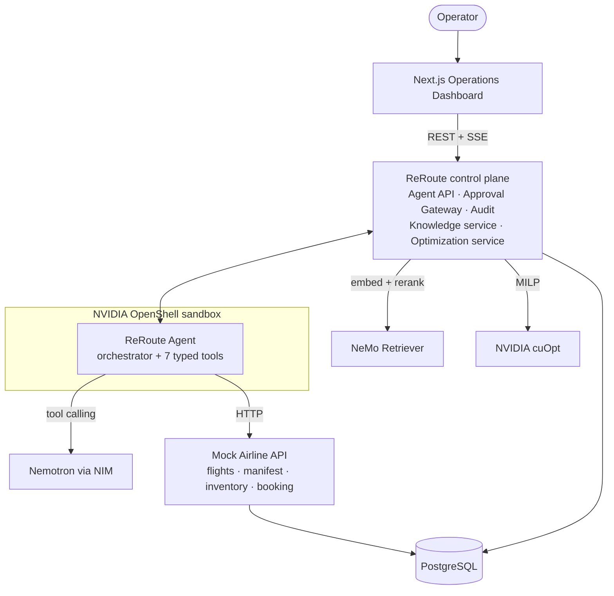

# ReRoute

**Autonomous Airline Disruption Recovery Agent** — NVIDIA Korea Agentic AI Hackathon

> 운영자가 한 문장을 입력하면 — *"KE123편이 결항됐어. 영향 승객을 확인하고 최적 재배정안을 만들어줘."* —
> ReRoute Agent가 스스로 계획을 세우고, 도구를 호출하고, 항공사 규정을 검색하고, NVIDIA cuOpt로 최적 재배정을 계산한 뒤,
> **운영자 승인을 받아** 실제 예약을 변경하고 감사 로그를 남깁니다.

- **LLM does not decide passenger allocation.** The Agent formulates the recovery task, retrieves airline
  policies, and delegates constrained allocation to **NVIDIA cuOpt**.
- **Read-only actions can execute autonomously, while state-changing booking actions require human approval.**
- The agent runs under an **NVIDIA OpenShell** policy: deny-by-default egress, no credential access, and it can
  never call the approval endpoints itself.


| | |
|---|---|
| 🎬 Demo in 1 command | `docker compose up --build` → http://localhost:3000 → **Run Agent** |
| 📖 3-minute judge guide | http://localhost:3000/guide · [docs/demo-scenario.md](docs/demo-scenario.md) |
| 🧭 Architecture (6 Mermaid diagrams) | [docs/architecture.md](docs/architecture.md) |
| 🟩 NVIDIA integration & verification status | [docs/nvidia-integration.md](docs/nvidia-integration.md) · [nvidia/](nvidia/) |
| ☁️ AWS deployment (Terraform) | [infra/terraform](infra/terraform) |

---

## Problem

결항 한 건은 수십 명의 승객, 수십 개의 규정, 수백 가지 좌석 조합을 동시에 만듭니다. IROPS(비정상 운항) 상황에서
운영자는 **연결편 MCT, VIP, 특수지원 승객(휠체어·비동반 소아), 좌석등급, 제휴사 협정, 재보호 시간 한도**를 동시에 지키며
제한된 좌석에 빠르게 재배정해야 합니다. 시간 압박 속의 선착순(FCFS) 수작업은 연결편 놓침과 규정 위반을 만들고,
LLM 챗봇은 규정을 지어내거나 좌석 제약을 어긴 배정을 "그럴듯하게" 제안할 수 있습니다.

## Solution

ReRoute는 답변하는 챗봇이 아니라 **업무를 계획하고 Tool을 사용해 Action까지 수행하는 운영 Agent**입니다.

```
KE123 상태 조회 → CANCELLED 확인 → 영향 승객 35명 조회 → 대체편 7편 탐색 → 규정 검색 11회(RAG)
→ 검색된 규정을 제약조건으로 컴파일 → NVIDIA cuOpt MILP 최적화 → 재배정안 + 근거 + 브리핑
→ 운영자 승인 요청 → [사람 승인] → Booking API 실행 → 최종 보고 + Audit Log
```

KE123 데모 결과 (cuOpt와 CPU 폴백이 동일한 MILP를 풀어 동일한 최적해 115,367.5):

| Affected | Auto-assigned | Manual review | No feasible |
|---:|---:|---:|---:|
| **35** | **31** | **3** (SSR 2, at-risk connection 1) | **1** (MCT 불충족; 유일한 대안 7C1102는 IROP-002로 차단 → 운영자 판단 요청) |

동일한 허용 항공편에서 선착순 수작업 대비: **연결편 놓침 4 → 0, SSR 규정 위반 2 → 0, 비즈니스 다운그레이드 2 → 1,
VIP 평균 지연 5h40m → 4h00m.** (전체 평균 지연은 +6분 — 연결편·VIP 보호를 위한 의도된 trade-off로 UI에 그대로 표시합니다.)

## Why Agentic AI?

고정 스크립트가 아니라 **상황에 따라 경로가 달라지는** 업무이기 때문입니다.

| 상황 | Agent의 행동 |
|---|---|
| KE123 결항 | 전체 재배정 워크플로 수행 → 승인 요청 |
| KE125 45분 지연 | 규정 RBK-002(180분 기준)를 **스스로 검색**해 "재배정 불필요"로 종료 — 불필요한 예약 변경을 만들지 않음 |
| ZZ999 (존재하지 않는 편) | 추측하지 않고 실패를 명확히 보고 |
| 필수 규정 누락 상태로 최적화 시도 | 가드레일이 도구 호출을 막고 "MCT 규정을 먼저 검색하라"고 되돌려 줌 |
| Nemotron 엔드포인트 장애 | 결정론적 플래너로 전환하고 그 사실을 이벤트 로그에 기록 |

## Why NVIDIA?

각 기술은 서로 다른 **LLM Agent의 실패 모드**를 막습니다.

| NVIDIA | ReRoute에서의 역할 | 막는 실패 모드 |
|---|---|---|
| **Nemotron · NIM** | 목표 해석, 계획, Tool 선택(function calling), 예외 설명 | 경직된 스크립트 |
| **NeMo Retriever** (RAG) | 재예약·운임·VIP·MCT·IROPS 규정 검색, policy id·문서·점수 provenance | 환각된 규정 |
| **cuOpt** | 승객×항공편×좌석등급 0-1 MILP로 최종 배정 계산 (source of truth) | LLM의 임의 배정 · 제약 위반 |
| **OpenShell** | Agent 샌드박스: egress/L7 규칙, 파일시스템, 프로세스, 자격증명 격리 | 과도한 권한 · 데이터 유출 |
| **NemoClaw** | 운영자 Copilot의 governed runtime (policy preset + skill) | 통제 없는 상시 Agent |
| **NVIDIA Skills** | `cuopt-numerical-optimization-formulation`, `cuopt-server-api-python`, `nemo-retriever` 규약을 따라 구현 | 추측된 API |

> NVIDIA API는 추측하지 않았습니다. NIM·cuOpt·OpenShell·NemoClaw·Retriever 인터페이스는 NVIDIA 공식 저장소의 docs 소스와
> NVIDIA skills 카탈로그에서 확인했고, 각 항목의 검증 수준(Verified / Contract-tested / Documented)을
> [docs/nvidia-integration.md](docs/nvidia-integration.md)에 명시했습니다.

## Architecture



- Agent는 DB에 직접 SQL을 실행하지 않습니다. 모든 도메인 액션은 명시적 Tool → HTTP API를 거칩니다.
- Tool 인자는 **데이터가 아닌 핸들**(편명, 질의)입니다. 35명의 승객 데이터가 LLM을 통과하지 않으므로 LLM이 배정을 조작할 수 없습니다.
- `AGENT_EXECUTION=remote`에서 Agent는 **DB 자격증명도, 승인 서명 키도 없는** 별도 worker 프로세스로 실행됩니다(OpenShell 샌드박스 대상).

Tools: `get_disrupted_flight` · `get_affected_passengers` · `search_alternative_flights` · `search_rebooking_policy` ·
`optimize_rebooking` · `propose_rebooking` · `execute_rebooking` *(approval required)*

State machine: `RECEIVED → ANALYZING_DISRUPTION → FETCHING_PASSENGERS → SEARCHING_ALTERNATIVES → RETRIEVING_POLICIES →
OPTIMIZING → GENERATING_PROPOSAL → WAITING_APPROVAL → EXECUTING → COMPLETED` (+ `REJECTED`, `FAILED`) — every
transition is persisted and streamed to the UI over SSE.

## NVIDIA Stack

| Env | Real NVIDIA mode | Demo / Fallback mode |
|---|---|---|
| `LLM_PROVIDER` | `nvidia` → Nemotron via NIM (`nvidia/nemotron-3-super-120b-a12b` default) | `mock` → deterministic scripted planner, same tools & guardrails |
| `RETRIEVER_PROVIDER` | `nvidia` → `llama-nemotron-embed-1b-v2` + `llama-nemotron-rerank-1b-v2` | `lexical` → BM25 over the same documents |
| `OPTIMIZATION_PROVIDER` | `cuopt` → cuOpt server (GPU) | `fallback` → HiGHS (CPU), **same** MILP object |
| `SECURITY_RUNTIME` | `openshell` → agent worker inside an OpenShell sandbox | `policy-mirror` → same policy YAML evaluated in-process |

**Honesty rule:** the dashboard's runtime chips and every timeline badge show the implementation that actually
ran — green for NVIDIA, amber for fallbacks. A fallback is never labelled as NVIDIA; automatic fallbacks are
recorded as `GUARDRAIL` events.

## Demo

`DEMO_MODE=true` gives the same seed, the same disruption, and deterministic responses — a network hiccup cannot
break the presentation. Full script: [docs/demo-scenario.md](docs/demo-scenario.md).

1. **Run Agent** → live timeline of tool calls with component badges
2. KPIs 35 / 31 / 3 / 1, FCFS comparison, seat loads, excluded flights with the policy that excluded them
3. Allocation table with per-passenger reasons and policy chips linked to Policy Evidence cards
4. **"승인 없이 execute API 직접 호출"** → `HTTP 403 APPROVAL_REQUIRED`, audited
5. **Approve** (optionally including reviewed passengers) → execution → Final Report, real inventory change
6. **Run all probes** → OpenShell policy ALLOW/DENY: unknown host, self-approval, `~/.ssh/id_rsa`, secrets
7. Scenario **KE125 45분 지연** → agent finds RBK-002 and stops with "no action required"

## Getting Started

### Docker (recommended)

```bash
cp .env.example .env            # optional - defaults run the full demo without any API key
docker compose up --build
open http://localhost:3000      # API docs: http://localhost:8000/docs
./tests/e2e/smoke.sh            # verifies the whole MVP flow end-to-end
```

Real NVIDIA mode: set `NVIDIA_API_KEY` (build.nvidia.com), `LLM_PROVIDER=nvidia`, `RETRIEVER_PROVIDER=nvidia`;
on a GPU host `OPTIMIZATION_PROVIDER=cuopt` and `docker compose --profile gpu up --build`.
Sandboxed worker: `AGENT_EXECUTION=remote`, `AGENT_WORKER_TOKEN=...`, `docker compose --profile worker up`,
or inside OpenShell: `make sandbox` ([nvidia/openshell](nvidia/openshell)).

### Local development

```bash
make install                    # uv venv (Python 3.12) + npm ci
make test                       # 67 backend tests
DATABASE_URL=sqlite:///./reroute.db make dev-api    # or a local PostgreSQL
make dev-web                    # http://localhost:3000 (proxies /api to :8000)
```

### Cloud (AWS, Terraform)

VPC · ALB (`/internal/*` blocked) · EC2 GPU host (`g6.xlarge`, Deep Learning AMI) running cuOpt + the stack ·
RDS PostgreSQL · ECR · Secrets Manager (NVIDIA key set out-of-band) · SSM-only access · CloudWatch Logs.
See [infra/terraform/README.md](infra/terraform/README.md). `enable_gpu = false` gives a cheaper CPU-only demo.

## Security

Two boundaries, never confused:

| | Technical boundary — **OpenShell** | Business boundary — **Human approval** |
|---|---|---|
| Question | *Can this process reach that endpoint / file?* | *Has an accountable person authorised this change?* |
| Mechanism | [`reroute-agent.yaml`](nvidia/openshell/policies/reroute-agent.yaml): deny-by-default egress, L7 method/path rules, `deny_rules` on approval endpoints, filesystem allow-list, non-root | Approval Gateway (`PENDING → APPROVED/REJECTED/EXPIRED`, TTL) mints an HMAC token bound to plan, approval and **item digest**, single-use, 5-min expiry |
| Enforced by | OpenShell (sandbox mode) / in-process mirror of the same YAML (demo mode, labelled) | Backend: gateway **and** independently the Booking API — not the UI |

- No approval → `execute` returns 403 and is audited; the Booking API rejects writes without a token (401),
  with a forged token (403), or with items different from what was approved (403).
- Operators must present a human identity; agent identities cannot approve.
- Audit log fields: `timestamp · agent · tool · target · action · policy · result · enforced_by` —
  including real OpenShell OCSF decisions via `POST /api/audit/openshell` ([ingest script](nvidia/openshell/scripts/ingest-logs.sh)).
- Credentials only via environment / Secrets Manager; `.env` is git-ignored; only `.env.example` is committed.

## Optimization

```
x[p,f,c] ∈ {0,1}  passenger p on flight f in cabin c        y[p] ∈ {0,1}  unassigned
C1  Σ_f,c x[p,f,c] + y[p] = 1                one outcome per passenger
C2  Σ_p x[p,f,c] ≤ seats[f,c]                cabin capacity
C3  business keeps business when possible    downgrade penalty × tier × VIP
C4  onward_departure − arrival(f) ≥ MCT      (MCT-002, retrieved)
C5  destination(f) = original destination    (IROP-005 co-terminal)
C6  carrier / window / flight status allowed (IROP-002, IROP-003)
min Σ delay·tier + VIP delay + downgrade + connection risk + rebooking cost + 100 000·y
```

- Constraint parameters are **compiled from retrieved policy documents** (`policy-params` blocks); if a required
  policy was not retrieved, a conservative default applies and the gap is reported — never filled from LLM memory.
- Weights live in [`config/optimization.yaml`](config/optimization.yaml) (`delay_weight`, `vip_delay_weight`,
  `downgrade_weight`, `connection_risk_weight`, `unassigned_weight`, …).
- `OptimizationProvider` → `CuOptOptimizationProvider` (cuOpt server REST) | `FallbackOptimizationProvider` (HiGHS).
- Output per passenger: original/alternative flight, original/new cabin, delay, penalty breakdown, objective
  contribution, status, reason, policy IDs. Try the exact model on a cuOpt server:
  [`nvidia/cuopt/ke123-milp.json`](nvidia/cuopt/).

## Screenshots

| | |
|---|---|
|  Problem & pillars |  Agent running — live tool timeline |
|  Approved → executed, final report |  OpenShell probes & audit log |
|  Execute without approval → 403 |  KE125 delay: agent decides no action |

Full-page views: [plan](docs/screenshots/03b-plan-full.png) · [completed](docs/screenshots/05b-completed-full.png) · [judge guide](docs/screenshots/08-guide.png)

## Repository layout

```
apps/api      FastAPI: mock airline API, agent (orchestrator, tools, providers), RAG, optimization,
              approval gateway, audit, OpenShell policy mirror, worker; 67 tests
apps/web      Next.js + TypeScript + Tailwind operations dashboard and judge guide
documents     airline policy corpus (IROP, RBK, SSR, FARE, VIP, MCT) with machine-readable params
data/seed     KE123 scenario: 9 flights, 35 passengers
config        optimization weights
nvidia        openshell · nemoclaw · cuopt · skills
infra         terraform (AWS)
docs          architecture · demo scenario · NVIDIA integration · screenshots
tests/e2e     smoke test of the MVP definition of done
```

## Quality

- 67 backend tests: flight / passenger lookup, policy retrieval & provenance, every optimization constraint
  (C1–C6), weights, cuOpt REST contract, approval required, unauthorized execution blocked, token tampering,
  expiry, successful rebooking, OpenShell policy schema & decisions, NIM request contract & fallback,
  remote DB-less worker over real HTTP, schema migration.
- E2E smoke test (`tests/e2e/smoke.sh`) and a Playwright walkthrough of the dashboard.
- CI: lint, tests + smoke on PostgreSQL, web typecheck/build, `terraform validate`, Docker builds.

## Future Work

- Hub-wide IROPS: re-optimize many disrupted flights in one cuOpt model (the GPU advantage grows with scale).
- Crew and aircraft rotation recovery as additional cuOpt models; passenger notifications (SMS / app).
- NeMo Guardrails for conversational policy; NeMo Evaluator for planner regression tests.
- OIDC operator identity with approval limits by plan size / cost; Alembic migrations; ECS/EKS GPU node groups.
- Live GDS/PSS integration behind the existing Airline API adapter.

---

Demo data and policies are fictional. "KE", "OZ", "7C" are used only as illustrative carrier codes.
