[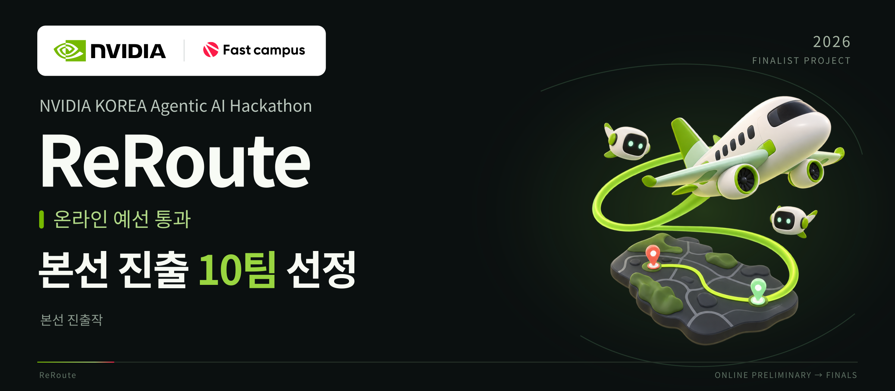](https://fastcampus.co.kr/NVIDIA_hackathon)

**온라인 예선 통과 · 본선 진출 10팀 선정** — [NVIDIA Korea Agentic AI Hackathon](https://fastcampus.co.kr/NVIDIA_hackathon). 본선은 2026년 10월 7일 예정입니다.

# ReRoute — 자율 항공 비정상운항 복구 에이전트

**🇰🇷 한국어** · [🇺🇸 English](README.en.md)

**ReRoute: Autonomous Airline Disruption Recovery Agent** · NVIDIA Korea Agentic AI Hackathon 출품작

> 운영자가 한 문장을 입력합니다 — *"KE123편이 결항됐어. 영향 승객을 확인하고 최적 재배정안을 만들어줘."*
> ReRoute 에이전트가 스스로 계획을 세우고, 도구를 호출하고, 항공사 규정을 검색하고, NVIDIA cuOpt로 최적 재배정을 계산한 뒤,
> **운영자 승인을 받아** 실제 예약을 변경하고 감사 로그를 남깁니다.

| 핵심 원칙 | |
|---|---|
| **"LLM does not decide passenger allocation."** | LLM은 승객 배정을 결정하지 않습니다. 에이전트는 문제를 정식화하고 규정을 검색하며, 제약이 있는 배정은 **NVIDIA cuOpt**에 위임합니다. |
| **"Read-only actions can execute autonomously, while state-changing booking actions require human approval."** | 조회·검색·최적화는 자율 실행하고, 예약 변경은 반드시 사람의 승인을 거칩니다. |
| **"Governed by NVIDIA OpenShell."** | 에이전트는 OpenShell 정책 안에서만 동작합니다. 허용되지 않은 외부 통신·자격증명 접근·자기 승인 호출은 모두 차단됩니다. |

https://github.com/user-attachments/assets/3676a23d-fc44-42bb-8b70-774336f012c3

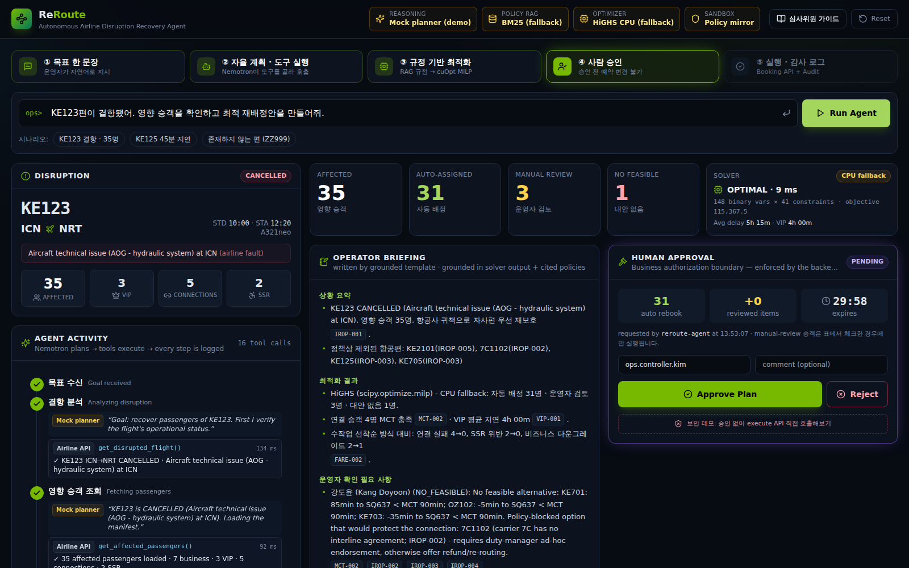

| 바로가기 | |
|---|---|
| 🎬 명령 한 줄로 데모 | `docker compose up --build` → http://localhost:3000 → **Run Agent** |
| 🎞️ 21초 런칭 영상 | [docs/video/reroute-launch.mp4](docs/video/reroute-launch.mp4) — 결항 → 한 문장 지시 → cuOpt 재배정 → 사람 승인 흐름 |
| 📖 심사위원 3분 가이드 | http://localhost:3000/guide · [발표 대본 (영문)](docs/demo-scenario.md) |
| 🤖 에이전트 구조와 동작 (그림 7종) | [docs/agent.md](docs/agent.md) · [English](docs/agent.en.md) |
| 🧸 3D 시스템 구조도 | [아래 아키텍처](#아키텍처) · [원본 PNG](docs/assets/reroute-system-architecture-cute3d.png) |
| 🧭 시스템 아키텍처 (Mermaid 다이어그램 7종) | [docs/architecture.md](docs/architecture.md) · [English](docs/architecture.en.md) |
| 🖥️ GPU 서버에서 LLM 직접 실행 | 아래 [GPU 자체 호스팅 추론](#gpu-자체-호스팅-추론-선택-배포안) — 현재 연동과 추가 설정 구분 |
| 🟩 NVIDIA 연동 방식과 검증 수준 | [docs/nvidia-integration.md (영문)](docs/nvidia-integration.md) · [nvidia/](nvidia/) |
| ☁️ AWS 배포 (Terraform) | [infra/terraform/README.md](infra/terraform/README.md) · [English](infra/terraform/README.en.md) · 아래 [AWS 배포](#aws-배포) 절 |

### 📝 개발기 블로그 — 「LLM이 결정하지 않는 에이전트」 시리즈

이 저장소(ReRoute)를 만들면서 내린 설계 결정을 두 편의 글로 정리했습니다.

| 편 | 글 | 다루는 내용 |
|---|---|---|
| 1편 | [항공 결항 재배정에서 계산과 승인을 분리한 이유](https://hyunolike.tistory.com/73) | LLM은 다음 행동만 고르고 좌석 배정은 cuOpt가 계산하며, 예약 변경은 운영자 승인을 거치도록 역할을 나눈 과정 |
| 2편 | [OpenShell 격리와 OpenClaw MCP 연동](https://hyunolike.tistory.com/74) | 에이전트를 OpenShell 샌드박스로 옮기고 OpenClaw를 MCP로 붙여, 정책이 코드가 아닌 인프라 수준에서 지켜지게 만든 과정 |

---

## 목차
1. [문제](#문제) · 2. [해결책](#해결책) · 3. [왜 Agentic AI인가](#왜-agentic-ai인가) · 4. [왜 NVIDIA인가](#왜-nvidia인가)
5. [아키텍처](#아키텍처) · [LLM 에이전트 동작 방식](#llm-에이전트-동작-방식) · [NemoClaw·OpenClaw 연동](#nemoclaw--openclaw-연동-mcp) · 6. [NVIDIA 스택과 실행 모드](#nvidia-스택과-실행-모드) · 7. [데모](#데모) · 8. [시작하기](#시작하기)
9. [클라우드 배포 구조](#클라우드-배포-구조) · [GPU 자체 호스팅 추론](#gpu-자체-호스팅-추론-선택-배포안) · [AWS 배포](#aws-배포) · 10. [보안](#보안) · 11. [최적화 모델](#최적화-모델) · 12. [화면](#화면) · 13. [향후 계획](#향후-계획)

---

## 문제

결항 한 건은 수십 명의 승객, 수십 개의 규정, 수백 가지 좌석 조합을 동시에 만듭니다. IROPS(비정상 운항) 상황에서
운영자는 **연결편 최소 환승시간(MCT), VIP, 특수지원 승객(휠체어·비동반 소아), 좌석등급, 제휴사 협정, 재보호 시간 한도**를
동시에 지키며 제한된 좌석에 빠르게 재배정해야 합니다.

- 시간 압박 속의 **선착순(FCFS) 수작업**은 연결편 놓침과 규정 위반을 만듭니다.
- **LLM 챗봇**은 규정을 지어내거나, 좌석 제약을 어긴 배정을 "그럴듯하게" 제안할 수 있습니다.

## 해결책

ReRoute는 답변하는 챗봇이 아니라 **업무를 계획하고 도구를 사용해 실제 행동까지 수행하는 운영 에이전트**입니다.

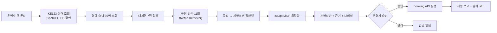
```mermaid
flowchart LR
    A["운영자 한 문장"] --> B["KE123 상태 조회<br/>CANCELLED 확인"]
    B --> C["영향 승객 35명 조회"]
    C --> D["대체편 7편 탐색"]
    D --> E["규정 검색 11회<br/>(NeMo Retriever)"]
    E --> F["규정 → 제약조건 컴파일"]
    F --> G["cuOpt MILP 최적화"]
    G --> H["재배정안 + 근거 + 브리핑"]
    H --> I{"운영자 승인"}
    I -- 승인 --> J["Booking API 실행"]
    I -- 반려 --> K["변경 없음"]
    J --> L["최종 보고 + 감사 로그"]
```

KE123 데모 결과 (cuOpt와 CPU 대체 solver가 **동일한 MILP**를 풀어 같은 최적해 115,367.5를 냅니다):

| 영향 승객 | 자동 배정 | 운영자 검토 | 대안 없음 |
|---:|---:|---:|---:|
| **35** | **31** | **3** (특수지원 2, 환승 여유 부족 1) | **1** (MCT 불충족 — 유일한 대안 7C1102는 IROP-002로 차단되어 운영자 판단 요청) |

같은 허용 항공편에서 선착순 수작업과 비교하면 **연결편 놓침 4 → 0, 특수지원 규정 위반 2 → 0, 비즈니스 다운그레이드 2 → 1,
VIP 평균 지연 5시간 40분 → 4시간**입니다. 전체 평균 지연은 6분 늘어나는데, 연결편과 VIP를 보호하기 위한 **의도된 trade-off**이며
화면에 그대로 표시합니다.

## 왜 Agentic AI인가

고정 스크립트로는 처리할 수 없는, **상황에 따라 경로가 달라지는** 업무이기 때문입니다.

| 상황 | 에이전트의 행동 |
|---|---|
| KE123 결항 | 전체 재배정 워크플로 수행 → 승인 요청 |
| KE125 45분 지연 | 규정 RBK-002(180분 기준)를 **스스로 검색**해 "재배정 불필요"로 종료 — 불필요한 예약 변경을 만들지 않음 |
| ZZ999 (존재하지 않는 편) | 추측하지 않고 실패를 명확히 보고 |
| 필수 규정 없이 최적화 시도 | 가드레일이 도구 호출을 막고 "MCT 규정을 먼저 검색하라"고 되돌려 줌 |
| Nemotron 엔드포인트 장애 | 결정론적 플래너로 전환하고, 그 사실을 이벤트 로그에 기록 |

## 왜 NVIDIA인가

각 기술은 LLM 에이전트의 **서로 다른 실패 모드**를 막습니다.

| NVIDIA 기술 | ReRoute에서의 역할 | 막는 실패 모드 |
|---|---|---|
| **Nemotron · NIM** | 목표 해석, 계획, 도구 선택(function calling), 예외 설명 | 경직된 스크립트 |
| **NeMo Retriever** (RAG) | 재예약·운임·VIP·MCT·IROPS 규정 검색, 정책 ID·문서·점수 출처 제공 | 지어낸 규정 |
| **cuOpt** | 승객×항공편×좌석등급 0-1 MILP로 최종 배정 계산 (결과의 기준값) | LLM의 임의 배정·제약 위반 |
| **OpenShell** | 에이전트 샌드박스: 외부 통신·L7 규칙·파일시스템·프로세스·자격증명 격리 | 과도한 권한·데이터 유출 |
| **NemoClaw · OpenClaw** | OpenClaw가 MCP로 ReRoute 도구를 사용 (NemoClaw가 OpenShell 정책·자격증명 주입 관리) | 통제 없는 상시 에이전트 |
| **NVIDIA Skills** | `cuopt-numerical-optimization-formulation`, `cuopt-server-api-python`, `nemo-retriever` 규약을 따라 구현 | 추측한 API |

> NVIDIA API는 추측하지 않았습니다. NIM·cuOpt·OpenShell·NemoClaw·Retriever 인터페이스는 NVIDIA 공식 저장소의 문서 원본과
> NVIDIA skills 카탈로그에서 확인했습니다. 기술별 검증 수준(실행 검증 / 계약 테스트 / 문서 기반)은
> [docs/nvidia-integration.md](docs/nvidia-integration.md)에 정리했습니다.

## 아키텍처

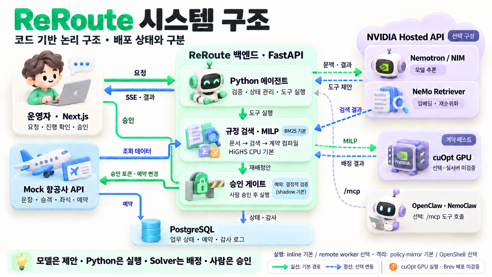

*모델은 제안하고 Python은 실행하며, solver는 배정하고 사람은 승인합니다. 실선은 기본 경로, 점선은 선택 연동입니다. 기본 실행은 inline과 policy-mirror이며, cuOpt GPU 실서버 실행과 Brev 배포는 미검증입니다. GPU에서 LLM을 직접 실행하는 방식은 [GPU 자체 호스팅 추론](#gpu-자체-호스팅-추론-선택-배포안)을 참고하세요.*

아래 Mermaid는 NVIDIA 연동과 원격 worker를 선택한 구조입니다. 키가 없는 기본 `docker compose up --build`는 **inline Python 에이전트 · 스크립트 플래너 · lexical 검색 · HiGHS CPU solver · policy-mirror**로 실행됩니다. 실제 OpenShell worker와 cuOpt GPU 서버는 선택 구성이고, 자체 호스팅 LLM은 아래 [선택 배포안](#gpu-자체-호스팅-추론-선택-배포안)에서 현재 코드와 추가 설정을 구분합니다. 기술별 기존 검증 기록은 [NVIDIA 연동 문서](docs/nvidia-integration.md)에 있습니다.

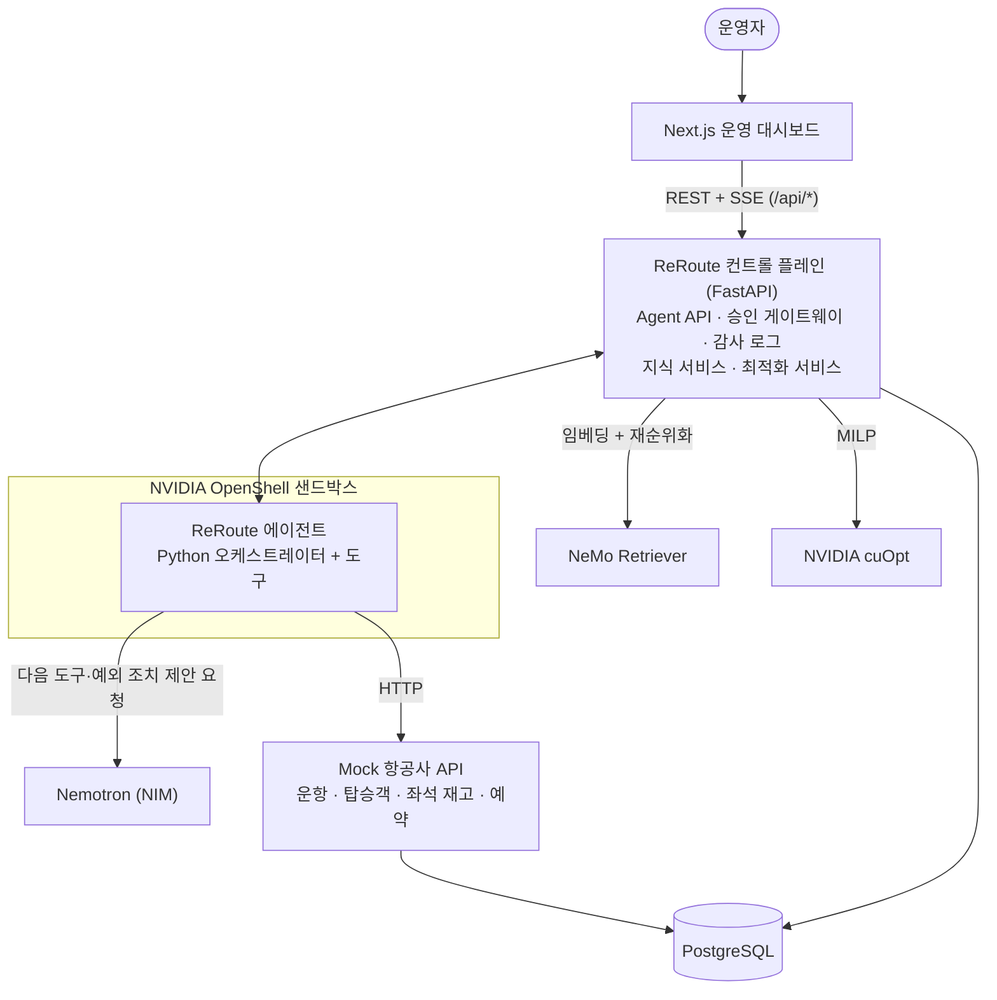
```mermaid
flowchart TB
    op([운영자]) --> web["Next.js 운영 대시보드"]
    web -- "REST + SSE (/api/*)" --> cp["ReRoute 컨트롤 플레인 (FastAPI)<br/>Agent API · 승인 게이트웨이 · 감사 로그<br/>지식 서비스 · 최적화 서비스"]
    subgraph sandbox["NVIDIA OpenShell 샌드박스"]
        agent["ReRoute 에이전트<br/>Python 오케스트레이터 + 도구"]
    end
    cp <--> agent
    agent -- "다음 도구·예외 조치 제안 요청" --> nim["Nemotron (NIM)"]
    agent -- HTTP --> airline["Mock 항공사 API<br/>운항 · 탑승객 · 좌석 재고 · 예약"]
    cp -- "임베딩 + 재순위화" --> ret["NeMo Retriever"]
    cp -- MILP --> cuopt["NVIDIA cuOpt"]
    cp --> db[(PostgreSQL)]
    airline --> db
```

- 에이전트의 도메인 조회·변경은 명시적인 도구 → HTTP API를 거칩니다. 원격 worker는 DB에 직접 접근하지 않으며, 컨트롤 플레인이 상태·승인·감사 로그를 저장합니다.
- 조회 도구는 편명·검색어 같은 핸들을 받고 LLM에는 승객 요약·연결편·특수지원 정보와 예외 승객 ID 등을 반환합니다. 전체 승객·좌석 데이터로 기본 배정을 계산하는 주체는 solver입니다.
- 모델은 다음 도구와 예외 조치를 **제안**하고 Python이 인자·규정·순서를 검증해 실행합니다. `assist` 모드의 예외 조치는 운영자 승인·실행 시 최신 좌석 재고로 재검증하며, 모델의 제안 자체는 예약을 변경하지 않습니다.
- `AGENT_EXECUTION=remote`로 두면 에이전트는 **DB 접속 정보도, 승인 서명 키도 없는** 별도 worker 프로세스로 실행됩니다. 이 worker가 OpenShell 샌드박스에서 돌아가는 대상입니다.

**도구:** `get_disrupted_flight` · `get_affected_passengers` · `search_alternative_flights` · `search_rebooking_policy` ·
`optimize_rebooking` · `explore_exception_options` · `propose_rebooking` · `execute_rebooking` *(승인 필요)*

`EXCEPTION_RESOLUTION_MODE=shadow`(기본) / `assist`에서는 `propose_exception_resolution`도 등록되어 9종, `off`에서는 8종입니다. `shadow`는 예외 제안을 평가용으로 기록하고, `assist`는 검증된 제안을 운영자 검토 화면에 표시합니다.

**상태 머신:** `RECEIVED → ANALYZING_DISRUPTION → FETCHING_PASSENGERS → SEARCHING_ALTERNATIVES → RETRIEVING_POLICIES →
OPTIMIZING → GENERATING_PROPOSAL → WAITING_APPROVAL → EXECUTING → COMPLETED` (+ `REJECTED`, `FAILED`).
모든 상태 변경은 DB에 저장되고 SSE로 화면에 실시간 전달됩니다. 상세 다이어그램(상태도·시퀀스·보안 경계·승인 흐름·최적화 흐름·배포)은
[docs/architecture.md](docs/architecture.md)에 있습니다.

## LLM 에이전트 동작 방식

> 그림으로 보기: [docs/agent.md](docs/agent.md) — 에이전트 구조, 루프, 실행 순서, 역할 분리, 복구 경로

기본값 `LLM_PROVIDER=auto`에서는 NVIDIA 키가 있으면 **Nemotron이 매 단계 다음 도구를 직접 고릅니다**. 정해진 순서는 없습니다.

| 설계 요소 | 역할 |
|---|---|
| 계획 먼저 | 첫 응답에서 3~6단계 계획을 세우고, 매 도구 호출 전에 운영자의 언어로 짧은 추론을 남깁니다 (타임라인에 표시) |
| 도구 피드백 | 규정 검색 결과에 `coverage`(확보된 규정 / 빠진 규정 / 추천 질의)가 포함되어, 모델이 스스로 추가 검색을 판단합니다 |
| 예외 추론 | 최적화 후 `explore_exception_options`로 예외 승객의 선택지와 차단 사유를 조사하고, 근거 있는 조치를 브리핑에 담습니다 |
| 가드레일 | 잘못된 순서·인자는 오류로 되돌려 모델이 고치게 합니다. 모델이 일찍 멈추면 **다음에 할 일을 구체적으로 안내**합니다 (최대 2회) |
| 견고성 | 텍스트로 온 도구 호출(`<TOOLCALL>` 등) 파싱, `<think>` 분리, 429/5xx 재시도. 끝까지 진행이 안 될 때만 스크립트 플래너가 이어받고 그 사실을 기록합니다 |
| 결정 경계 | 모델은 배정을 바꿀 수 없고(solver가 결정), 예약 변경은 승인 없이 불가능합니다 |

실제 모델 평가: `make eval-llm` (루트 `.env`의 `NVIDIA_API_KEY`를 읽음) → 시나리오 4개(결항 국문/영문, 지연, 없는 편)를 Nemotron으로 실행하고,
최종 상태 · 사용 도구 · 안내 개입 횟수 · 스크립트 플래너 전환 여부 · solver 결과를 채점합니다.

> 실행 결과 (2026-09-25, build.nvidia.com의 `nvidia/nemotron-3-super-120b-a12b`): 연속 3회 모두 **4/4 통과**, 스크립트 플래너 전환 0회.
> 무료 엔드포인트는 실행마다 429/500/503을 13~21회 돌려주는데, 재시도(최대 4회, `Retry-After` 반영)가 모두 흡수했습니다.
> 재시도가 2회였을 때는 실행마다 1~2개 시나리오가 스크립트 플래너로 넘어갔습니다. 모델이 도구 순서를 틀린 경우는 가드레일이 되돌려 고쳤습니다.
> 실제 모델의 불완전한 행동(도구 하나씩 호출, 순서 오류, 인자 형식 오류, 중간 멈춤)은 가짜 모델 테스트로도 검증합니다.

## NemoClaw · OpenClaw 연동 (MCP)

ReRoute의 도구를 **MCP 서버**(`/mcp`)로 공개해서, **NVIDIA NemoClaw 샌드박스 안의 OpenClaw**가 두뇌가 되어 ReRoute를 쓰게 할 수 있습니다.
OpenClaw가 부르는 모든 도구는 ReRoute 에이전트와 **같은 검증 · 사전 조건 · 상태 머신 · 감사 로그**를 거치고, MCP에는 승인·실행 도구가 아예 없습니다.

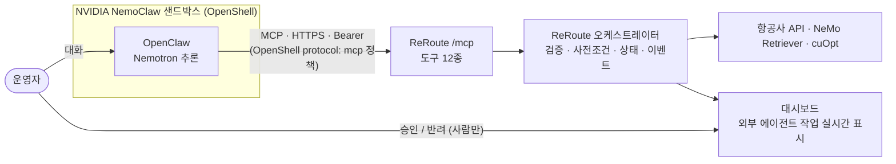
```mermaid
flowchart LR
    op([운영자]) -->|대화| oc
    subgraph nemo["NVIDIA NemoClaw 샌드박스 (OpenShell)"]
        oc["OpenClaw<br/>Nemotron 추론"]
    end
    oc -->|"MCP · HTTPS · Bearer<br/>(OpenShell protocol: mcp 정책)"| mcp["ReRoute /mcp<br/>도구 12종"]
    mcp --> orch["ReRoute 오케스트레이터<br/>검증 · 사전조건 · 상태 · 이벤트"]
    orch --> svc["항공사 API · NeMo Retriever · cuOpt"]
    orch --> dash["대시보드<br/>외부 에이전트 작업 실시간 표시"]
    op -->|"승인 / 반려 (사람만)"| dash
```

```bash
nemoclaw ops-copilot mcp add reroute --url https://<도메인>/mcp --env REROUTE_MCP_TOKEN   # HTTPS 필수
nemoclaw ops-copilot skill install nvidia/skills/reroute-irops
REROUTE_MCP_TOKEN=... make mcp-smoke MCP_URL=https://<도메인>/mcp                       # 연결 전 점검
```

- 두 가지 방식: OpenClaw가 **직접 계획**(`open_recovery_task` → 도구들 → `propose_rebooking`)하거나, ReRoute 에이전트에게 **위임**(`delegate_recovery`)합니다.
- 대시보드는 외부 에이전트가 시작한 작업을 감지해 "실시간으로 보기" 배너를 띄웁니다.
- **대시보드에서 OpenClaw로 보내기:** 입력창 위에서 **OpenClaw (NemoClaw)**를 고르면, NemoClaw 호스트의 브리지(`infra/openclaw-bridge`)가 작업을 가져가 OpenClaw에 넘깁니다. OpenClaw는 MCP로 **같은 작업**에 붙어 계획하므로 타임라인에서 그대로 지켜보고 승인하면 됩니다. 브리지는 바깥으로만 연결하고, 연결이 끊기면 선택지가 비활성화됩니다.
- 검증 상태: NemoClaw 샌드박스 안의 OpenClaw가 AWS의 HTTPS MCP 주소로 KE123을 승인 대기까지 처리하는 것을 실제로 확인했습니다. 라이브 데모에서는 NemoClaw가 GCP VM에서 돌고 있습니다. NVIDIA 무료 엔드포인트가 자주 과부하를 돌려줘 브리지가 재시도하므로, 한 작업에 몇 분 걸릴 수 있습니다. 절차: [nvidia/nemoclaw](nvidia/nemoclaw/README.md)

## NVIDIA 스택과 실행 모드

| 환경 변수 | 실제 NVIDIA 모드 | 데모 / 대체(Fallback) 모드 |
|---|---|---|
| `LLM_PROVIDER` | 키가 있는 `auto`(기본) / `nvidia` → NIM의 Nemotron (기본 `nvidia/nemotron-3-super-120b-a12b`) | 키 없음 / `mock` 지정 → 스크립트 플래너; 모델 오류가 재시도·가드레일로 복구되지 않으면 명시적 대체 실행 (도구·가드레일 동일) |
| `RETRIEVER_PROVIDER` | `nvidia` → `nemotron-3-embed-1b` + `llama-nemotron-rerank-vl-1b-v2` | `lexical` → 같은 문서에 대한 BM25 검색 |
| `OPTIMIZATION_PROVIDER` | `cuopt` → cuOpt 서버 (GPU) | `fallback` → HiGHS (CPU), **같은** MILP 객체 |
| `SECURITY_RUNTIME` | `openshell` → OpenShell 샌드박스 안의 에이전트 worker | `policy-mirror` → 같은 정책 YAML을 프로세스 안에서 평가 |

라이브 데모(AWS)의 현재 구성:

| 구성 요소 | 지금 쓰는 것 |
|---|---|
| 추론 | Nemotron (`nemotron-3-super-120b-a12b`, NVIDIA NIM) |
| 규정 검색 | NeMo Retriever (`nemotron-3-embed-1b` + `llama-nemotron-rerank-vl-1b-v2`) |
| 최적화 | HiGHS (CPU). 무료 플랜 계정이라 GPU 인스턴스를 쓸 수 없어 cuOpt 대신 같은 MILP를 CPU로 풉니다 |
| 에이전트 격리 | **OpenShell 샌드박스 안의 worker** (`enable_openshell`). NVIDIA 키와 worker 토큰은 provider가 주입해 샌드박스에는 placeholder만 있습니다 |
| 외부 에이전트 | OpenClaw (NemoClaw, GCP VM), 대시보드에서 선택 |

**정직성 원칙:** 대시보드 상단 표시등과 타임라인의 모든 배지는 **실제로 실행된 구현**을 보여줍니다. NVIDIA 서비스는 초록색,
대체 구현은 주황색입니다. 대체 구현을 NVIDIA로 표시하는 일은 없으며, 자동 전환이 일어나면 `GUARDRAIL` 이벤트로 기록합니다.

## 데모

키가 없는 기본 Docker 구성은 같은 시드 데이터와 스크립트 플래너를 사용합니다. 네트워크 없는 데모를 확실히 고정하려면 `LLM_PROVIDER=mock`, `RETRIEVER_PROVIDER=lexical`, `OPTIMIZATION_PROVIDER=fallback`을 사용합니다. `DEMO_MODE=true`만으로 LLM 선택이 고정되지는 않으며, `LLM_PROVIDER=auto`에 키가 있으면 실제 모델을 호출합니다.
전체 대본은 [docs/demo-scenario.md](docs/demo-scenario.md)에 있습니다.

1. **Run Agent** → 도구 호출이 배지와 함께 실시간 타임라인으로 표시
2. KPI 35 / 31 / 3 / 1, 선착순 대비 비교표, 항공편별 좌석 배정, 제외된 항공편과 제외 근거 규정
3. 배정표: 승객별 사유와 정책 칩 → 마우스를 올리면 해당 규정 근거 카드가 강조
4. **"승인 없이 execute API 직접 호출"** → `HTTP 403 APPROVAL_REQUIRED`, 감사 로그에 기록
5. **Approve** (검토 대상 승객 선택 포함 가능) → 실행 → 최종 보고, 실제 좌석 재고 변화
6. **Run all probes** → OpenShell 정책 판정: 미등록 외부 호스트, 자기 승인 호출, `~/.ssh/id_rsa`, 비밀값 접근 모두 차단
7. 시나리오 **KE125 45분 지연** → 에이전트가 RBK-002를 찾아 "조치 불필요"로 종료

## 시작하기

### Docker (권장)

```bash
cp .env.example .env            # 선택 사항 — 기본값만으로 API 키 없이 전체 데모가 동작합니다
docker compose up --build
open http://localhost:3000      # API 문서: http://localhost:8000/docs
./tests/e2e/smoke.sh            # MVP 흐름 전체를 자동 점검
```

- **실제 NVIDIA 모드:** `NVIDIA_API_KEY`(build.nvidia.com), `LLM_PROVIDER=nvidia`, `RETRIEVER_PROVIDER=nvidia`.
  GPU 서버에서는 `OPTIMIZATION_PROVIDER=cuopt`로 두고 `docker compose --profile gpu up --build`.
- **에이전트를 별도 worker로 실행:** `AGENT_EXECUTION=remote`, `AGENT_WORKER_TOKEN=...`, `docker compose --profile worker up`.
  OpenShell 샌드박스 안에서 실행하려면 `make sandbox` ([nvidia/openshell](nvidia/openshell)).

### 로컬 개발

```bash
make install                    # uv 가상환경(Python 3.12) + npm ci
make test                       # 백엔드 테스트 99개
DATABASE_URL=sqlite:///./reroute.db make dev-api    # 또는 로컬 PostgreSQL
make dev-web                    # http://localhost:3000 (/api는 :8000으로 프록시)
```

## 클라우드 배포 구조

라이브 데모는 클라우드 두 곳에 나눠 돌아갑니다. **AWS**에는 ReRoute 서비스가, **GCP**에는 NemoClaw와 OpenClaw가 있고,
둘 다 NVIDIA의 호스팅 모델을 부릅니다. 배포는 GitHub Actions가 합니다.

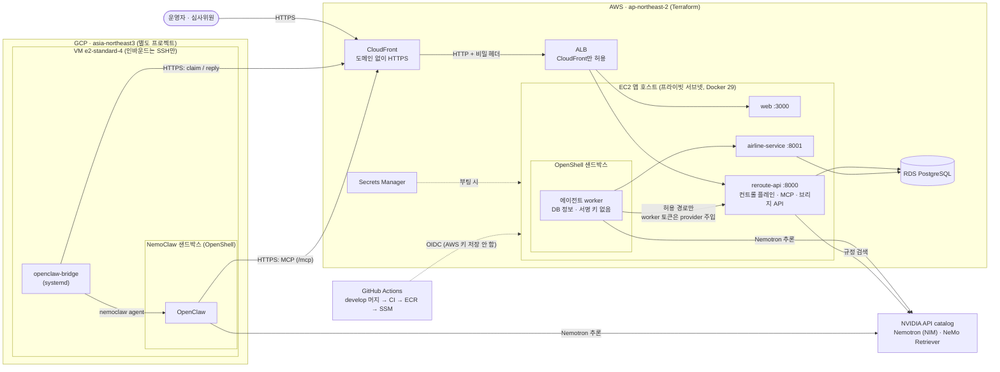
```mermaid
flowchart LR
    op([운영자 · 심사위원]) -->|HTTPS| cf

    subgraph aws["AWS · ap-northeast-2 (Terraform)"]
        cf["CloudFront<br/>도메인 없이 HTTPS"] -->|"HTTP + 비밀 헤더"| alb["ALB<br/>CloudFront만 허용"]
        subgraph ec2["EC2 앱 호스트 (프라이빗 서브넷, Docker 29)"]
            web["web :3000"]
            cp["reroute-api :8000<br/>컨트롤 플레인 · MCP · 브리지 API"]
            air["airline-service :8001"]
            subgraph sb["OpenShell 샌드박스"]
                wk["에이전트 worker<br/>DB 정보 · 서명 키 없음"]
            end
        end
        alb --> web
        alb --> cp
        wk -->|"허용 경로만<br/>worker 토큰은 provider 주입"| cp
        wk --> air
        cp --> rds[("RDS PostgreSQL")]
        air --> rds
        sm["Secrets Manager"] -.->|부팅 시| ec2
    end

    subgraph gcp["GCP · asia-northeast3 (별도 프로젝트)"]
        subgraph vm["VM e2-standard-4 (인바운드는 SSH만)"]
            br["openclaw-bridge<br/>(systemd)"]
            subgraph ns["NemoClaw 샌드박스 (OpenShell)"]
                oc["OpenClaw"]
            end
        end
        br -->|"nemoclaw agent"| oc
    end

    br -->|"HTTPS: claim / reply"| cf
    oc -->|"HTTPS: MCP (/mcp)"| cf

    nv["NVIDIA API catalog<br/>Nemotron (NIM) · NeMo Retriever"]
    wk -->|"Nemotron 추론"| nv
    cp -->|"규정 검색"| nv
    oc -->|"Nemotron 추론"| nv

    gh["GitHub Actions<br/>develop 머지 → CI → ECR → SSM"] -.->|"OIDC (AWS 키 저장 안 함)"| ec2
```

| 연결 | 내용 |
|---|---|
| 운영자 → CloudFront → ALB | HTTPS는 CloudFront에서 끝납니다. ALB는 CloudFront IP 대역과 비밀 헤더가 있는 요청만 받습니다 |
| worker → 컨트롤 플레인, 항공사 API | OpenShell 정책이 허용한 경로만 지납니다. worker 토큰과 NVIDIA 키는 provider가 주입해 샌드박스에는 placeholder만 있습니다 |
| AWS → NVIDIA | Nemotron 추론은 worker가, NeMo Retriever 검색은 컨트롤 플레인이 NAT를 거쳐 호출합니다 |
| GCP 브리지 → ReRoute | 대시보드에서 OpenClaw로 보낸 작업을 가져가고 결과를 보고합니다. 바깥으로만 연결해 GCP에 열린 포트가 없습니다 |
| OpenClaw → ReRoute MCP | 같은 작업에 붙어 도구를 호출합니다. MCP에는 승인과 실행 도구가 없어서 승인은 대시보드에서 사람이 합니다 |
| GitHub → AWS | `develop`에 머지하면 CI, 이미지 빌드, ECR 업로드, SSM 롤아웃이 이어집니다. 브리지는 GCP VM에 직접 배포합니다 |

cuOpt는 GPU 인스턴스(`enable_gpu = true`)에서 앱 호스트에 함께 뜹니다. 라이브 데모 계정은 AWS 무료 플랜이라 GPU를 쓸 수 없어
같은 MILP를 CPU(HiGHS)로 풉니다.

## GPU 자체 호스팅 추론 (선택 배포안)

[시스템 구조도](#아키텍처)의 NVIDIA Hosted API 대신 별도 GPU 추론 서버를 연결하는 선택안입니다.

학습이 끝난 **모델 가중치(weights)를 GPU 서버에 내려받고**, NIM 또는 vLLM이 이를 GPU 메모리에 올려 **추론 API**를 제공하는 일반적인 자체 호스팅 방식입니다. 이 절은 학습·파인튜닝이 아니라 추론 배포 설명이며, **이 저장소에서 Brev나 자체 호스팅 NIM/vLLM을 배포·실행 검증했다는 뜻은 아닙니다.** 현재 README에 기록된 라이브 데모는 NVIDIA 호스팅 API를 호출합니다.

| 구성 요소 | 역할 |
|---|---|
| **Brev** | GPU 서버 생성·접속·관리. 인스턴스를 만드는 것만으로 선택한 모델이나 추론 서버가 자동 설치되지는 않습니다. |
| **Nemotron** | 학습된 LLM 모델과 가중치. ReRoute에서는 도구 선택·브리핑·예외 조치를 제안합니다. |
| **NIM / vLLM** | 선택한 모델을 로드하고 `/v1/chat/completions` 같은 HTTP 추론 API를 제공하는 서버. 둘 중 해당 모델을 지원하는 방식을 선택합니다. |
| **ReRoute Python 앱 / worker** | API로 모델의 제안을 받고, 검증·도구 호출·상태 전이·승인 후 예약 실행을 수행합니다. GPU 추론 서버와 별도 호스트에서 실행할 수도 있습니다. |
| **cuOpt / HiGHS · 운영자** | solver는 기본 승객 배정을 계산하고, 운영자는 예약 변경을 승인합니다. LLM을 자체 호스팅해도 이 책임 경계는 동일합니다. |

```text
ReRoute Python 앱 / worker ── HTTP 추론 요청 ──> GPU 서버
                                               NIM 또는 vLLM
                                               └─ 학습된 Nemotron weights
                                                   (Brev 등으로 서버 관리)
```

### 현재 코드와 추가로 필요한 설정

- **이미 구현됨:** [`Settings`](apps/api/app/config.py)의 `NIM_BASE_URL` / `NIM_MODEL`과 [`NvidiaNimProvider`](apps/api/app/providers/llm/nim.py)는 OpenAI 호환 Chat Completions 요청을 구성합니다. 현재 기본 주소는 `https://integrate.api.nvidia.com/v1`입니다. [`factory`](apps/api/app/providers/llm/factory.py)는 `LLM_PROVIDER=auto` / `nvidia`에서도 비어 있지 않은 `NVIDIA_API_KEY`를 요구하고 Bearer 헤더로 전달하며, 키가 없으면 스크립트 플래너를 선택합니다.
- **추가 배포 설정 필요:** 현재 [`docker-compose.yml`](docker-compose.yml)은 `NIM_BASE_URL`을 API/worker 컨테이너에 전달하지 않고 NIM/vLLM 서비스도 정의하지 않습니다. 자체 호스팅에서는 실제 LLM 호출 프로세스(`inline`: API, `remote`: worker)의 환경에 `/v1`을 포함한 서버 주소와 서버가 제공하는 모델 ID를 전달해야 합니다. `.env`의 주소만 바꾸거나 `--profile gpu`를 켜는 것으로 끝나지 않습니다. 이 GPU 프로필은 **cuOpt**용입니다.
- **보안 경로 조정 필요:** [`기본 정책`](nvidia/openshell/policies/reroute-agent.yaml)과 [`자격증명 provider`](nvidia/openshell/providers/nvidia-reroute.yaml)는 NVIDIA 호스팅 주소만 허용합니다. 자체 추론 서버의 호스트·포트·`POST /v1/chat/completions`를 policy-mirror와 실제 OpenShell 정책에 반영하고, provider의 자격증명 주입 경로도 조정해야 합니다. 승인 금지 규칙은 유지합니다. 자체 API 인증 토큰을 현재 `NVIDIA_API_KEY` 필드로 전달할 경우, 같은 필드를 쓰는 NVIDIA Retriever 인증과 충돌하지 않도록 별도 자격증명 설계를 확인해야 합니다.
- **아직 미검증:** 자체 NIM/vLLM의 모델·chat template·`tools`·`tool_choice=auto`·`tool_calls`·추론 옵션 호환성과 전체 승인 흐름. 현재 adapter는 vLLM을 별도 provider로 구분하지 않고 NIM으로 표시하므로, 일반 vLLM 연결을 기존 NVIDIA 실행 검증으로 해석하면 안 됩니다.

### 배포 전 확인할 항목

1. 선택한 모델과 NIM/vLLM 버전에 맞는 **GPU 종류·개수·VRAM**, 컨텍스트 길이와 동시 요청 수를 확인합니다. 기본 120B 모델 ID가 작은 GPU 한 장에 들어간다고 가정하지 않습니다.
2. 모델 라이선스·다운로드 권한, NIM 컨테이너 접근·사용 조건, NVIDIA 드라이버·Container Toolkit 또는 vLLM 실행 환경을 확인합니다. NIM용 NGC 다운로드 자격증명과 앱의 추론 API 인증은 별도 역할입니다.
3. 초기 weights/컨테이너 다운로드 시간과 디스크 용량, 재시작 시 재사용할 캐시를 준비하고 모델 로딩·API 응답을 먼저 확인합니다.
4. 엔드포인트는 사설망·포트 포워딩 또는 인증과 TLS가 있는 프록시로 보호합니다. vLLM의 `--api-key`만으로 모든 경로가 보호되는 것은 아니므로 네트워크 제한도 필요합니다.
5. 도구 호출·예외 검증·운영자 승인·감사 로그·장애 시 대체 실행을 확인한 뒤 기존 평가와 승인 시나리오를 수행합니다. LLM 자체 호스팅은 Retriever나 cuOpt까지 함께 배포했다는 의미가 아닙니다.

GPU 운영이 필요하지 않다면 **NVIDIA 호스팅 API**를 그대로 쓰는 것이 대안입니다. 모델 추론 위치만 외부로 바뀌며 ReRoute의 Python 실행·solver·사람 승인 구조는 유지됩니다.

공식 절차: [Brev에서 NIM 배포](https://docs.nvidia.com/brev/guides/inference-deployment/deploying-nims) · [NIM 시작하기](https://docs.nvidia.com/nim/large-language-models/latest/getting-started.html) · [vLLM OpenAI 호환 서버](https://docs.vllm.ai/en/latest/serving/online_serving/openai_compatible_server/).

## AWS 배포

Terraform으로 AWS에 한 번에 배포합니다. 상세 절차와 체크리스트는 [infra/terraform/README.md](infra/terraform/README.md)에 있습니다.

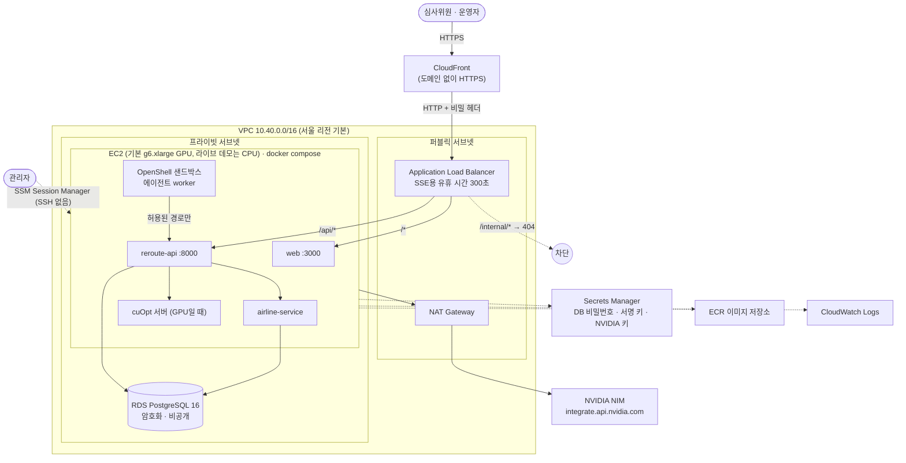
```mermaid
flowchart TB
    user([심사위원 · 운영자]) -->|"HTTPS"| cf["CloudFront<br/>(도메인 없이 HTTPS)"]
    cf -->|"HTTP + 비밀 헤더"| alb
    admin([관리자]) -.->|"SSM Session Manager (SSH 없음)"| ec2
    subgraph vpc["VPC 10.40.0.0/16 (서울 리전 기본)"]
        subgraph pub["퍼블릭 서브넷"]
            alb["Application Load Balancer<br/>SSE용 유휴 시간 300초"]
            nat["NAT Gateway"]
        end
        subgraph priv["프라이빗 서브넷"]
            subgraph ec2["EC2 (기본 g6.xlarge GPU, 라이브 데모는 CPU) · docker compose"]
                web["web :3000"]
                api["reroute-api :8000"]
                air["airline-service"]
                cu["cuOpt 서버 (GPU일 때)"]
                sb["OpenShell 샌드박스<br/>에이전트 worker"]
            end
            rds[("RDS PostgreSQL 16<br/>암호화 · 비공개")]
        end
    end
    alb -->|"/*"| web
    alb -->|"/api/*"| api
    alb -.->|"/internal/* → 404"| blocked(("차단"))
    api --> air
    api --> cu
    api --> rds
    air --> rds
    sb -->|"허용된 경로만"| api
    ec2 --> nat --> nim["NVIDIA NIM<br/>integrate.api.nvidia.com"]
    ec2 -.-> sm["Secrets Manager<br/>DB 비밀번호 · 서명 키 · NVIDIA 키"]
    ec2 -.-> ecr["ECR 이미지 저장소"]
    ec2 -.-> cw["CloudWatch Logs"]
```

```bash
cd infra/terraform && cp terraform.tfvars.example terraform.tfvars
terraform init && terraform apply -target=aws_ecr_repository.repo   # 1) 이미지 저장소 먼저
cd ../.. && make push                                               # 2) 이미지 빌드·업로드
aws secretsmanager put-secret-value --secret-id "$(cd infra/terraform && terraform output -raw nvidia_api_key_secret_arn)" \
  --secret-string 'nvapi-...'                                       # 3) NVIDIA 키 등록 (4번보다 먼저)
cd infra/terraform && terraform apply && terraform output url       # 4) 전체 생성 후 접속 주소 확인
```

> ⚠️ 배포 전 확인: **GPU 인스턴스 할당량**(새 계정은 0인 경우가 많음), **서울 리전의 g6 제공 여부**(없으면 `g5.xlarge`),
> **NVIDIA 키는 서버 생성 전에 등록**. 시연 후에는 `terraform destroy`. `enable_gpu = false`로 두면 CPU 전용의 저렴한 구성입니다.

라이브 데모는 이 Terraform으로 실제 배포했습니다(CPU 구성). 이후 변경은 `develop`에 머지하면 GitHub Actions가 이미지를 빌드해
ECR에 올리고 SSM으로 서버를 교체합니다(OIDC 인증, AWS 키를 GitHub에 저장하지 않음). 선택 기능은 변수 하나로 켭니다.

| 변수 | 효과 |
|---|---|
| `enable_cloudfront` | 도메인 없이 HTTPS. ALB는 CloudFront에서 온 요청만 받습니다 |
| `enable_openshell` | 에이전트를 OpenShell 샌드박스 안의 worker로 실행. Docker 28 미만이면 부팅 때 올립니다(moby#34143) |
| `github_repository` | GitHub Actions 배포용 OIDC 역할 생성 |

## 보안

두 개의 경계를 절대 섞지 않습니다.

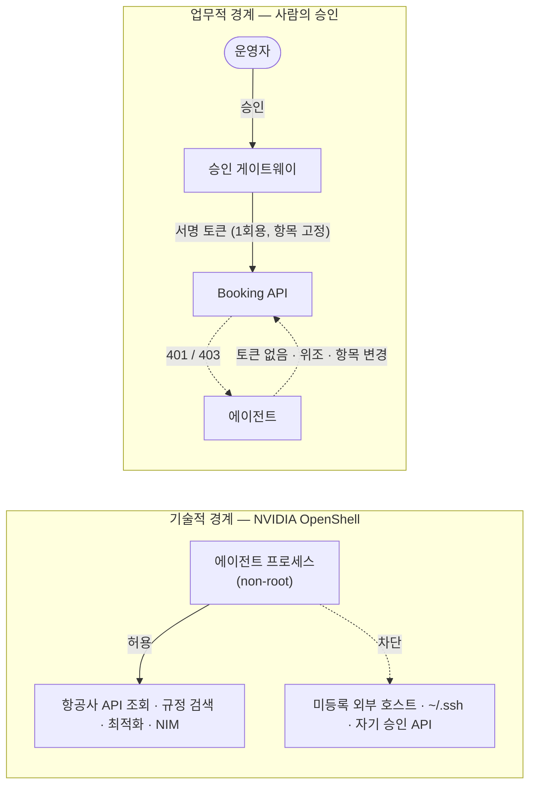
```mermaid
flowchart LR
    subgraph tech["기술적 경계 — NVIDIA OpenShell"]
        a["에이전트 프로세스<br/>(non-root)"] -->|허용| ok["항공사 API 조회 · 규정 검색 · 최적화 · NIM"]
        a -.->|차단| no["미등록 외부 호스트 · ~/.ssh · 자기 승인 API"]
    end
    subgraph biz["업무적 경계 — 사람의 승인"]
        o([운영자]) -->|승인| g["승인 게이트웨이"]
        g -->|"서명 토큰 (1회용, 항목 고정)"| bk["Booking API"]
        a2["에이전트"] -.->|"토큰 없음 · 위조 · 항목 변경"| bk
        bk -.->|"401 / 403"| a2
    end
```

| | 기술적 경계 — **OpenShell** | 업무적 경계 — **사람의 승인** |
|---|---|---|
| 질문 | *이 프로세스가 이 엔드포인트·파일에 접근해도 되는가?* | *책임 있는 사람이 이 변경을 승인했는가?* |
| 방식 | [`reroute-agent.yaml`](nvidia/openshell/policies/reroute-agent.yaml): 기본 차단 egress, L7 메서드·경로 규칙, 승인 엔드포인트 `deny_rules`, 파일시스템 허용 목록, non-root | 승인 게이트웨이(`PENDING → APPROVED/REJECTED/EXPIRED`, 유효시간)가 계획·승인·**승객 목록 해시**에 묶인 HMAC 토큰 발급 — 1회용, 5분 만료 |
| 강제 주체 | OpenShell(샌드박스 모드) / 같은 YAML의 프로세스 내 평가(데모 모드, 화면에 명시) | 백엔드: 게이트웨이 **그리고** Booking API가 각각 독립 검증 (UI 버튼 차단이 아님) |

- 승인 없이 실행하면 403이 반환되고 감사 로그에 남습니다. Booking API는 토큰이 없으면 401, 위조되었거나 승인된 목록과 다르면 403으로 거부합니다.
- 승인은 사람 운영자 신원으로만 가능하며, 에이전트 신원으로는 승인할 수 없습니다.
- 감사 로그 필드: `timestamp · agent · tool · target · action · policy · result · enforced_by`. 실제 OpenShell의 판정 로그도
  `POST /api/audit/openshell`로 가져올 수 있습니다([수집 스크립트](nvidia/openshell/scripts/ingest-logs.sh)).
- 자격증명은 환경 변수 / Secrets Manager로만 다룹니다. `.env`는 git에서 제외되며 `.env.example`만 커밋합니다.

## 최적화 모델

```
x[p,f,c] ∈ {0,1}  승객 p를 항공편 f의 좌석등급 c에 배정        y[p] ∈ {0,1}  미배정
C1  Σ_f,c x[p,f,c] + y[p] = 1                승객마다 결과는 정확히 하나
C2  Σ_p x[p,f,c] ≤ seats[f,c]                좌석등급별 잔여 좌석
C3  비즈니스는 가능하면 비즈니스 유지         다운그레이드 벌점 × 등급 × VIP
C4  후속편 출발 − 도착(f) ≥ MCT               (MCT-002, 검색된 규정)
C5  도착지(f) = 원래 도착지                   (IROP-005 공동 도시 공항)
C6  항공사·시간 한도·운항 상태가 규정상 허용   (IROP-002, IROP-003)
최소화: Σ 지연×등급 + VIP 지연 + 다운그레이드 + 환승 위험 + 재발권 비용 + 100,000×미배정
```

- 제약 파라미터는 **검색된 규정 문서의 `policy-params` 블록에서 컴파일**합니다. 필요한 규정이 검색되지 않으면 보수적인 기본값을 쓰고
  누락 사실을 보고합니다. LLM의 기억으로 채우지 않습니다.
- 가중치는 [`config/optimization.yaml`](config/optimization.yaml)에서 조정합니다 (`delay_weight`, `vip_delay_weight`,
  `downgrade_weight`, `connection_risk_weight`, `unassigned_weight` 등).
- `OptimizationProvider` → `CuOptOptimizationProvider`(cuOpt 서버 REST) | `FallbackOptimizationProvider`(HiGHS).
- 승객별 출력: 원 항공편/대체편, 원 좌석/새 좌석, 지연, 벌점 내역, 목적함수 기여도, 상태, 사유, 정책 ID.
  같은 모델을 cuOpt 서버에 직접 보내볼 수 있습니다: [`nvidia/cuopt/ke123-milp.json`](nvidia/cuopt/).

## 화면

| | |
|---|---|
| 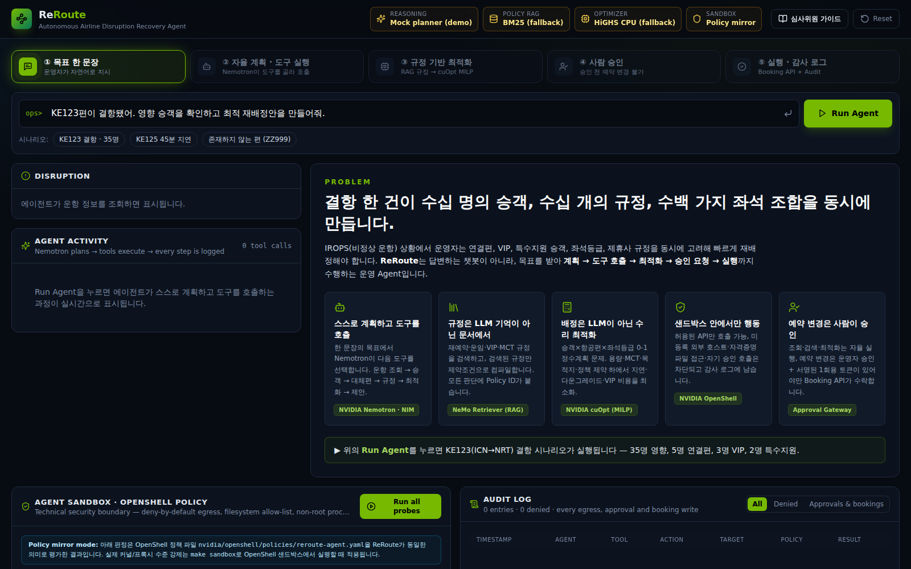 문제 정의와 5가지 핵심 | 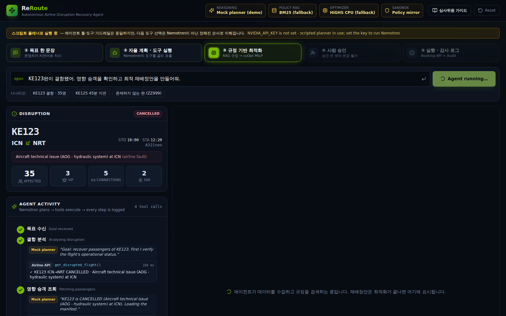 에이전트 실행 — 실시간 도구 타임라인 |
| 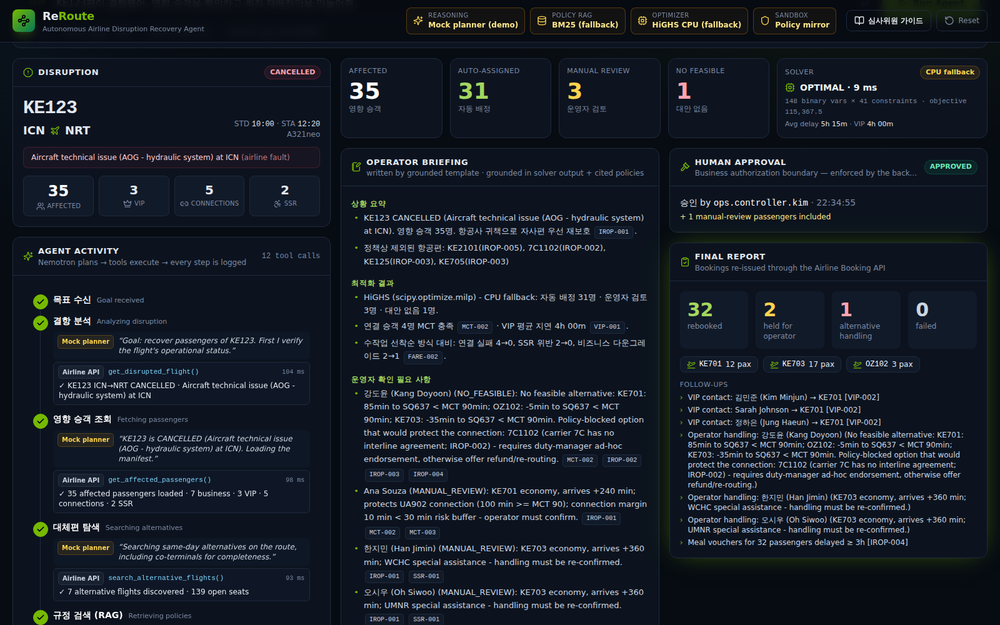 승인 → 실행, 최종 보고 | 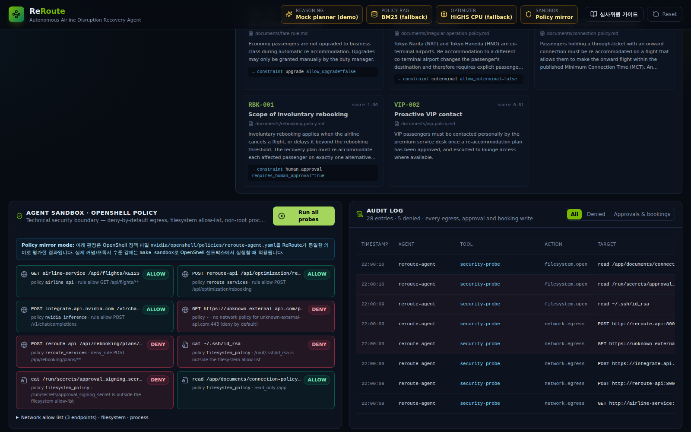 OpenShell 정책 판정과 감사 로그 |
| 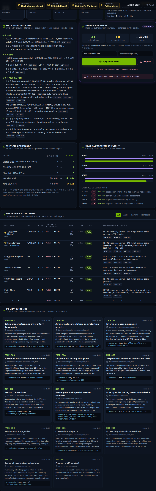 승인 없이 실행 → 403 | 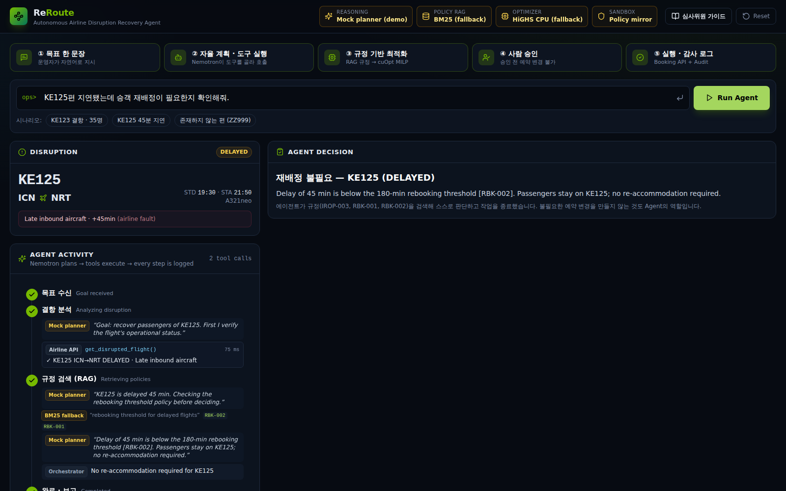 KE125 지연: 에이전트가 조치 불필요로 판단 |
| 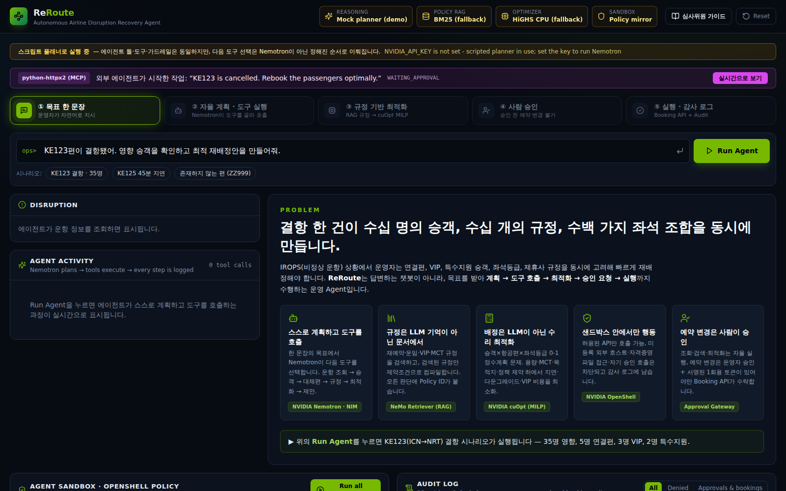 MCP로 시작된 외부 에이전트 작업 감지 | 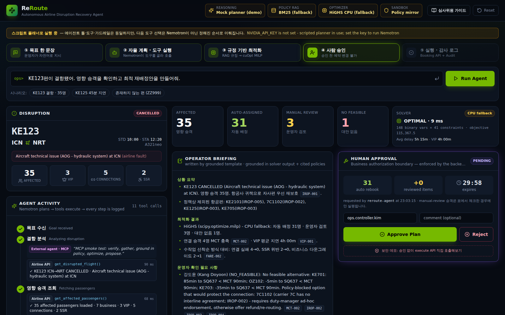 외부 에이전트가 계획한 재배정안 (승인은 사람) |

전체 화면: [재배정안](docs/screenshots/03b-plan-full.png) · [완료](docs/screenshots/05b-completed-full.png) · [심사위원 가이드](docs/screenshots/08-guide.png)

## 저장소 구조

```
apps/api      FastAPI: Mock 항공사 API, 에이전트(오케스트레이터·도구·LLM 어댑터), RAG, 최적화,
              승인 게이트웨이, 감사 로그, OpenShell 정책 평가, worker, MCP 서버, OpenClaw 브리지 — 테스트 99개
apps/web      Next.js + TypeScript + Tailwind 운영 대시보드와 심사위원 가이드
documents     항공사 규정 문서 (IROP, RBK, SSR, FARE, VIP, MCT) + 기계가 읽는 파라미터
data/seed     KE123 시나리오: 항공편 9편, 승객 35명
config        최적화 가중치
nvidia        openshell · nemoclaw · cuopt · skills
infra         terraform (AWS)
docs          아키텍처 · 데모 시나리오 · NVIDIA 연동 · 화면 캡처
tests/e2e     MVP 완료 기준 자동 점검
```

## 품질

- 백엔드 테스트 99개: 운항·승객 조회, 규정 검색과 출처, 최적화 제약 C1–C6 전부, 가중치, cuOpt REST 형식,
  승인 필수, 무단 실행 차단, 토큰 변조, 승인 만료, 재배정 성공, OpenShell 정책 스키마와 판정, NIM 요청 형식과 재시도·장애 시 전환,
  DB 없는 원격 worker(실제 HTTP, 시작 시 컨트롤 플레인 대기), MCP 서버, 대시보드→OpenClaw 브리지, 스키마 마이그레이션.
- 실제 NVIDIA 모델 평가(`make eval-llm`)와 AWS 라이브 데모의 OpenShell 샌드박스 금지 행동 점검(자기 승인, 메타데이터, 미등록 호스트).
- 전체 흐름 자동 점검(`tests/e2e/smoke.sh`)과 Playwright 브라우저 시연.
- CI: 코드 검사, PostgreSQL에서 테스트와 자동 점검, 웹 타입 검사·빌드, `terraform validate`, Docker 이미지 빌드.

## 향후 계획

- 허브 단위 IROPS: 여러 결항편을 하나의 cuOpt 모델로 동시 재최적화 (규모가 커질수록 GPU 이점 증가)
- 승무원·기재 로테이션 복구를 추가 cuOpt 모델로 확장, 승객 알림(SMS / 앱) 연동
- 대화형 정책에 NeMo Guardrails, 플래너 회귀 테스트에 NeMo Evaluator 적용
- OIDC 기반 운영자 인증과 금액·규모별 승인 한도, Alembic 마이그레이션, ECS/EKS GPU 노드 그룹
- 실제 GDS/PSS 연동 (기존 항공사 API 어댑터 뒤에 교체)

---

데모 데이터와 규정은 가상입니다. "KE", "OZ", "7C"는 예시용 항공사 코드로만 사용했습니다.
