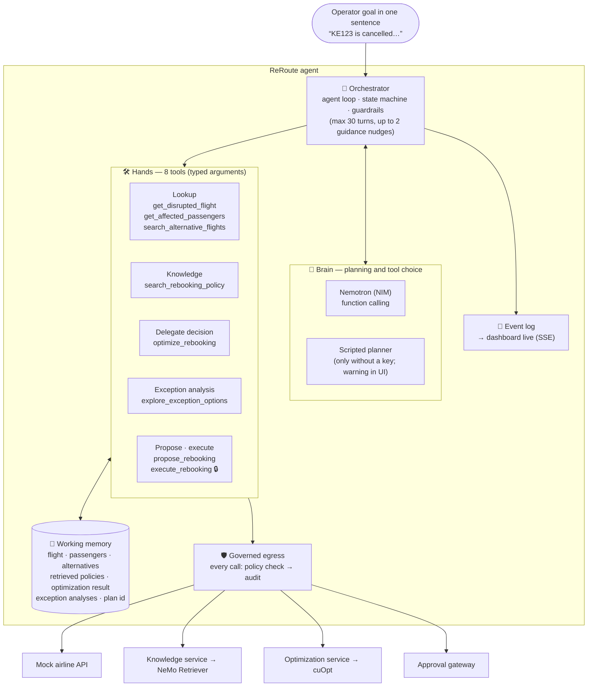
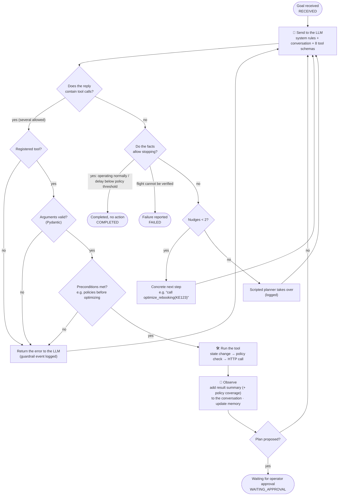
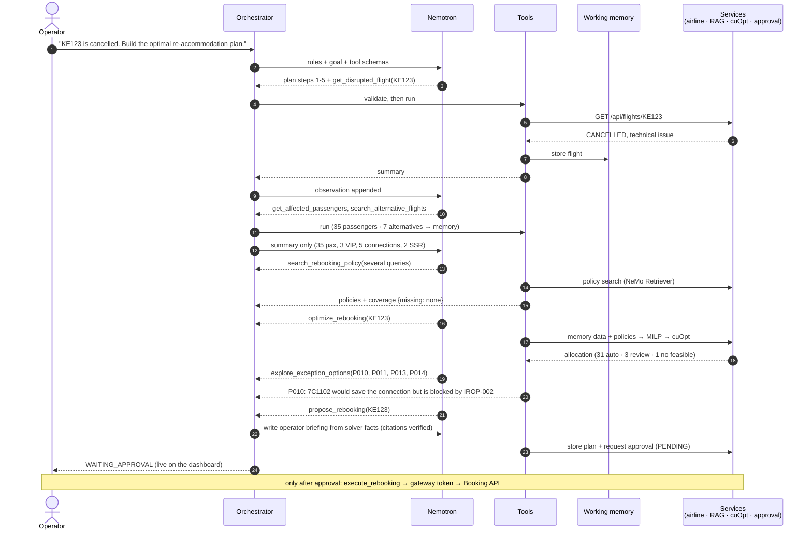
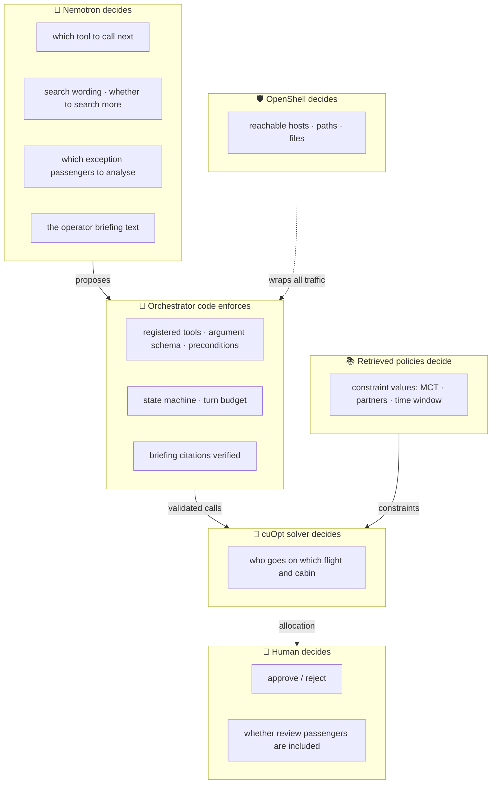
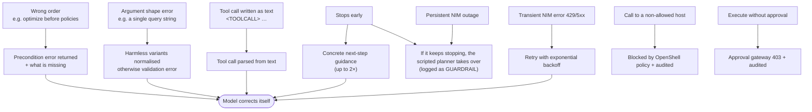
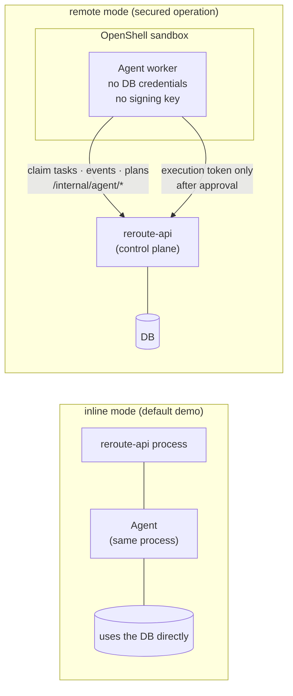
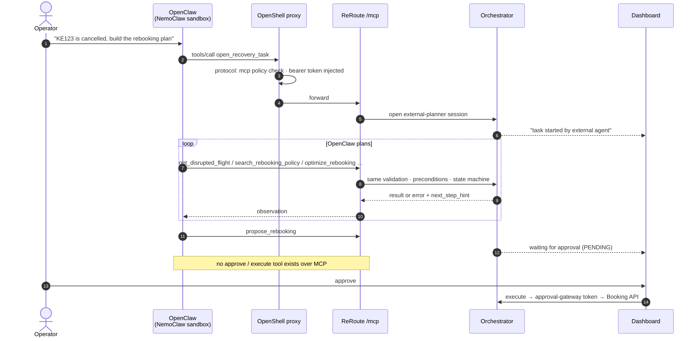

# The ReRoute agent: structure and behaviour

[🇰🇷 한국어](agent.md) · **🇺🇸 English**

This document shows **what a single agent is made of and how it handles one request**.
For the overall system and deployment see [architecture.en.md](architecture.en.md).

| Diagram | Shows |
|---|---|
| [1. Agent structure](#1-agent-structure) | the parts: brain, hands, memory, safety |
| [2. Agent loop](#2-agent-loop-plan--act--observe) | what happens every turn: plan → act → observe |
| [3. One KE123 run](#3-one-ke123-run) | a real request, step by step |
| [4. Who decides what](#4-who-decides-what) | LLM · code · solver · human · OpenShell |
| [5. What the LLM sees and does not see](#5-what-the-llm-sees-and-does-not-see) | data never passes through the LLM |
| [6. Recovery paths](#6-recovery-paths) | when the model is wrong or stops |
| [7. Two execution modes](#7-two-execution-modes) | inside the API vs sandboxed worker |
| [8. External agent mode](#8-external-agent-mode-openclaw--mcp) | OpenClaw in NemoClaw uses ReRoute over MCP |

---

## 1. Agent structure

- **Brain:** picks what to do next. In real mode Nemotron chooses the tool and its arguments every turn.
- **Hands:** the 8 tools. Every domain action goes through them to an HTTP API; the agent never touches the database.
- **Memory:** large data (35 passengers) lives here; the LLM only sees summaries (diagram 5).
- **Safety:** the orchestrator checks order, arguments and preconditions; every outbound call is checked against the OpenShell policy and audited.

## 2. Agent loop (plan → act → observe)

## 3. One KE123 run

The model decides how many tools to call per turn and how often to search, so turn structure varies between runs.
What does not vary: the validation rules, the solver result, and the approval boundary.

## 4. Who decides what

The LLM decides **how to work**. It does not decide **outcomes (allocation) or permissions (approval, access)**.

## 5. What the LLM sees and does not see

```mermaid
flowchart LR
    subgraph seen["Visible to the LLM"]
        a1["goal sentence"]
        a2["tool schemas"]
        a3["result summaries<br/>e.g. 35 pax · 3 VIP · 5 connections"]
        a4["policy excerpts + coverage"]
        a5["optimization summary · exception list"]
    end
    subgraph hidden["Never passes through the LLM"]
        b1["full data of 35 passengers"]
        b2["seat inventory"]
        b3["MILP: 148 variables · 41 constraints"]
        b4["raw allocation"]
        b5["approval signing key · DB credentials"]
    end
    seen -->|"tool arguments are handles only<br/>(flight no, query, passenger id)"| tools["Tools"]
    tools <--> hidden
```

So there is structurally no path for the LLM to "adjust" the allocation or leak passenger data.

## 6. Recovery paths

## 7. Two execution modes

With `AGENT_EXECUTION=remote` the agent is a separate process inside the sandbox. Even a compromised agent cannot change
bookings without a human approval.

## 8. External agent mode (OpenClaw → MCP)

Even with an external brain, ReRoute's rules hold: no optimization without policy coverage, no "no action" without the facts,
and only humans approve.

---

Code: `apps/api/app/agent/orchestrator.py` (loop · guardrails) · `app/agent/prompts.py` (rules) · `app/tools/` (8 tools) ·
`app/providers/llm/` (Nemotron adapter · selection) · `app/agent/worker.py` (sandbox worker) · `app/agent/evaluate.py` (real-model evaluation) · `app/integrations/mcp_server.py` (MCP server)
