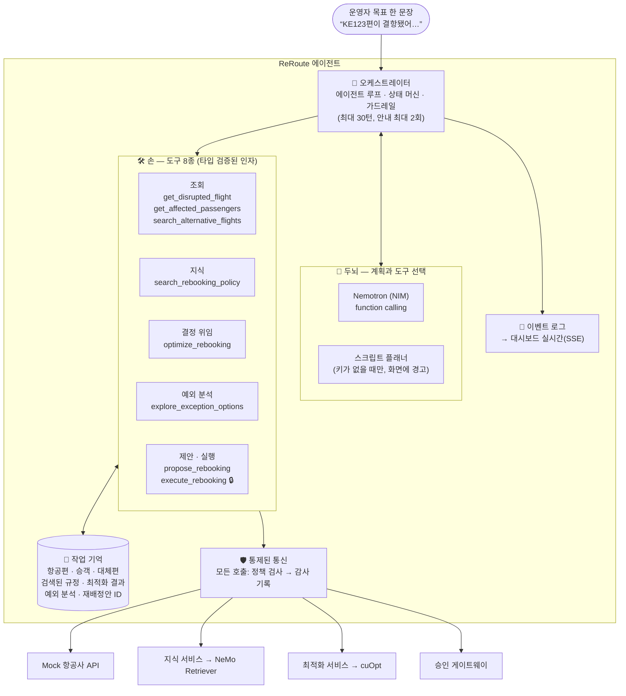
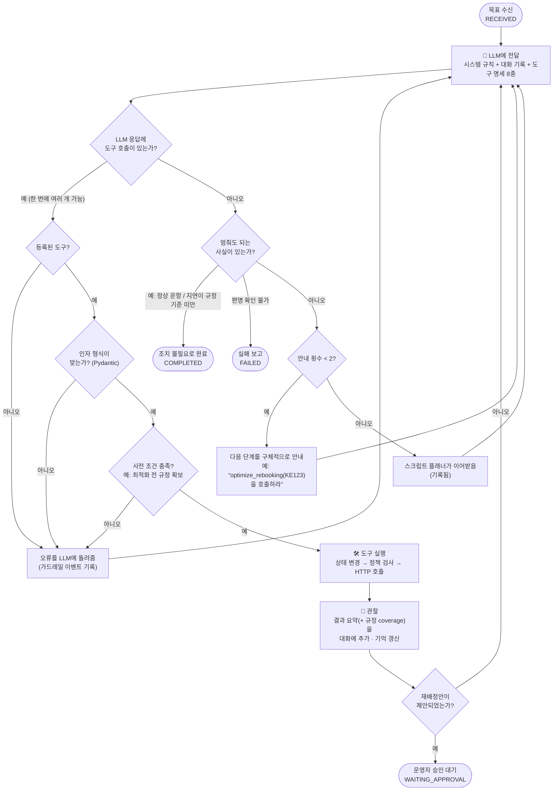
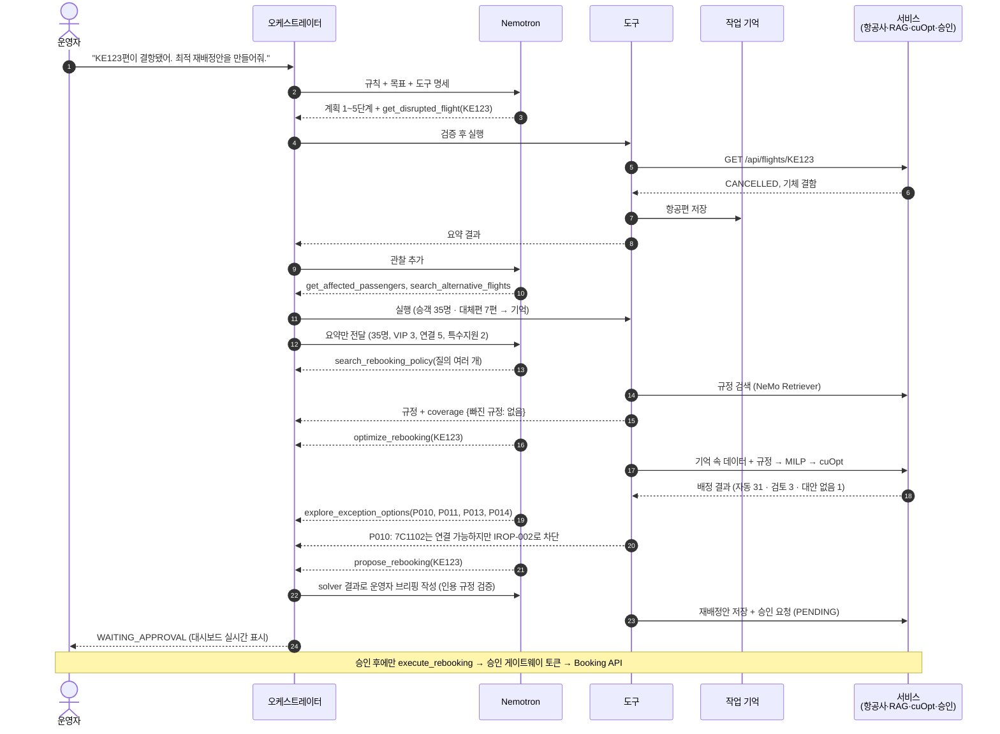
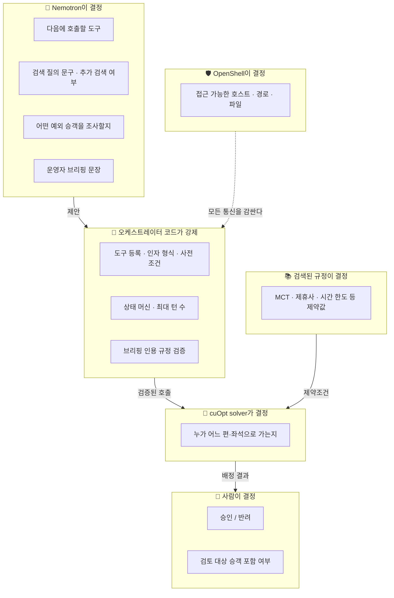
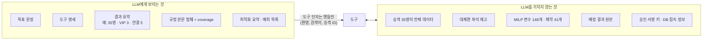
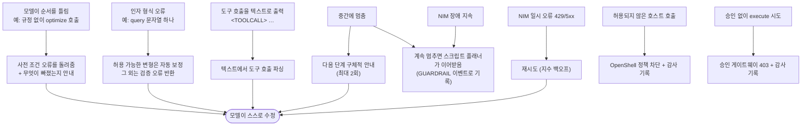
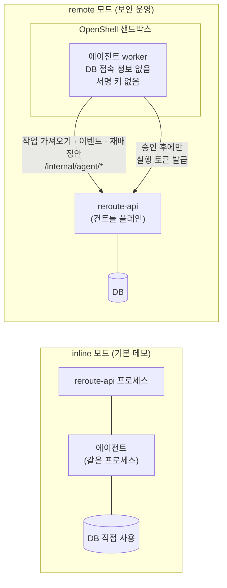

# ReRoute 에이전트: 구조와 동작

**🇰🇷 한국어** · [🇺🇸 English](agent.en.md)

이 문서는 **에이전트 한 개가 어떻게 생겼고, 한 번의 요청을 어떻게 처리하는지**를 그림으로 설명합니다.
시스템 전체 구성과 배포는 [architecture.md](architecture.md)를 보세요.

| 그림 | 보여주는 것 |
|---|---|
| [1. 에이전트 구조](#1-에이전트-구조) | 에이전트를 이루는 부품 (두뇌·손·기억·안전장치) |
| [2. 에이전트 루프](#2-에이전트-루프-계획--행동--관찰) | 매 턴마다 일어나는 일: 계획 → 행동 → 관찰 |
| [3. KE123 한 번의 실행](#3-ke123-한-번의-실행) | 실제 요청 하나가 흘러가는 순서 |
| [4. 누가 무엇을 결정하는가](#4-누가-무엇을-결정하는가) | LLM · 코드 · solver · 사람 · OpenShell의 역할 분리 |
| [5. LLM이 보는 것과 보지 않는 것](#5-llm이-보는-것과-보지-않는-것) | 데이터가 LLM을 거치지 않는 구조 |
| [6. 실수했을 때의 복구 경로](#6-실수했을-때의-복구-경로) | 모델이 틀리거나 멈출 때 |
| [7. 두 가지 실행 형태](#7-두-가지-실행-형태) | API 안에서 실행 vs 샌드박스 worker |

---

## 1. 에이전트 구조

- **두뇌:** 다음에 무엇을 할지 고르는 부분입니다. 실제 모드에서는 Nemotron이 매 턴 도구와 인자를 직접 고릅니다.
- **손:** 도구 8종입니다. 도메인 작업은 전부 이 도구를 통해 HTTP API로만 합니다. 에이전트는 DB에 직접 접근하지 않습니다.
- **기억:** 승객 35명 같은 큰 데이터는 여기에 둡니다. LLM에게는 요약만 보여줍니다(5번 그림).
- **안전장치:** 오케스트레이터가 순서·인자·사전 조건을 검사합니다. 모든 외부 통신은 OpenShell 정책으로 검사되고 감사 로그에 남습니다.

## 2. 에이전트 루프 (계획 → 행동 → 관찰)

## 3. KE123 한 번의 실행

턴 구성(한 턴에 도구를 몇 개 부를지, 규정 검색을 몇 번 할지)은 모델이 정하므로 실행마다 달라질 수 있습니다.
달라지지 않는 것은 검증 규칙, solver 결과, 승인 경계입니다.

## 4. 누가 무엇을 결정하는가

LLM은 **어떻게 일할지**를 정하고, **결과(배정)와 권한(승인·접근)은 정하지 않습니다.**

## 5. LLM이 보는 것과 보지 않는 것

그래서 LLM이 배정을 "살짝 고치거나" 승객 데이터를 외부로 흘릴 경로가 구조적으로 없습니다.

## 6. 실수했을 때의 복구 경로

## 7. 두 가지 실행 형태

`AGENT_EXECUTION=remote`로 두면 에이전트는 샌드박스 안의 별도 프로세스가 됩니다. 에이전트가 장악되더라도 사람의 승인 없이는 예약을 바꿀 수 없습니다.

---

관련 코드: `apps/api/app/agent/orchestrator.py` (루프·가드레일) · `app/agent/prompts.py` (규칙) · `app/tools/` (도구 8종) ·
`app/providers/llm/` (Nemotron 어댑터·선택 로직) · `app/agent/worker.py` (샌드박스 worker) · `app/agent/evaluate.py` (실제 모델 평가)
