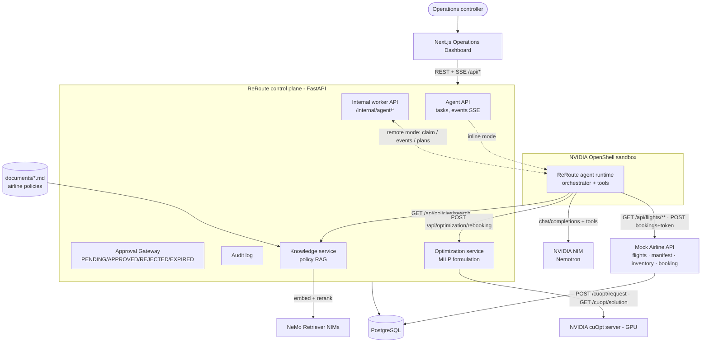
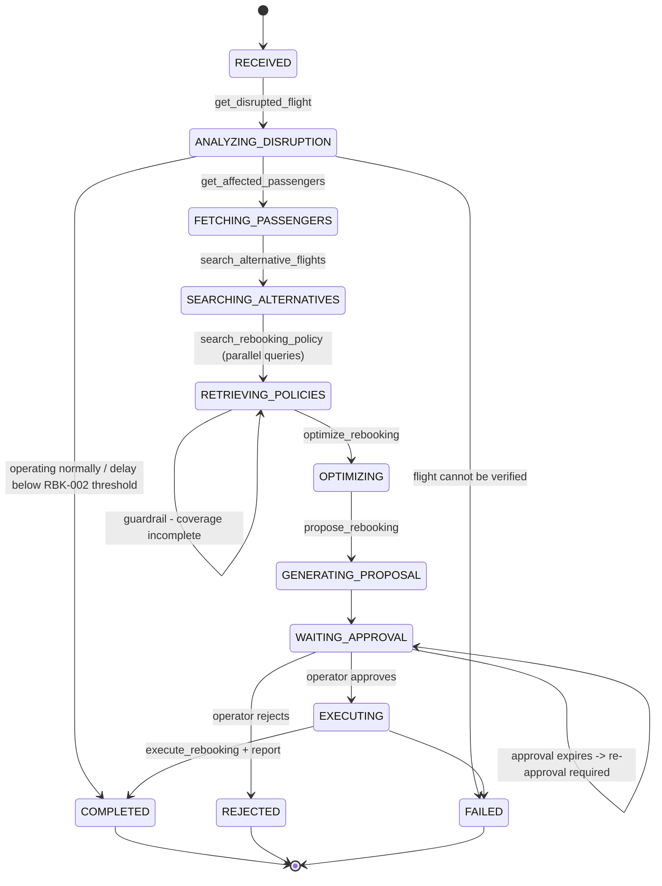
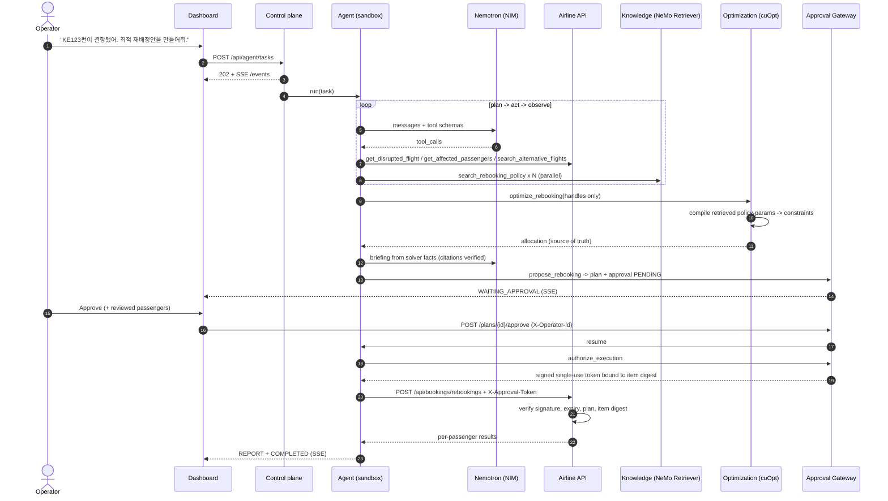
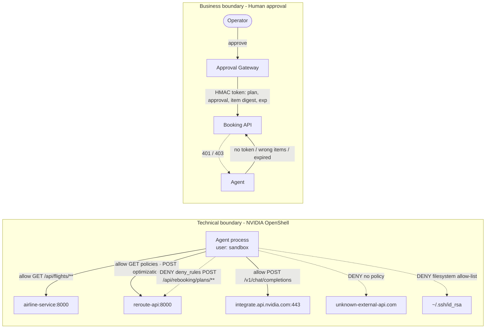
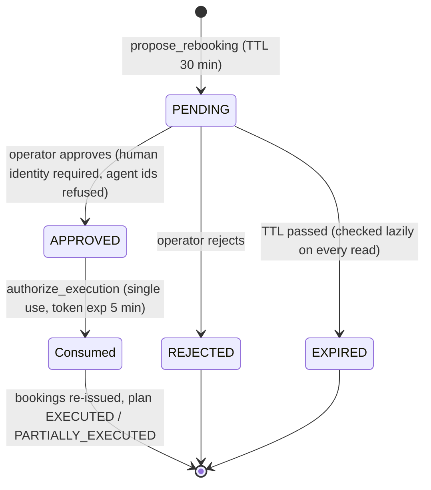
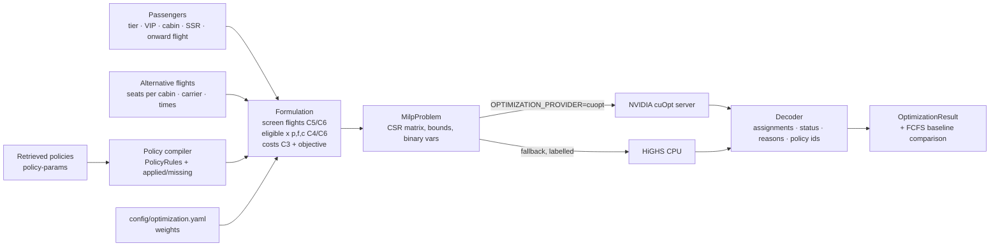

# ReRoute Architecture

ReRoute separates **reasoning** (Nemotron), **grounding** (NeMo Retriever), **decision** (cuOpt),
**technical governance** (OpenShell) and **business authorization** (human approval) into distinct
components with explicit interfaces. Each one closes a different failure mode of LLM agents:

| Failure mode | Closed by |
|---|---|
| Hallucinated airline rules | Policies only enter the model through `search_rebooking_policy`; retrieved `policy-params` compile into constraints; missing coverage is reported, not guessed |
| LLM "decides" who flies | Allocation is a MILP solved by cuOpt; the LLM receives only a summary and cannot write the plan |
| Over-privileged agent | OpenShell sandbox: deny-by-default egress, L7 rules, `deny_rules` on approval endpoints, FS allow-list, non-root |
| Unauthorised state change | Approval Gateway + signed, single-use, item-bound token verified by the Booking API |
| Invisible behaviour | Every state change, tool call, policy decision, approval and booking write is in the event log / audit log |

## 1. System architecture

Bounded contexts share one PostgreSQL instance but not tables: the **airline domain**
(flights, passengers, reservations, disruptions) is owned by the airline service; the **agent domain**
(tasks, events, plans, approvals, audit) by the control plane. The agent never touches either directly.

## 2. Agent workflow (state machine)

Nemotron chooses the next tool; the orchestrator enforces: known tool, Pydantic-validated arguments,
tool preconditions (e.g. `optimize_rebooking` requires passengers, alternatives and full policy coverage),
a step budget (14), and that `execute_rebooking` only succeeds through the Approval Gateway.
If NIM is unavailable, the task switches to the deterministic planner and says so in the event log.

## 3. Sequence (KE123 cancellation)

## 4. Security boundaries

- **OpenShell** answers *"can this process reach this endpoint / file?"* It is enforced by OpenShell in
  sandbox mode; in demo mode the same YAML is evaluated in-process and labelled "policy mirror".
- **Human approval** answers *"did an accountable person authorise this business change?"* It is
  enforced in the backend twice: the gateway only mints a token for an APPROVED, unexpired, unused
  approval, and the Booking API independently verifies that token against the exact item set.

The worker in remote mode has neither DB credentials nor the signing key; even a fully compromised agent
cannot change a booking without a human approval.

## 5. Human approval flow

Manual-review passengers (SSR, at-risk connections) are only executed if the operator explicitly
includes them in the approval; otherwise they are marked `HELD_FOR_OPERATOR`.

## 6. Optimization flow

`x[p,f,c]` binary, `y[p]` binary; C1 `Σx + y = 1`, C2 capacity; C3 downgrade penalty (tier × VIP);
C4 MCT; C5 same destination; C6 carrier/window/flight-status policy; objective = delay × tier + VIP delay
+ downgrade + connection risk + rebooking cost + 100 000 × unassigned.
