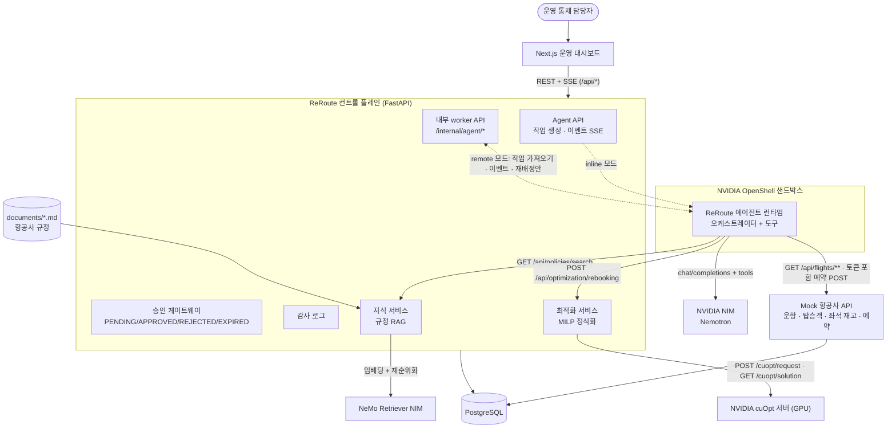
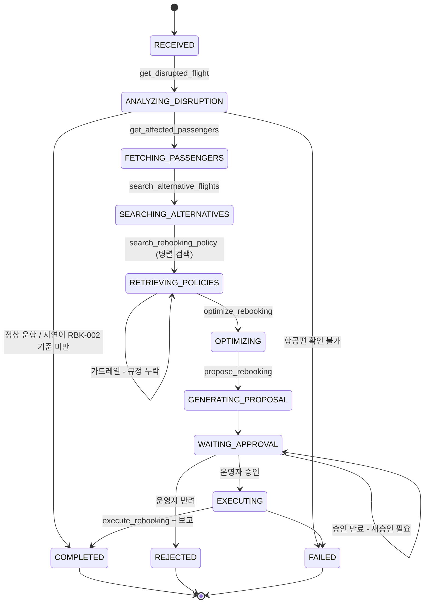
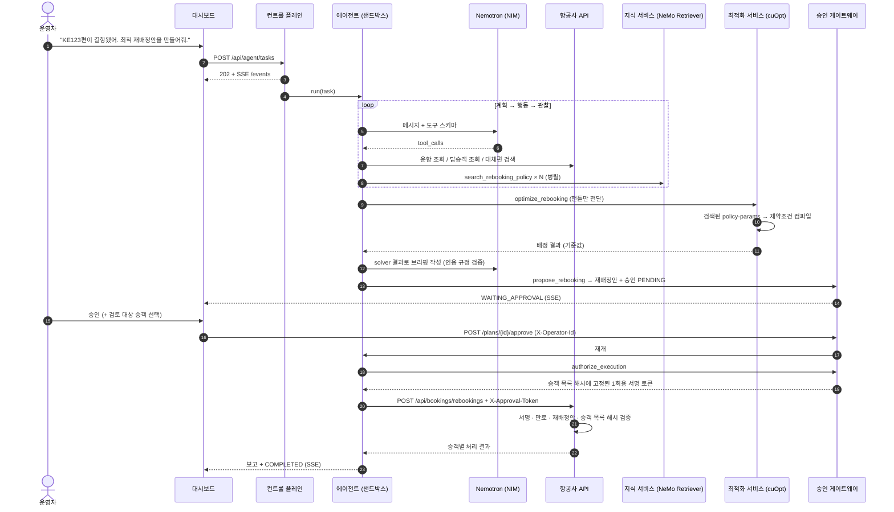
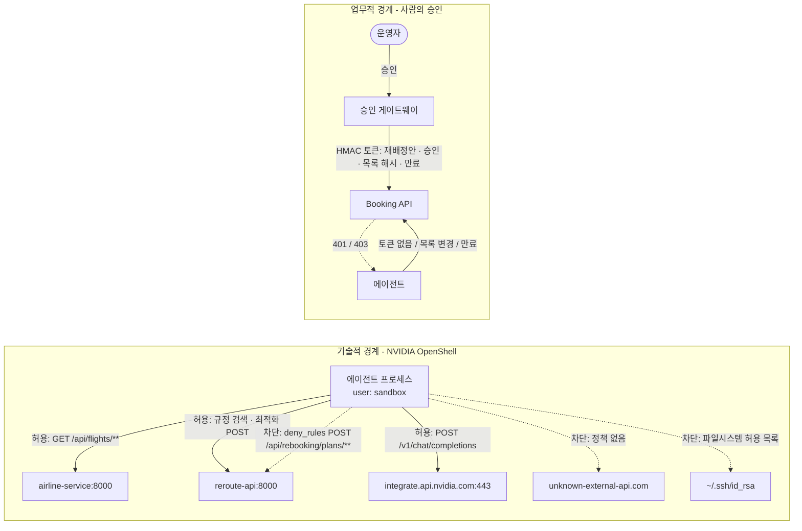
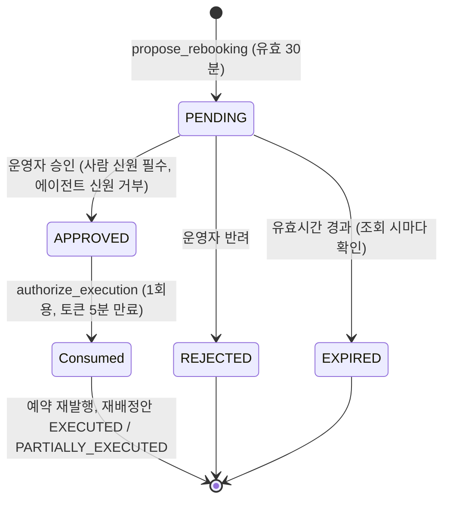
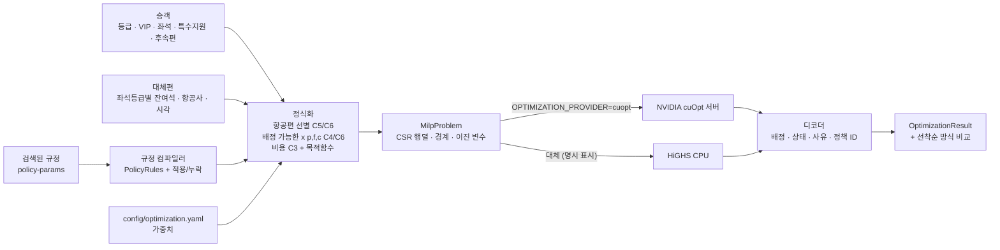
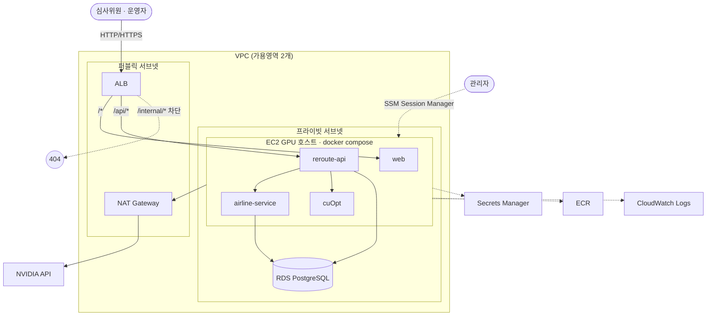

# ReRoute 아키텍처

ReRoute는 **추론**(Nemotron), **근거**(NeMo Retriever), **결정**(cuOpt), **기술적 통제**(OpenShell),
**업무적 승인**(사람의 승인)을 명시적인 인터페이스를 가진 별도 구성요소로 분리합니다. 각각이 LLM 에이전트의 서로 다른 실패 모드를 막습니다.

| 실패 모드 | 막는 방법 |
|---|---|
| 지어낸 항공사 규정 | 규정은 `search_rebooking_policy` 도구로만 들어옵니다. 검색된 `policy-params`가 제약조건으로 컴파일되고, 누락된 규정은 추측하지 않고 보고합니다 |
| LLM이 누가 어느 편을 탈지 결정 | 배정은 cuOpt가 푸는 MILP입니다. LLM은 요약만 받고 재배정안에 쓸 수 없습니다 |
| 과도한 권한을 가진 에이전트 | OpenShell 샌드박스: 기본 차단 egress, L7 규칙, 승인 엔드포인트 `deny_rules`, 파일시스템 허용 목록, non-root |
| 승인 없는 상태 변경 | 승인 게이트웨이 + 서명된 1회용 토큰(승인된 승객 목록에 고정)을 Booking API가 독립 검증 |
| 보이지 않는 행동 | 모든 상태 변경, 도구 호출, 정책 판정, 승인, 예약 쓰기가 이벤트 로그 / 감사 로그에 남습니다 |

다이어그램 목록: [1. 시스템 구성](#1-시스템-구성) · [2. 에이전트 상태 머신](#2-에이전트-워크플로-상태-머신) ·
[3. 시퀀스](#3-시퀀스-ke123-결항) · [4. 보안 경계](#4-보안-경계) · [5. 승인 흐름](#5-사람-승인-흐름) ·
[6. 최적화 흐름](#6-최적화-흐름) · [7. AWS 배포 구성](#7-aws-배포-구성)

## 1. 시스템 구성

두 도메인(bounded context)은 PostgreSQL 인스턴스 하나를 쓰지만 테이블은 공유하지 않습니다.
- **항공사 도메인**(항공편, 승객, 예약, 결항 정보)은 항공사 서비스가 소유합니다.
- **에이전트 도메인**(작업, 이벤트, 재배정안, 승인, 감사)은 컨트롤 플레인이 소유합니다.
- 에이전트는 어느 쪽 테이블에도 직접 접근하지 않습니다.

## 2. 에이전트 워크플로 (상태 머신)

다음 도구는 Nemotron이 고르고, 오케스트레이터는 아래 규칙을 강제합니다.
- 등록된 도구만 호출할 수 있습니다.
- 도구 인자는 Pydantic으로 검증합니다.
- 도구별 사전 조건을 확인합니다. 예를 들어 `optimize_rebooking`은 승객, 대체편, 필요한 규정이 모두 준비되어야 호출됩니다.
- 한 작업의 단계 수는 최대 14로 제한합니다.
- `execute_rebooking`은 승인 게이트웨이를 통과해야만 성공합니다.

NIM을 사용할 수 없으면 해당 작업은 결정론적 플래너로 전환되고, 그 사실이 이벤트 로그에 기록됩니다.

## 3. 시퀀스 (KE123 결항)

## 4. 보안 경계

- **OpenShell**은 *"이 프로세스가 이 엔드포인트·파일에 접근해도 되는가?"*에 답합니다. 샌드박스 모드에서는 OpenShell이
  강제하고, 데모 모드에서는 같은 YAML을 프로세스 안에서 평가하며 화면에 "policy mirror"로 표시합니다.
- **사람의 승인**은 *"책임 있는 사람이 이 업무 변경을 승인했는가?"*에 답합니다. 백엔드에서 두 번 강제합니다.
  1. 게이트웨이는 승인됨(APPROVED), 유효기간 안, 미사용 상태인 승인에 대해서만 토큰을 발급합니다.
  2. Booking API가 그 토큰을 정확한 승객 목록과 대조해 따로 검증합니다.

remote 모드의 worker는 DB 접속 정보도 서명 키도 없습니다. 그래서 에이전트가 완전히 장악되더라도, 사람의 승인 없이는 예약을 바꿀 수 없습니다.

## 5. 사람 승인 흐름

운영자 검토가 필요한 승객(특수지원, 환승 여유 부족)은 운영자가 승인할 때 직접 포함시킨 경우에만 실행됩니다.
포함하지 않으면 `HELD_FOR_OPERATOR`(운영자 처리 대기)로 남습니다.

## 6. 최적화 흐름

- 변수: `x[p,f,c]`와 `y[p]`는 모두 0/1 이진 변수입니다.
- C1: `Σx + y = 1` (승객마다 결과는 정확히 하나)
- C2: 좌석등급별 잔여 좌석
- C3: 다운그레이드 벌점 (등급 × VIP)
- C4: 최소 환승시간(MCT)
- C5: 같은 도착지
- C6: 항공사 · 시간 한도 · 운항 상태 규정
- 목적함수: 지연×등급 + VIP 지연 + 다운그레이드 + 환승 위험 + 재발권 비용 + 100,000 × 미배정

## 7. AWS 배포 구성

상세 절차, 비밀값 흐름, 사전 점검 체크리스트는 [infra/terraform/README.md](../infra/terraform/README.md)에 있습니다.
