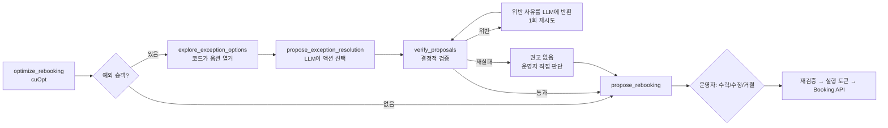

# 예외 승객 처리: LLM 제안 + 결정적 검증기

> 상태: **P1·P2 구현 완료** (검증기, 에이전트 루프 연동, shadow 모드 기록) · P3~P4 설계 단계

## 배경

cuOpt가 자동 배정하지 못한 승객(`MANUAL_REVIEW` / `NO_FEASIBLE`)은 지금도 `explore_exception_options`로 분석되지만,
결과는 브리핑 안의 자유 텍스트 권고로만 나갑니다. 운영자가 할 수 있는 선택은 "solver가 정한 편을 승인할지"뿐입니다.

이 설계는 그 권고를 **검증 가능한 구조화 제안**으로 바꿉니다. 자동 배정 31명은 건드리지 않으며,
"LLM은 배정을 결정하지 않는다"는 원칙도 그대로 유지합니다. LLM은 코드가 열거한 선택지 안에서만 고르고,
최종 판정은 solver와 같은 제약 코드를 쓰는 검증기가 내립니다.

## 원칙

| 원칙 | 의미 |
|---|---|
| 닫힌 선택지 | 편과 좌석은 검색된 대체편 중에서만 고릅니다. 편명을 새로 만들면 `UNKNOWN_FLIGHT`로 거부됩니다 |
| 검증기가 최종 판정 | 통과한 제안만 운영자에게 "권고"로 표시됩니다 |
| 자동배정 불가침 | 예외 승객만 대상입니다. 그 외 승객에 대한 제안은 `TARGET`으로 거부됩니다 |
| 사람 승인 후 실행 | 정책 예외(waiver)는 duty manager 역할만 승인할 수 있습니다 |

## 흐름

## 액션 (닫힌 집합) — `app/resolution/models.py`

| 액션 | 대상 | 좌석 | 비고 |
|---|---|---|---|
| `CONFIRM_SOLVER_ASSIGNMENT` | MANUAL_REVIEW | solver 좌석 유지 | 체크리스트 필수 (예: WCHC 지상조업 재확인) |
| `REASSIGN_TO_OPTION` | 예외 승객 | 다른 대체편 | 정책상 feasible한 편만 |
| `REQUEST_POLICY_WAIVER` | 예외 승객 | 정책 차단 편 | 면제 가능한 차단만 있어야 함, 해당 정책 ID 인용 필수, duty manager 승인 |
| `OFFER_REFUND` | 예외 승객 | 없음 | 환불/duty of care 후속 태스크 |
| `REROUTE_OFFLINE` | 예외 승객 | 없음 | 시스템 밖 처리 (타사, 육로 등) |

LLM의 자기평가 confidence 필드는 일부러 두지 않았습니다. 품질 신호는 검증 결과와 운영자 수락률로 봅니다.

## 공용 제약 함수 — `app/optimization/constraints.py`

제약 판정이 `formulation.py`와 `tools/exceptions.py` 두 곳에 흩어져 있던 것을 한 곳으로 모았습니다.
MILP formulation, 예외 분석 툴, 검증기가 모두 이 모듈을 씁니다. 그래서 "모델에게 feasible하다고 보여준 옵션을
검증기가 거부"하거나 그 반대가 되는 일은 구조적으로 생기지 않습니다(`test_verifier_agrees_with_the_options_shown_to_the_model`로 고정).

각 차단(`Block`)은 자신을 만든 정책 규칙을 기록합니다. **면제 가능 여부는 규칙으로 판정**합니다.

| 차단 | 규칙 | 면제 |
|---|---|---|
| C5 co-terminal 공항 | `coterminal` | 가능 |
| C6 interline 협정 없음 | `interline` | 가능 |
| C6 재보호 시간창 초과 | `max_delay` | 가능 |
| C6 편 자체가 비운항/지연 | 운영 사실 | **불가** |
| C6 SSR(WCHC/UMNR/MEDA) 자사편 한정 | `ssr` | **불가** (안전) |
| C4 MCT 미달 / 공항 변경 | `mct` / 물리 제약 | **불가** |
| C2 좌석 부족 | 물리 제약 | **불가** |

기존 코드는 제약 코드가 C5/C6인지로 면제 가능 여부를 판단했습니다. 그래서 "편 자체가 지연됨" 같은 운영 사실도
정책 차단처럼 보일 수 있었는데, 이번에 규칙 기반 판정으로 바로잡았습니다. KE123 데모의 배정 결과와 목적함수는 리팩터링 전후가 동일합니다.

## 검증기 — `app/resolution/verifier.py`

LLM 호출과 I/O가 없는 순수 함수입니다. `verify_proposals(proposals, req, assignments, known_policy_ids)`

| 코드 | 검사 |
|---|---|
| `TARGET` | 예외 승객인가, 확인할 solver 좌석이 있는가 |
| `DUPLICATE` | 같은 승객에 제안이 둘 이상인가 |
| `PARAMS` / `RATIONALE` / `CHECKLIST` | 액션에 맞는 인자인가, 운영자용 설명과 체크리스트가 있는가 |
| `UNKNOWN_FLIGHT` | 검색된 대체편인가 (편명 지어내기 차단) |
| `CABIN` | 탑승 가능한 등급인가 (이코노미 승급은 정책이 허용할 때만) |
| `CONSTRAINT` | 하드 제약 위반 (면제 가능하면 waiver 힌트 포함) |
| `NOT_WAIVABLE` / `NO_WAIVER_NEEDED` | 면제 불가 제약을 면제하려 하거나, 면제가 필요 없는 편인가 |
| `CITATION` | 검색되지 않은 정책 인용, 또는 면제 대상 정책을 인용하지 않은 waiver |
| `CAPACITY` | **모든 제안을 함께 적용했을 때** 좌석 초과 |

**좌석 검사는 합산으로 합니다.** `explore_exception_options`는 승객을 한 명씩 분석하므로, 두 제안이 각자 보기엔 문제없는데
같은 마지막 좌석을 가져갈 수 있습니다. 검증기는 solver 계획 위에 유효한 제안을 모두 적용합니다(원래 좌석 반납 + 새 좌석 점유).
초과가 생기면 해당 좌석을 새로 점유하려던 제안을 거부하고, 안정될 때까지 반복합니다. 거부된 제안이 반납하려던 좌석은
반납되지 않은 것으로 다시 계산되므로, "P011이 KE701을 비우면 P013이 그 자리로" 같은 연쇄 제안도 앞 제안이 거부되면
뒤 제안이 함께 거부됩니다.

제안 집합이 바뀌면(운영자 수정, 부분 승인) 검증기를 **반드시 다시 실행**합니다. 이전 판정은 재사용하지 않습니다.

## KE123 데모에서의 모습

| 승객 | solver 결과 | 기대 권고 |
|---|---|---|
| P010 | NO_FEASIBLE (SQ637 환승) | `REQUEST_POLICY_WAIVER` 7C1102 [IROP-002] → duty manager, 거부 시 `OFFER_REFUND` |
| P011 | MANUAL_REVIEW, KE701 (환승 여유 빠듯) | `CONFIRM_SOLVER_ASSIGNMENT` + 환승 리스크 체크리스트 |
| P013 | MANUAL_REVIEW, KE703 (WCHC) | `CONFIRM_SOLVER_ASSIGNMENT` + 휠체어 지상조업 체크리스트 |
| P014 | MANUAL_REVIEW, KE703 (UMNR) | `CONFIRM_SOLVER_ASSIGNMENT` + 비동반 소아 인계 체크리스트 |

## 단계별 계획

| 단계 | 내용 | 상태 |
|---|---|---|
| P1 | 공용 제약 함수, 검증기, 테스트 (LLM 동작 변화 없음) | ✅ 완료 |
| P2 | `propose_exception_resolution` 툴, mock 규칙 기반 proposer(데모 + eval baseline), `ExceptionResolution` 저장. **shadow 모드**: 기록만 하고 UI에는 표시하지 않음 | ✅ 완료 |
| P3 | 승인 API를 `exception_decisions[{item_id, ACCEPT/MODIFY/REJECT, override}]`로 확장, 승인 시점과 `authorize_execution` 시점 재검증, waiver 역할 확인, UI 카드 | 예정 |
| P4 | LLMOps: 예외 단위 트레이싱, 골든셋, CI(mock)·nightly(Nemotron) eval 게이트 | 예정 |

자동 실행은 단계 계획에 없습니다. 상태를 바꾸는 작업은 계속 사람이 승인합니다.

## P2 구현 내용 (shadow 모드)

| 구성 요소 | 위치 | 내용 |
|---|---|---|
| 제안 툴 | `app/tools/resolution.py` | 승객당 1개 제안을 받아, 이미 통과한 다른 승객들의 제안과 **함께** 검증합니다. 거부되면 위반 사유를 돌려주고 1회 수정 기회를 줍니다(승객당 최대 2회). 이미 다른 승객에게 권고된 좌석을 뺏는 제안도 거부합니다 |
| 규칙 기반 제안기 | `app/resolution/baseline.py` | `explore_exception_options` 결과만 보고 제안합니다. mock 플래너(데모)와 eval baseline이 같이 씁니다 |
| 저장 | `exception_resolutions` 테이블 | 모든 시도를 저장합니다(최종 채택 여부 `final` 포함). 플래너(`provider/model`)와 **프롬프트 버전**(시스템 프롬프트 내용 해시)을 함께 기록합니다. `create_plan` 경로로 저장하므로 DB가 없는 sandbox worker에서도 동작합니다 |
| 조회 | `GET /api/rebooking/plans/{id}/exception-resolutions` | 시도 목록과 지표(coverage, 1차 통과율, 위반 코드 분포, 액션, waiver 요청) |
| 평가 | `make eval-llm` | KE123 시나리오에 "예외 승객 전원 권고" 체크가 추가되고, 1차 통과율과 baseline 일치율을 출력합니다 |
| 설정 | `EXCEPTION_RESOLUTION_MODE` | `shadow`(기본) 또는 `off`. `off`면 툴이 등록되지 않고 프롬프트에서도 빠집니다 |

shadow 모드에서는 권고가 에이전트 타임라인과 위 조회 API에만 남습니다. 브리핑, 승인 화면, 승인·실행 흐름은 `off`일 때와 **동일**합니다(`test_shadow_mode_does_not_change_what_the_operator_sees_or_approves`로 고정).

KE123 mock 실행 결과: 4/4 권고, 1차 통과율 100%. P010은 7C1102 waiver(duty manager), P011·P013·P014는 체크리스트가 붙은 확인입니다.

**P3로 넘긴 것**
- 외부 에이전트(OpenClaw, MCP)에는 아직 제안 툴이 노출되지 않습니다. 이 경로의 계획은 권고 없이 기록됩니다(coverage 0).
- 지금은 control plane이 worker가 보낸 검증 결과를 그대로 저장합니다. 권고를 운영자에게 보여주는 P3부터는 control plane이 DB의 승객·항공편 데이터로 **다시 검증**해야 합니다.

## LLMOps (P4)

- **트레이싱**: 예외 1건 = 트레이스 1개 (explore → propose → verify → 재시도 → 운영자 결정). 속성은 `prompt_version`, `model`, 토큰(`nim.py`가 이미 받는 `usage`), 지연시간, verdict, violations입니다.
- **골든셋**: seed를 변형해서 SSR, 빠듯한 환승, 매진, interline 차단, 좌석 경쟁 케이스 20~50개를 만듭니다. 정답은 대부분 코드로 계산할 수 있습니다(제약을 완화해 solver를 다시 돌리면 "waiver로 환승을 살릴 수 있나"가 판정됨). LLM-as-judge는 rationale 문장 품질에만 씁니다.

| 지표 | 게이트 예시 |
|---|---|
| 1차 검증 통과율 | ≥ 90% |
| 검증 실패 제안이 권고로 노출된 건수 | **0** (구조적 보장 + 테스트) |
| 액션 정확도 | ≥ mock proposer baseline |
| 인용 정밀도 | ≥ 95% |
| 5회 반복 액션 일치율 | ≥ 80% |

- **온라인 지표**: 액션 유형별·프롬프트 버전별 운영자 수락/수정/거절률, 검증 거절률, 재시도율, 결정까지 걸린 시간. 운영자가 수정한 케이스는 골든셋 후보로 올립니다.
- **CI**: PR마다 검증기 테스트와 mock LLM 파이프라인을 돌리고, nightly로 실제 Nemotron eval을 돌립니다. 프롬프트를 바꾼 PR은 nightly 결과를 첨부합니다.
