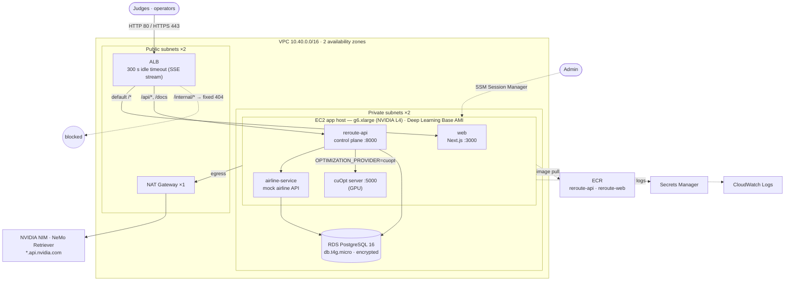
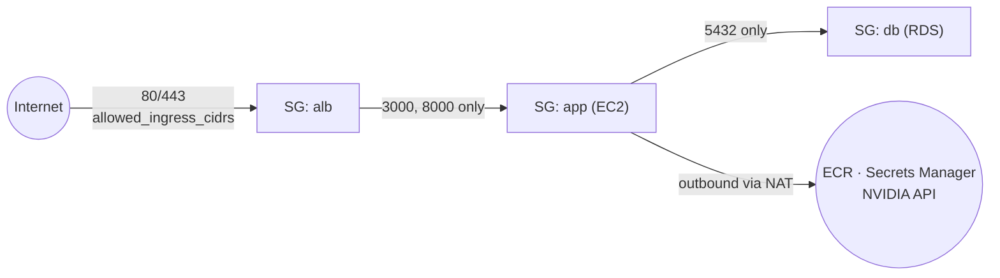
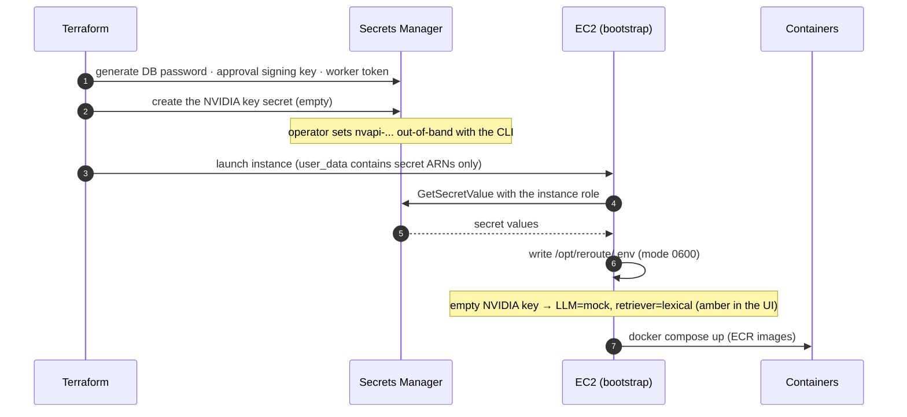
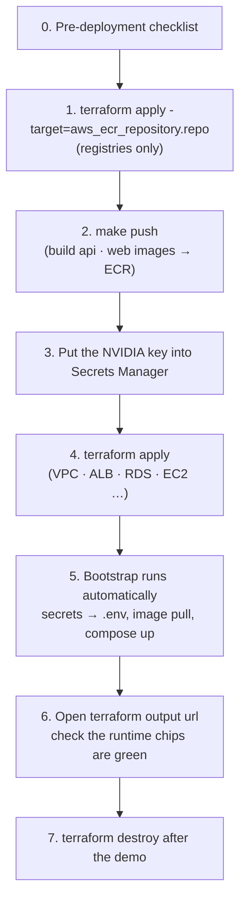

# ReRoute on AWS (Terraform)

[🇰🇷 한국어](README.md) · **🇺🇸 English**

A **single-host deployment** sized for a hackathon demo, built with production habits: private subnets, no SSH (SSM access),
IMDSv2 only, encrypted storage, secrets in Secrets Manager, least-privilege IAM.

> **Verification status:** `terraform fmt -check` and `terraform validate` (AWS provider 5.80) pass. The templates were rendered for
> both GPU and CPU variants and the bootstrap script / compose file were syntax-checked. **`terraform apply` has not been run yet** —
> check the [pre-deployment checklist](#4-pre-deployment-checklist) before the first deployment.

## 1. Topology



With `enable_gpu = false` the app host becomes a `t3.large` (Amazon Linux 2023) and the CPU fallback solver (HiGHS) replaces
cuOpt — clearly shown as an amber "CPU fallback" in the dashboard.

## 2. Network & security groups



| Security group | Inbound | Note |
|---|---|---|
| `alb` | 80, 443 ← `allowed_ingress_cidrs` | narrow to judges' / office IPs for a private demo |
| `app` | 3000, 8000 ← ALB only | no SSH port |
| `db` | 5432 ← app only | not publicly accessible |

## 3. Secret flow (no secrets in code, tfvars or user_data)



The instance role may only: use SSM, read ECR, read **this deployment's two secrets**, and write to this deployment's log group.

## 4. Pre-deployment checklist

| # | Check | How |
|---|---|---|
| 1 | **GPU instance quota** — often 0 on new accounts | Service Quotas → EC2 → "Running On-Demand G and VT instances" ≥ 4 vCPU (approval can take time) |
| 2 | **GPU instance type offered in the region** — g6 availability in Seoul was not verified | `aws ec2 describe-instance-type-offerings --region ap-northeast-2 --filters Name=instance-type,Values=g6.xlarge` → if empty, `gpu_instance_type = "g5.xlarge"` |
| 3 | **GPU AMI parameter** | `aws ssm get-parameter --region ap-northeast-2 --name /aws/service/deeplearning/ami/x86_64/base-oss-nvidia-driver-gpu-ubuntu-22.04/latest/ami-id` |
| 4 | **Register the NVIDIA key before the host is created** — the host reads it only at first boot | step 3 of the procedure below |
| 5 | **Local tools** | Terraform ≥ 1.6, AWS CLI v2, Docker (buildx on Apple Silicon), `make` |
| 6 | **Terraform state** — local file by default | for a team, uncomment the S3 backend in `versions.tf` |
| 7 | **HTTPS hostname for MCP (OpenClaw integration)** — NemoClaw only accepts HTTPS MCP endpoints | set `public_hostname` and `certificate_arn` → `terraform output mcp_url`; token via `terraform output -raw mcp_token_command` |
| 8 | **Cost** — GPU instance, NAT, ALB and RDS bill while running | `terraform destroy` after the demo; check your region's price list |

## 5. Deployment procedure



```bash
# 0) prepare
cd infra/terraform
cp terraform.tfvars.example terraform.tfvars      # git-ignored; set region, GPU, …
terraform init

# 1) registries first
terraform apply -target=aws_ecr_repository.repo

# 2) build & push images (from the repository root)
cd ../.. && make push AWS_REGION=ap-northeast-2 && cd infra/terraform

# 3) NVIDIA key — never put it in chat, tfvars or git
aws secretsmanager put-secret-value \
  --secret-id "$(terraform output -raw nvidia_api_key_secret_arn)" --secret-string 'nvapi-...'

# 4) everything else
terraform apply

# 5) URL
terraform output url
```

The first boot can take a few minutes (the cuOpt image is large). Wait until the ALB target groups report healthy.

## 6. Operations

| Task | Command |
|---|---|
| Roll out new images | `make push`, then `make redeploy` (SSM runs `docker compose pull && up -d` on the host) |
| Shell on the host | `aws ssm start-session --target $(terraform output -raw instance_id)` |
| Bootstrap log | on the host: `sudo cat /var/log/reroute-bootstrap.log` |
| Container status | on the host: `cd /opt/reroute && sudo docker compose ps` |
| Application logs | CloudWatch Logs `/reroute/demo` |
| Apply a changed NVIDIA key | recreate the host: `terraform apply -replace=aws_instance.app` |
| Tear down | `terraform destroy` |

## 7. Troubleshooting

| Symptom | Cause & fix |
|---|---|
| `InsufficientInstanceCapacity` / `VcpuLimitExceeded` during `apply` | GPU quota or AZ capacity → request quota, switch to `g5.xlarge`, or `enable_gpu = false` |
| ALB 502 / unhealthy targets | image pull still running, or no `image_tag` image in ECR → check the bootstrap log, re-run `make push` |
| All runtime chips amber | host booted with an empty NVIDIA key → set the key, then `terraform apply -replace=aws_instance.app` |
| Optimizer shows "CPU fallback" | cuOpt not ready or GPU not visible → `docker compose logs cuopt`, `nvidia-smi` |

## 8. Files

| File | Contents |
|---|---|
| `versions.tf` | Terraform / provider versions, default tags, optional S3 backend |
| `variables.tf` | region, GPU toggle, instance types, LLM / retriever modes, allowed IPs |
| `network.tf` | VPC, 2 public + 2 private subnets, IGW, 1 NAT, routing |
| `security_groups.tf` | ALB ← internet, app ← ALB, DB ← app |
| `alb.tf` | ALB, target groups (web/api), `/api/*` routing, `/internal/*` blocked, optional HTTPS |
| `compute.tf` | EC2 app host (GPU AMI or AL2023), IMDSv2, encrypted disk |
| `rds.tf` | PostgreSQL 16 |
| `ecr.tf` | two registries (scan on push, keep last 15 images) |
| `secrets.tf` | generated secrets + empty NVIDIA key secret |
| `iam.tf` | least-privilege instance role, CloudWatch log group |
| `templates/user_data.sh.tftpl` | bootstrap script (no secrets) |
| `templates/docker-compose.prod.yml.tftpl` | production compose (cuOpt only when GPU) |
| `outputs.tf` | URL, ECR repositories, instance id, NVIDIA key secret ARN |

## 9. Towards production

ECS/EKS with GPU node groups for cuOpt, Multi-AZ RDS, one NAT per AZ, WAF on the ALB, OpenShell-sandboxed agent workers
(`AGENT_EXECUTION=remote`), and OIDC/SSO operator identity instead of the `X-Operator-Id` header.
