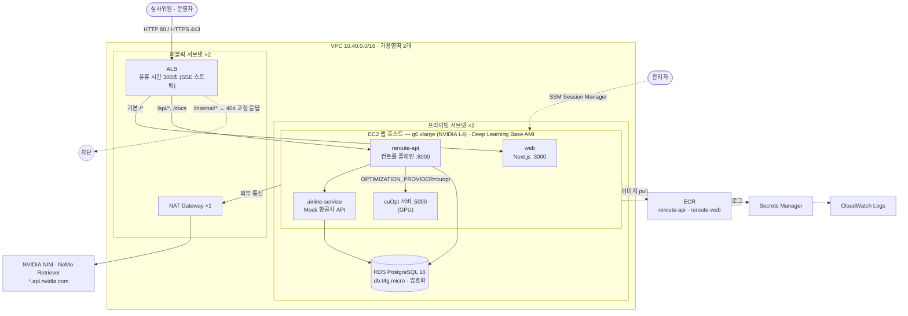
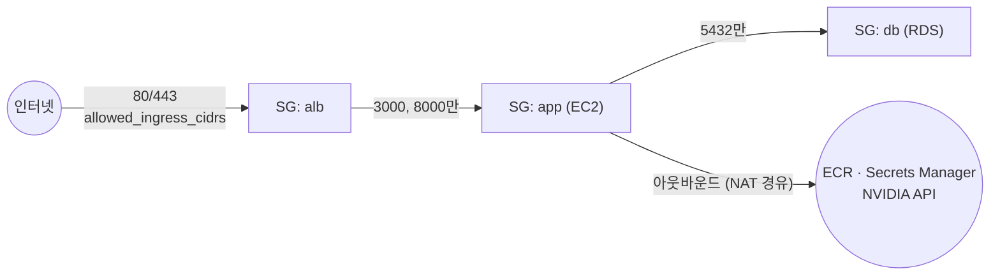
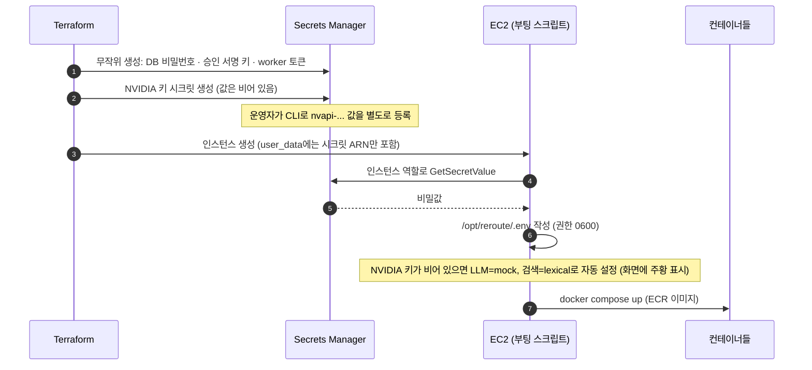
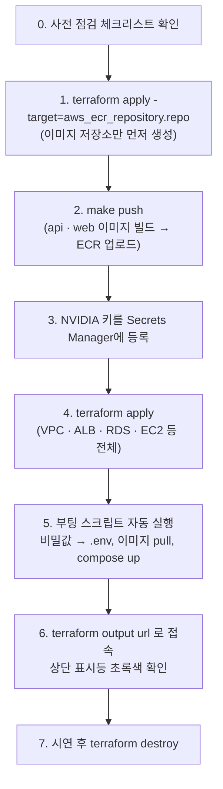
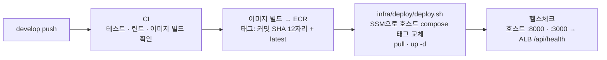

# ReRoute AWS 배포 (Terraform)

**🇰🇷 한국어** · [🇺🇸 English](README.en.md)

해커톤 데모 규모에 맞춘 **단일 호스트 배포**입니다. 규모는 작지만 운영 환경의 기본 원칙을 따릅니다:
프라이빗 서브넷, SSH 없음(SSM 접속), IMDSv2 강제, 스토리지 암호화, Secrets Manager 비밀값 관리, 최소 권한 IAM.

> **현재 검증 상태:** `terraform fmt -check`, `terraform validate`(AWS provider 5.80)는 통과했습니다. 템플릿을 GPU/CPU 두 경우로
> 렌더링해 부트스트랩 스크립트 문법과 compose 파일도 확인했습니다. **실제 `terraform apply`는 아직 실행하지 않았습니다.**
> 처음 배포할 때는 아래 [사전 점검](#4-배포-전-사전-점검-체크리스트)을 먼저 확인하세요.

## 1. 전체 구성



`enable_gpu = false`로 두면 앱 호스트가 `t3.large`(Amazon Linux 2023)로 바뀌고, cuOpt 대신 CPU 대체 solver(HiGHS)를 씁니다.
대시보드에는 주황색 "CPU fallback"으로 명확히 표시됩니다.

## 2. 네트워크와 보안 그룹



| 보안 그룹 | 인바운드 | 비고 |
|---|---|---|
| `alb` | 80, 443 ← `allowed_ingress_cidrs` | 심사위원·사내 IP로 좁히면 비공개 데모 가능 |
| `app` | 3000, 8000 ← ALB만 | SSH 포트 없음 |
| `db` | 5432 ← app만 | 퍼블릭 접근 불가 |

## 3. 비밀값 흐름 (코드·tfvars·user_data에 비밀값 없음)



IAM 인스턴스 역할이 할 수 있는 일: SSM 접속, ECR 이미지 읽기, **이 배포의 시크릿 2개만** 읽기, 이 배포의 로그 그룹에 쓰기.

## 4. 배포 전 사전 점검 체크리스트

| # | 확인 항목 | 방법 |
|---|---|---|
| 1 | **GPU 인스턴스 할당량** — 새 계정은 G 계열 한도가 0인 경우가 많습니다 | Service Quotas → EC2 → "Running On-Demand G and VT instances" ≥ 4 vCPU로 증가 요청 (승인에 시간 걸림) |
| 2 | **리전에 GPU 인스턴스 타입이 있는지** — 서울 리전 g6 제공 여부는 확인하지 못했습니다 | `aws ec2 describe-instance-type-offerings --region ap-northeast-2 --filters Name=instance-type,Values=g6.xlarge` → 없으면 `gpu_instance_type = "g5.xlarge"` |
| 3 | **GPU AMI 파라미터** | `aws ssm get-parameter --region ap-northeast-2 --name /aws/service/deeplearning/ami/x86_64/base-oss-nvidia-driver-gpu-ubuntu-22.04/latest/ami-id` |
| 4 | **NVIDIA 키를 서버 생성 전에 등록** — 서버는 처음 부팅할 때만 키를 읽습니다 | 아래 배포 절차 3단계 |
| 5 | **로컬 도구** | Terraform ≥ 1.6, AWS CLI v2, Docker (Apple Silicon이면 buildx), `make` |
| 6 | **Terraform 상태 저장소** — 기본은 로컬 파일 | 팀으로 쓸 거면 `versions.tf`의 S3 backend 주석 해제 |
| 7 | **MCP(OpenClaw 연동)용 HTTPS 도메인** — NemoClaw는 HTTPS MCP 엔드포인트만 받습니다 | `public_hostname`과 `certificate_arn` 설정 → `terraform output mcp_url`, 토큰은 `terraform output -raw mcp_token_command` 실행 |
| 8 | **비용** — GPU 인스턴스·NAT·ALB·RDS가 켜져 있는 동안 계속 과금 | 시연이 끝나면 `terraform destroy`. 금액은 리전 요금표로 확인 |

## 5. 배포 절차



```bash
# 0) 준비
cd infra/terraform
cp terraform.tfvars.example terraform.tfvars      # git에서 제외된 파일. 리전·GPU 여부 등을 수정
terraform init

# 1) 이미지 저장소 먼저 생성
terraform apply -target=aws_ecr_repository.repo

# 2) 이미지 빌드·업로드 (저장소 루트에서)
cd ../.. && make push AWS_REGION=ap-northeast-2 && cd infra/terraform

# 3) NVIDIA 키 등록 — 채팅·tfvars·git에 절대 넣지 마세요
aws secretsmanager put-secret-value \
  --secret-id "$(terraform output -raw nvidia_api_key_secret_arn)" --secret-string 'nvapi-...'

# 4) 나머지 전체 생성
terraform apply

# 5) 접속 주소
terraform output url
```

첫 부팅 후 앱이 뜨기까지 이미지 pull(특히 cuOpt 이미지)에 몇 분 걸릴 수 있습니다. ALB 대상 그룹이 healthy가 될 때까지 기다리세요.

## 6. 운영 명령

| 작업 | 명령 |
|---|---|
| 새 이미지 반영 | `develop`에 push하면 GitHub Actions가 자동 배포 (아래 절). 로컬에서는 `make push TAG=<태그>` 후 `make deploy TAG=<태그>` |
| 롤백 | 이전 태그로 다시 배포: `make deploy TAG=<이전 태그>` 또는 Actions의 **deploy** 워크플로를 수동 실행하며 `image_tag` 입력 |
| 서버 셸 접속 | `aws ssm start-session --target $(terraform output -raw instance_id)` |
| 부팅 로그 확인 | 접속 후 `sudo cat /var/log/reroute-bootstrap.log` |
| 컨테이너 상태 | 접속 후 `cd /opt/reroute && sudo docker compose ps` |
| 애플리케이션 로그 | CloudWatch Logs `/reroute/demo` |
| NVIDIA 키 변경 반영 | 키를 바꾼 뒤 인스턴스 재생성: `terraform apply -replace=aws_instance.app` |
| 전체 삭제 | `terraform destroy` |

### GitHub Actions 자동 배포

`develop`에 push하면 `.github/workflows/deploy.yml`이 아래 순서로 실행됩니다. AWS 액세스 키는 GitHub에 저장하지 않습니다.
GitHub OIDC 토큰으로 배포 전용 IAM 역할을 받고, 이 역할은 이 저장소의 `demo` environment에서 도는 작업만 받을 수 있습니다.



배포 전용 역할은 ECR 저장소 두 개에 이미지를 올리는 것과, `Name=<name>-<environment>-app` 태그가 붙은 인스턴스에
`AWS-RunShellScript`를 실행하는 것만 할 수 있습니다. 인프라 변경(`terraform apply`)은 자동화하지 않고 지금처럼 사람이 실행합니다.

**처음 한 번 설정**

```bash
# 1) terraform.tfvars에 저장소 지정 후 apply → 배포 역할 생성
#    github_repository = "hyunolike/reroute-irops-agent"
#    (계정에 GitHub OIDC 공급자가 이미 있으면 create_github_oidc_provider = false)
terraform apply
terraform output github_actions_variables     # 아래 2)에 넣을 값

# 2) GitHub에 값 등록 (gh CLI, 저장소 루트에서)
gh api -X PUT "repos/{owner}/{repo}/environments/demo"           # environment 생성
gh variable set AWS_DEPLOY_ROLE_ARN --env demo --body "arn:aws:iam::<계정>:role/reroute-demo-github-deploy"
gh variable set AWS_REGION          --env demo --body ap-northeast-2
gh variable set DEPLOY_NAME         --env demo --body reroute
gh variable set DEPLOY_ENVIRONMENT  --env demo --body demo
gh variable set DEPLOY_ENABLED --body true                          # 저장소 변수. 이게 없으면 develop push에 CI만 돕니다
```

값은 모두 비밀값이 아닌 변수(variable)입니다. 저장하는 비밀값(secret)은 없습니다. GitHub의 **Settings → Environments → demo**에서
배포 브랜치를 `develop`으로 제한하거나 승인자를 지정하면, 수동 실행을 포함한 모든 배포에 그 규칙이 걸립니다.

**수동 실행과 롤백:** Actions 탭에서 **deploy** → **Run workflow**. `image_tag`를 비우면 선택한 브랜치의 커밋을 빌드해 배포하고,
이전 태그(ECR에 남아 있는 커밋 SHA, 최근 15개 보관)를 넣으면 빌드 없이 그 이미지로 되돌립니다. 호스트에서 배포가 실패하면
직전 compose 파일이 `/opt/reroute/docker-compose.yml.prev`에 남습니다.

## 7. 문제 해결

| 증상 | 원인과 조치 |
|---|---|
| `apply` 중 `InsufficientInstanceCapacity` / `VcpuLimitExceeded` | GPU 할당량 부족 또는 해당 가용영역에 재고 없음 → 할당량 증가 요청, `g5.xlarge`로 변경, 또는 `enable_gpu = false` |
| Actions `Could not assume role` / `Not authorized to perform sts:AssumeRoleWithWebIdentity` | 작업이 `demo` environment에서 돌지 않았거나 `github_repository` 값이 저장소 이름과 다름 → tfvars 확인 후 `terraform apply` |
| 배포가 `SSM command ... ended with status Failed` | 출력된 호스트 로그 확인. 흔한 원인은 이미지 pull 실패나 헬스체크 시간 초과. 이전 태그로 롤백 가능 |
| ALB 502 / 대상 unhealthy | 이미지 pull이 아직 진행 중이거나 ECR에 `image_tag` 이미지가 없음 → 부팅 로그 확인, `make push` 재실행 |
| 상단 표시등이 모두 주황색 | NVIDIA 키가 비어 있는 상태로 부팅됨 → 키 등록 후 `terraform apply -replace=aws_instance.app` |
| Optimizer가 "CPU fallback"으로 표시 | cuOpt 컨테이너가 아직 준비되지 않았거나 GPU를 인식하지 못함 → `docker compose logs cuopt`, `nvidia-smi` 확인 |

## 8. 파일 구성

| 파일 | 내용 |
|---|---|
| `versions.tf` | Terraform·provider 버전, 기본 태그, (선택) S3 backend |
| `variables.tf` | 리전, GPU 여부, 인스턴스 타입, LLM/검색 모드, 허용 IP 등 |
| `network.tf` | VPC, 퍼블릭·프라이빗 서브넷 각 2개, IGW, NAT 1개, 라우팅 |
| `security_groups.tf` | ALB ← 인터넷, 앱 ← ALB, DB ← 앱 |
| `alb.tf` | ALB, 대상 그룹(web/api), `/api/*` 라우팅, `/internal/*` 차단, 선택적 HTTPS |
| `compute.tf` | EC2 앱 호스트(GPU AMI 또는 AL2023), IMDSv2, 암호화 디스크 |
| `rds.tf` | PostgreSQL 16 |
| `ecr.tf` | 이미지 저장소 2개 (push 시 취약점 스캔, 최근 15개 보관) |
| `secrets.tf` | 무작위 생성 비밀값 + 비어 있는 NVIDIA 키 시크릿 |
| `iam.tf` | 인스턴스 역할(최소 권한), CloudWatch 로그 그룹 |
| `templates/user_data.sh.tftpl` | 부팅 스크립트 (비밀값 없음) |
| `templates/docker-compose.prod.yml.tftpl` | 운영용 compose (GPU일 때만 cuOpt 포함) |
| `github_oidc.tf` | GitHub Actions용 OIDC 공급자와 배포 전용 역할 (`github_repository`를 지정했을 때만 생성) |
| `outputs.tf` | 접속 URL, ECR 주소, 인스턴스 ID, NVIDIA 키 시크릿 ARN, GitHub Actions 변수 |
| `../deploy/deploy.sh` | AWS CLI만으로 호스트를 지정한 이미지 태그로 교체하고 헬스체크 (Actions와 `make deploy`가 함께 사용) |

## 9. 운영 환경으로 확장할 때

ECS/EKS와 GPU 노드 그룹(cuOpt), RDS Multi-AZ, 가용영역별 NAT, ALB에 WAF 적용, OpenShell 샌드박스 에이전트 worker
(`AGENT_EXECUTION=remote`), `X-Operator-Id` 헤더 대신 OIDC/SSO 기반 운영자 인증.
